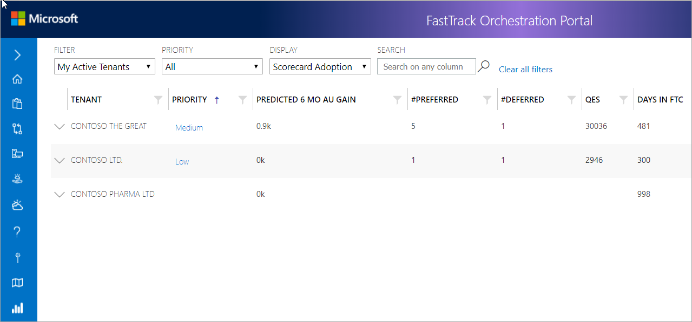
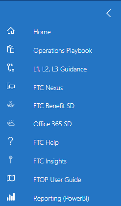

---
# required metadata
title: FTOP Partner User Guide
description: Process guidance for FTOP users.
author: Connie Brenden
ms.author: v-conbre
manager: jimmuir
ms.date: 2/22/2019
ms.topic: ftop-partner-user-guide
ms.prod: non-product-specific
ms.custom: ftop-partner-user-guide
ft.audience: partner
ft.owner: pagrim
---
# FTOP Home Page

## Overview

When you open FTOP, the default **Filter** is set to My Active Tenants, Priority is set to All, and Display is set to Scorecard Adoption. The list of tenants is sorted by highest to lowest (High, Medium, Low) priority. On the left side of the window (often referred to as the left fly-out menu) you have a *FastTrack Guidance* menu. This menu expands to display links (*see FastTrack Guidance menu in this article*).

## FastTrack Guidance Menu

The *FastTrack Guidance menu* is on the left side of FTOP. This menu expands to display links to help and guidance information for FTOP and the FastTrack Center. The menu appears collapsed by default and displays menu item icons.

Click each icon to open the content you want to view in a window. To view what is linked to each icon, hover over the menu item. Click the arrow at the top to expand and collapse the menu.

Review the table below for a definition of each link/icon.

| Link/button          | Description                                                                                                                                                                                                                                                       |
| -------------------- | ----------------------------------------------------------------------------------------------------------------------------------------------------------------------------------------------------------------------------------------------------------------- |
| Home                 | The Home icon navigates back to the FTOP home page.                                                                                                                                                                                                               |
| Operations Playbook  | The Clipboard icon navigates to the FastTrack Operations playbook.                                                                                                                                                                                                |
| L1, L2, L3 Guidance  | The Connector icon navigates to the Status & Entitlement Home and provides definition and guidance around the consumption status (L1) and reasons (L2 and L3) that are assigned to service entitlements.                                                          |
| FTC Nexus            | The FTC Nexus icon navigates you to the FTC Nexus home page and provides access to FTC Documents, videos, and other content.                                                                                                                                      |
| FTC Benefits SD      | The Benefits icon navigates you to the FastTrack Center Benefit for Office 365 and provides FTC Benefits service description (SD) on Docs.                                                                                                                        |
| Office 365 SD        | The Cloud icon navigates you to the Office 365 Service Descriptions on Docs.                                                                                                                                                                                      |
| FTC Help             | The Question mark icon navigates you to the Microsoft 365 CSP Portal where internal support tickets can be opened.                                                                                                                                                |
| FTC Insights         | The Insights icon navigates you to the FTC Insights (feedback) page where suggests/ideas can be logged.                                                                                                                                                           |
| FTOP User Guide      | The Guide icon opens this user guide.                                                                                                                                                                                                                             |
| Reporting (Power BI) | The Graph icon navigates you to FastTrack Power BI instance. To access FastTrack Power BI you will need to join the **[FastTrack Power BI](https://outlook-sdf.office.com/owa/?realm=microsoft.com&path=/group/FastTrackPowerBI@service.microsoft.com/mail) modern group.** |

## Next steps

- To learn about FRP View, see the [**FRP View**](frp-view.md).

[Home](http://partner-docs.microsoft.com)
