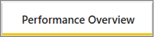
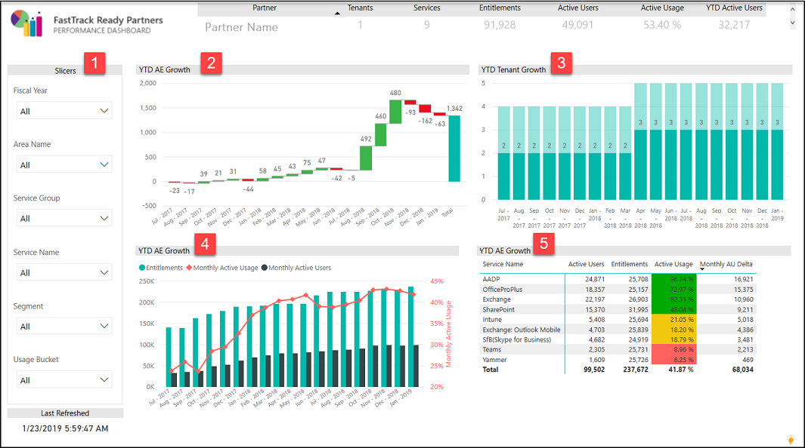
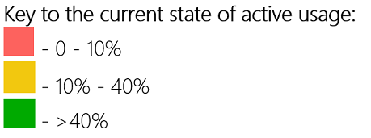

---
# required metadata
title: FastTrack Partner Power BI Report Guide
description: Performance Overview Tab
author: Celia Kennedy
ms.author: v-cekenn
manager: pagrim
ft.owner: pagrim
ms.date: 12/31/2019
ms.topic: performance-overview-tab
ms.prod: non-product-specific
ms.custom: performance-overview-tab
ft.audience: partner
ft.owner: pagrim
---

### Performance Overview Tab

Use this report to check the overall performance for all customers’ workloads in your portfolio, where the Engagement Scenario is set as **FRP Led and Assist** for qualified workloads. You can view customer Active Usage (AU) attribution by year (Y), quarter (Q) and month (M).

At the bottom of the report, click the **Performance Overview tab**.

 Page level slicers (filters) on Fiscal Year, Area, Service Group, Service, Customer Segment, and Active Usage buckets. The default selection for all the filters is ‘(All)’.

 **YTD AE Growth** graph shows Active Entitlements Growth by Fiscal Month for any selected filters. In this chart, you can drill in to quarterly view and Customer Segment view.

 **YTD Tenant Growth** graph shows total number of tenants by Fiscal Month and it helps to give information on number of tenants over the selected period. In this chart, you can drill in to quarterly view and Customer Segment view.

 **YTD AE Growth** graph shows the total number of QE and AE and Active Usage trends for the selected period. In this chart, you can drill in to quarterly view and Customer Segment view

 **YTD AE Growth** table summarizes the latest QE, AE, Active Usage and total incremental AE added in the selected period.

### Next Step

#### Choose a Power BI Report Tab

The following provides you with a description of all tabs in Power BI Dashboard and how to interpret the data in each.

- [Intro Tab](intro-tab.md)
- [Report Level Filters Tab](report-level-filters-tab.md)
- [Performance Overview Tab](performance-overview-tab.md)
- [Performance by Usage Milestone Tab](performance-by-usage-milestone-tab.md)
- [Service Usage Tab](service-usage-tab.md)
- [New Subscription Tab](new-subscription-tab.md)
- [Conversion Rate Tab](conversion-rate-tab.md)
- [Usage Trend Charts Tab](usage-trend-charts-tab.md)
- [RM is NOT FTP Tab](rm-not-ftp-tab.md)
- [Engagement Scenario is not FTC-FTP Led Tab](engagement-scenario-not-ftc-ftp-led-tab.md)
- [Overall Status Notes Updates Tab](overall-status-notes-updates-tab.md)
- [10% Forecast Tab](10-percent-forecast-tab.md)
- [40% Forecast Tab](40-percent-forecast-tab.md)
- [Performance Tab](performance-tab.md)
- [Version History Tab](version-history-tab.md)

### Refresh Summary

|Date|Who Changed|What Changed|
|---------|---------------|----------------------------|
|12/31/2019| Celia Kennedy| Guide Updated|

[Return to Power BI Report Guide Intro](index.md)

[Back to FTOP Partner User Guide](https://partner-docs.microsoft.com/partner-site/ftop-partner-user-guide/index.html)
