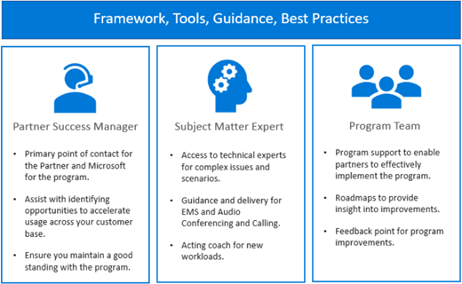

---
# required metadata
title: FastTrack Ready Partners - Partner Success Team
description: FRP Program Introduction - Partner Success Team
author: Celia Kennedy
ms.author: v-cekenn
manager: pagrim
ms.date: 12/12/2018
ms.topic: frp
ms.prod: non-product-specific
ms.custom: frp
ft.audience: internal, partner
---

# Partner Success Team

The Partner Success Team is devoted to empowering partners to develop strong customer relationships and Microsoft onboarding and adoption practices. Team resources include a FastTrack Partner Manager (FPM), Subject Matter Experts (SMEs), and a Partner Program Team—all of which are regionally aligned.

## FastTrack Partner Manger (FPM)

As a participating partner, we assign a single point of contact to you, known as your FastTrack Partner Manager (FPM).  The PSM works with a set of partners to help them deliver the FastTrack Benefit to their customers. The FPM's success is directly tied to their partners' successes.

PSM activities include:

- Main point of contact to assigned partners.
- Coaching partners to deliver the FastTrack Benefit to customers based on their needs and intents.
- Training partners to use FastTrack program tools, reports, and portals.
- Helping partners to identify new opportunities.
- Conducting regular portfolio reviews.
- Providing access to Microsoft SME resources.
- Providing actionable insights based on data analysis.
- Managing and resolving partner operational issues.
- Managing and resolving customer and field escalations.

## Subject Matter Expert (SME)

For partners who need technical or process assistance, you'll use this guide to help you create and submit a request for help from a SME using the [FTC Resource Request](https://aka.ms/frpsmerequest) page. SMEs provide coaching, and in certain cases, can work directly with a customer. However, the goal is to work through the partner, rather than directly with the customer whenever possible.

SME activities include providing:

- Technical expertise for complex issues, escalations, and scenarios
- Guidance and delivery coaching for Enterprise Mobility + Security (EMS) and Audio Conferencing and Calling
- Guidance and delivery coaching for customer business value and adoption conversations
- Guidance and delivery coaching for unblocking workloads
- Partner development for new workloads
- Best practice guidance and coaching
- FastTrack Migration benefit delivery (works directly with customer in this scenario)

In some circumstances, a SME is assigned to coach a partner (without the partner's request) to ensure they follow certain service processes so we achieve the targeted outcomes. For example, Intune value proposition and onboarding. With a Microsoft-initiated assignment, the goal is to work with the partner and act as a coach whenever possible.

For procedures on how to request a SME, see the [Partner SME Request Guide](https://aka.ms/FastTrack-Partner-SME-Request-Guide).

## Partner Program Team

The Program Team provides worldwide and regional support for both partners and PSMs. The team monitors program success factors and solicits feedback from partners, customers, and PSMs to create actionable insights.

Partner Program Team activities include:

1. Programming support to help partners effectively implement the program
2. Collecting and acting on partner feedback
3. Creating and testing program improvements
4. Providing a strategic roadmap
5. Escalating all program issues (billing, contracting, and escalations)
6. Ensuring alignment with Microsoft field teams and initiatives

[Home](http://partner-docs.microsoft.com)
