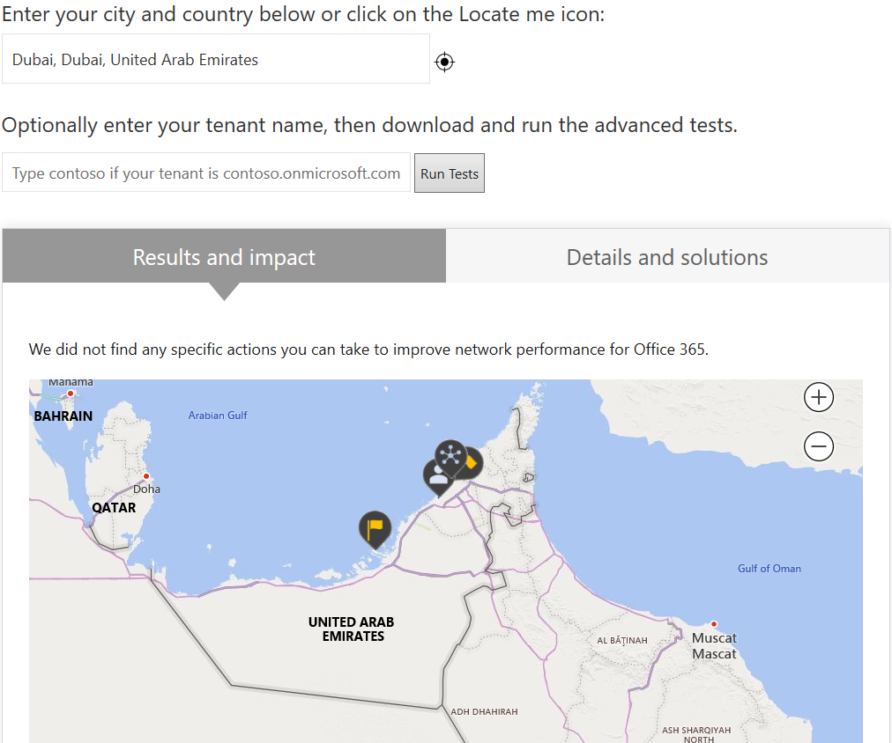
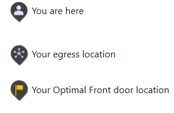

---  
# required metadata  
title: FastTrack Playbook - COVID FastTrack Center 
description: FastTrack Playbook - COVID FastTrack Center
ms.author: v-cekenn
manager: pagrim
ms.date: 4/6/2020  
ms.topic: partner-playbook  
ms.prod: non-product-specific  
ms.custom: partner-playbook  
ft.audience: partner
ft.owner: pagrim
---   

# FastTrack Center

Microsoft is focused on helping customers in this time of need with Remote Work and Remote Learning in response to COVID-19. Quick onboarding to Teams and OneDrive with baseline security and controls.  

Onboarding to Microsoft 365 usually involves complex Identity synchronization, security configuration, network changes and weeks of remediation. FastTrack is providing guidance on a couple Commercial as well as EDU scenarios that will provide rapid identity implementation and baseline security to quickly enable remote-work for the customer. It is assumed that users will leverage their local internet egress so bandwidth should not be a major topic of conversation unless there is insistence on VPN or other conditional access.  

## Tracking the COVID impact  

### FTOP Notes #covid Hashtag

For customers that request M365 deployment assistance or shifted deployment/adoption priorities due to COVID-19 (e.g. Teams), we're asking the **#covid hashtag** be added to the Engagement Management and/or Service Intent notes fields along with additional details on how COVID-19 has changed the customer's priorities. For general guidance on using the notes tool, click [FTOP Notes](https://partner-docs.microsoft.com/partner-site/fasttrack-playbook/english-playbook/guidance-ftop-notes-guidance-partner.html).

## Pre-requisites – browsers  

Ensure the customer has the basics in place for remote-work. Users will need an **up-to-date browser** to access the Office on the web capabilities. Refer to this [support article](https://support.office.com/en-us/article/which-browsers-work-with-office-for-the-web-ad1303e0-a318-47aa-b409-d3a5eb44e452) for a list of supported browsers across PC, Mac, iOS, and Android platforms.

## Foundation – tenant and domain  

Before moving forward with deployment tasks, ensure that the customer meets some basic criteria.  

- Does the customer already have an Office 365 tenant with the required licenses?
  - As part of Microsoft's COVID response, if the business is not currently licensed for Office 365, they need to sign up for a free six-month [Microsoft Teams Cloud Service Provider (CSP) trial.](https://www.microsoft.com/microsoft-365/partners/news/article/acquire-new-and-upsell-current-customers-with-new-microsoft-teams-trial)
- Has the customer already configured their own domain in the Office 365 service?
  - If the customer has not already configured their domain in the Office 365 service and wishes to do so, assist the customer with custom domain setup.  

> [!NOTE]
> Task reference: 1641 (Core Onboarding)

## Networking – connectivity, including VPN  

This network guidance is targeted for remote workers, mobility workers connecting to Office 365 remotely, i.e., outside the managed corporate network.  

When connecting from outside the corporate network, it is necessary to understand the user's connection path to Office 365 by asking the following questions:  

1. Is the user connecting from a personal device? If so, chances are they are directly connected to the Internet and no action is required. 
1. Is the user connected via a corporate device (PC, tablet)? If so, is there VPN software installed on the device? 
1. Is the VPN software on by default and/or forced? Or does the user have an option to switch off VPN connection? If yes, they should follow instructions from their administrator to disable VPN connection to connect directly to Office 365
1. The user can use the [Netonboard tool](http://aka.ms/netonboard) to get an understanding of their connectivity path, e.g., the below is a screen shot that portrays direct connectivity to Office 365 for a remote user based in Dubai.  Notice that the user location and network egress location is aligned with user's physical location.  

  

  
  
Below is another screen shot that portrays traffic backhaul via a VPN path to the same user in Dubai.  Notice that the user location and egress location (UK) are not aligned with the user's physical location (Dubai).  

  

Most customers already have a VPN solution in place for remote connectivity, but the main challenge is with how the VPN is designed to route Office 365 traffic, for example:  

> Route everything locally (including Office 365) on-premises application traffic via VPN  
> or  
> Route everything via VPN, define exceptions for local routing  

If the customer routes everything via the VPN by default, and hasn't defined exceptions for Office 365 traffic, this leads to a bad user experience due to congestion on the VPN path, traffic back haul via central egress, and scalability issues of VPN infrastructure given the increase in load due to COVID-19. The exception needs to be defined on priority for the 'Prioritize' set of endpoints since it accounts for 75-90% of traffic volume with most of the impact on the user experience.  

Customers asking for information about how to implement exceptions or split tunneling for Office 365 traffic should be pointed to the [TechCommunity blog](https://techcommunity.microsoft.com/t5/office-365-blog/how-to-quickly-optimize-office-365-traffic-for-remote-staff-amp/ba-p/1214571).  

> [!NOTE]
> Task reference: 4071 (Core Onboarding), 4072 (Core Onboarding)  

## Identity, Authentication, and Assignment  

### Authentication  

For customers that have not set up authentication for their tenant, work with the customer to determine the correct authentication method based on the infrastructure they currently have configured and/or what they intend to do.  

- Customers that do not have an on-premises Active Directory or do not have the time nor the intent to set up AAD Connect should leverage Managed CloudIDs with separate passwords. 
- Customers that have AAD Connect set up (or are planning to do so) can leverage either:
  1. Password Hash Sync (PHS) - recommended
  1. Pass-through Authentication (PTA) with Password Hash Sync (as backup)
- Some questions that can be used to determine current customer state:
  - Are you using a managed authentication option or federation? If you are using federation, which federation service/provider are you using (ADFS? Ping, Siteminder? SecureAuth? Shibboleth?) Do you also sync your password hashes to AAD (as a backup or for ID protection)?  

For customers that already have authentication set up for their tenant, they can continue to leverage the approach they have implemented.  

- Customers that already have ADFS configured can continue to leverage ADFS, but it is recommended that Password Hash Sync be enabled as a back-up authentication method.  

> [!NOTE]
> Task reference: 3736 (Core Onboarding)  

### Create Identities  

If the customer has not already created or synchronized users, assist the customer with populating user and group objects into the tenant. Leverage existing identities where this has been completed in prior deployments.  

**Create Cloud IDs**  

- Customers that do not have an on-premises Active Directory or do not have time to set it up or do not plan to set up AAD Connect should do a bulk import of CloudIDs. Ensure passwords are captured for later distribution. Refer the next section for license assignment needs.  

**Set Up Directory Synchronization (Azure AD Connect)**  

- Customers that have an on-premises Active Directory or a significant number of objects should sync their objects via AAD Connect (DirSync). (Scenario C2)
- EDU customers that have an on-premises Active Directory have the option to sync their objects via the School Data Sync. (E2)  

**Set Up Microsoft School Data Sync (SDS) for Education Customers**  

- School Data Sync is a free service in Office 365 for Education that reads the school and roster data from a school's Student Information System (SIS). Use this guidance to help your customer [deploy School Data Sync](https://docs.microsoft.com/SchoolDataSync) to make it easier for teachers to automatically create Teams.  You can direct your customer to contact [https://aka.ms/sdssupport](https://aka.ms/sdssupport) for deployment assistance if needed.  

### License Assignment  

If the customer has not yet assigned licenses to their users, **assist the customer with the steps in the article,** [Assign Office 365 licenses to user accounts](https://docs.microsoft.com/office365/enterprise/assign-licenses-to-user-accounts). You may have completed this at time of user setup. The recommendation is to assign all the available apps and services in your plan – excluding Exchange - unless the customer is specifically intending to setup mail in Exchange Online. In many cases, this will be the E1 plan when assisting with this scenario. At minimum, include these apps: **Office for the web; Microsoft 365 Apps; Microsoft Teams; SharePoint Online; Yammer.**  

If the customer has additional subscriptions, like EMS, apply the required licenses. Learn more about [how to assign Intune licenses.](https://docs.microsoft.com/en-us/mem/intune/fundamentals/licenses-assign)  

> [!NOTE]
> Task reference: 1134 (Core Onboarding), 1141 (Core Onboarding), 3736 (Core Onboarding)  

## Security baseline  

It is critical for customers to enable security features for their environment. Specific features will depend on the customer's AADP licensing.  

1. Customers that do not own AADP licenses should enable Security Defaults. Security Defaults enable key security features without the need for the customer to configure/customize them. 
1. Customers with AADP licenses should leverage the new "Secure Foundations" approach to enable critical security settings and work with the customer to enable the following features:  

   - Self-service Password Reset (SSPR)
   - Multi-Factor Authentication (MFA)
   - Conditional Access (CA)  
For specific feature guidance, see the "published guidance" that outlines the most critical security features that customers should deploy based on their licensing.  

1. Customers with an Intune license should enroll devices.  

> [!NOTE]
> Task reference: 3720 (Core Onboarding)  

Some suggested questions to help determine the best approach for the customer:  

- Are you using MFA today?
  - If so, are you using Azure MFA Server, Azure MFA or 3rd party?
  - If not, are you open to a simplified, rapid pilot implementation as part of this offering/solution set that you can expand when/as you see fit?
     1. Security Defaults for non-EMS/M365
     1. Simple Azure AD CA Policy for MFA for EMS/M365 customers
     1. More advanced Azure AD CA Policy for adaptive MFA incl device state, location, etc.
- Are you allowing personal or BYO **mobile devices** to access O365 corporate resources today? such as email?  

  If so:
     - What (if any) app restrictions are in place for accessing O365 corporate resources?
     - Do you use Intune MAM and the Office Mobile Apps to control/manage the Apps and O365 data?  

  If not:
     - Are you open to a simplified, rapid pilot implementation as part of this offering/solution set that you can expand when/as you see fit?

- This can work on personal/BYO, 3rd party MDM or Intune MDM-managed devices.
  - Are you using an MDM today?
  - If so, is it Intune or 3rd party?
  - If not, are you open to a simplified, rapid pilot implementation as part of this offering/solution set that you can expand when/as you see fit.
- Are you interested in limiting web access to SPO/OD/OWA on un-managed devices, such as home Windows PCs, Macs, personal tablets, etc?
  - If so, are you open to a simplified, rapid pilot implementation as part of this offering/solution set that you can expand when/as you see fit?
  - This may require Hybrid AAD Join for your domain-joined PCs – is that setup today?
  - This may be impacted if mobile devices are managed by a 3rd party MDM (such as AirWatch)" &lt;see above question/answer about current MDM&gt;
- Are you interested in enrolling personal un-managed devices such as home Windows PC, Macs, personal tablets, etc., into Intune?
  - There may be some liability or personal privacy concerns – this should be vetted/approved by org management.
  -  Due to this concern, some may want to actively block personal devices from enrolling – and possibly only allow the limited web access mentioned above.
  - [Control Access from Unmanaged Devices](https://docs.microsoft.com/en-us/sharepoint/control-access-from-unmanaged-devices)
- Enable MFA for all users based on customer licensing:
  - Azure AD Free Customers / OFFICE 365 APPS (O365 E1, E3, E5, F1, A1):
     - [Enable Security Defaults](https://docs.microsoft.com/azure/active-directory/fundamentals/concept-fundamentals-security-defaults) (Non-customizable for exclusions).
  -  Premium P1 (AADP P1/ M365 E3/A3, EMS E3) or Premium P2 (AADP P2/ M365 E5/A5, EMS E5): 
     - [Enable combined policy for ALL users](https://docs.microsoft.com/azure/active-directory/authentication/howto-registration-mfa-sspr-combined) - Enables combined MFA and SSPR registration to simplify user registration experience.
     - [Enable policy to allow MFA with Authenticator App](https://docs.microsoft.com/azure/active-directory/authentication/howto-mfa-getstarted) - Configure MFA settings to ensure we can protect accounts from being compromised by bad actors  

## Initial Communication and Readiness Resources  

### Provide Users Access  

If the customer's end users do not know how to sign-in to Office 365 from their remote-work device, the customer may leverage the communication option during user setup or send their own communications.  

It is important that the customer ensures they are using a method to distribute the initial user credentials that meets their company policy. Note that credential distribution only applies to scenarios where they used cloud identities.  

An alternative to using the built-in recommended training content is to leverage the templates available in the [FastTrack Resource Hub](https://www.microsoft.com/fasttrack/resources).  Templates are available to customize and share with users that allow the customer to send from their existing email platforms.  

At this point, users will be technically enabled in the service with Office on the web services.  

### Share user readiness resources  

To help the users begin using the new services, we should provide the recommended user readiness resources. The IT Admin can readily share the resources with ready-to-use templates and training content. The goal of this step is to provide the resources to avoid the customer from having to create their own resources to enable rapid re-use.  

Share the following resources to educate the customers and their end users on our services and aligned business scenarios.  

**Commercial:**  

- [Adopt Microsoft Teams Landing Page](https://docs.microsoft.com/en-us/MicrosoftTeams/adopt-microsoft-teams-landing-page)
- [Teams Training Landing Page for (Admins, Instructor-Led, End User)](https://docs.microsoft.com/en-us/MicrosoftTeams/training-microsoft-teams-landing-page)
- [Office 365 Training Center](https://support.office.com/office-training-center)  

**Education:**  

- [Helping Teachers and Students make the switch to remote learning](https://www.microsoft.com/en-us/microsoft-365/blog/2020/03/11/helping-teachers-students-switch-remote-learning/)
- [Microsoft Teams guide for EDU IT Admins](https://docs.microsoft.com/en-us/microsoftteams/expand-teams-across-your-org/teams-for-education-landing-page)  

In all cases, ensure they are aware of the Office 365 Training center. Here they'll find courses on how to [work together](https://support.office.com/article/best-practices-for-collaborating-with-office-365-5144136b-1ff8-476f-bcba-00de0bdaa600) and use the [Office for the web](https://support.office.com/article/office-for-the-web-training-e315b031-2bd5-40a1-99ca-264ebf2c8f96) solutions and many others.  

Admins can also leverage the admin center communication templates for the easiest way to share the recommended guidance. Further resources to help them share resources, like tips and tricks, are available in the [FastTrack Resource Hub](https://www.microsoft.com/fasttrack/resources).  

Even if the customer's users are knowledgeable about Office apps, we recommend ensuring their users have the training resources in the [Office Training Center](https://support.office.com/office-training-center) as additional content continues to become available.  

As the users transition to the remote-work environment with their new technology, it is important to share best practices on how to be effective from home. Share the [remote-work tips](https://aka.ms/Remote-Work_Tips_FT) for customers to distribute to their users to help them sustain productivity during this change. This includes tips for working from home and using Bing search capabilities to find work content, including Teams conversations, work files on OneDrive for Business, and people info.  

## Teams Enablement  

### Getting Started: (Commercial and Gov)  

Here are some resources available to help your customer plan for their Teams deployment and get them up and running.  

- [How to Roll Out Teams](https://docs.microsoft.com/en-us/MicrosoftTeams/how-to-roll-out-teams) – **Start Here**. Use this guidance to determine your customer's recommended path to Teams. We suggest rolling out Teams in stages, workload by workload, as the customer's organization is ready. **They do not have to wait until they've completed one step before they move to the next.** Some orgs may want to roll out all Teams features at once, while others may prefer a phased approach. Here are the Teams workloads, in the order we recommend rolling them out:  

  1. [Get started](https://docs.microsoft.com/en-us/MicrosoftTeams/get-started-with-teams-quick-start)
  1. [Chat, teams, channels, & apps](https://docs.microsoft.com/en-us/MicrosoftTeams/deploy-chat-teams-channels-microsoft-teams-landing-page)
  1. [Meetings & conferencing](https://docs.microsoft.com/en-us/MicrosoftTeams/deploy-meetings-microsoft-teams-landing-page)
  1. [Cloud voice](https://docs.microsoft.com/en-us/MicrosoftTeams/cloud-voice-landing-page)

- [Quick start guide for Teams](https://docs.microsoft.com/en-us/MicrosoftTeams/get-started-with-teams-quick-start) – If your customer is trying to roll out Microsoft Teams quickly to respond to an increased demand to support remote work, use this Get Started guidance to help them deploy Teams quickly to their entire organization.  This guidance applies even when Teams is their first Office 365 workload.
- [Teams Rollout FAQ](https://docs.microsoft.com/en-us/microsoftteams/use-advisor-teams-roll-out#frequently-asked-questions) – answers to frequently asked questions to help get your customer up and running faster.  

### Teams Advisor: (Commercial and Gov)  

Encourage your customer to take advantage of the in-product experience designed to guide a customer through the steps needed to deploy:  

- Chat, teams, channels, and apps
- Meeting and Conferencing  

The Advisor for Teams (preview) walks the customer through their Microsoft Teams rollout. It assesses their Office 365 tenant environment and identifies the most common configurations that they may need to update or modify before they can successfully roll out Teams. Then, Advisor for Teams creates a Deployment team (in Teams), with channels for each workload they want to roll out. Each workload in the Deployment team comes with a comprehensive Planner plan that includes all the rollout tasks for each workload. Using this Planner plan, they can assign tasks to the people responsible for each phase of the rollout - including the project manager, Teams and Office 365 admins, support people, and their adoption and user readiness team. Each rollout task contains all the guidance and resources they need to successfully complete the task.  

Advisor for Teams is part of the  [Teams admin center](https://admin.teams.microsoft.com/). At a minimum, they will need an Office 365 Business Essentials license so they can take advantage of the Advisor for Teams integration with Forms and Planner. To begin using Advisor for Teams, they need to click the **Start** button in the **Deploying Teams workload** widget on the Dashboard or go to **Planning > Teams Advisor**.  

> [!NOTE]
> Task reference: 3268 (Teams)  

### Getting Started: (Education)  

Teams for Education can create collaborative classrooms, connect in professional learning communities, and communicate with students and teachers. Use the admin resources to help you successfully deploy, adopt, and manage Teams in schools or institutions.  

Encourage your customers' admins to use the following Teams for Education deployment content to:  

- Learn how to quickly get started with [Teams for Education admins](https://docs.microsoft.com/microsoftteams/teams-quick-start-edu)
- Learn how to use [Assignments in Teams for Education](https://docs.microsoft.com/microsoftteams/expand-teams-across-your-org/assignments-in-teams)
- Find additional [resources for Teams for Education admins](https://docs.microsoft.com/microsoftteams/resources-teams-edu)
- Review the [Governance FAQ for Teams for Education admins](https://docs.microsoft.com/microsoftteams/plan-teams-governance-edu)  

### Skype for Business to Teams Transition  

For customers with users in Skype for Business Online as well as any customers who already have started planning their transition from Skype for Business to Teams, we recommend continuing to enable Teams and Skype side-by-side with either overlapping capabilities or select capabilities, determined by the customer's requirements and considerations based on current environment. Then customers can upgrade to Teams Only for all end users once they are ready.  

Leverage [aka.ms/SkypeToTeams](http://aka.ms/SkypetoTeams) for comprehensive set of technical guidance and planning resources, including a proven success framework, best practices and planning documents, to enable upgrade discussions.  

Direct customers to our free, interactive online [Upgrade Planning Workshops](https://aka.ms/SkypeToTeamsPlanning) designed to plan and implement their upgrade to Teams as well as to download the [Upgrade Success Kit](https://aka.ms/UpgradeSuccessKit) featuring customizable assets such as a sample project plan, user communications, feedback surveys, and more.

## Remote access to apps  

### Integrate SaaS Applications with Azure AD:  

Provides access to corporate SaaS applications remotely and securely with improved user experience (SSO). Does not provide access to legacy on prem application. [Instructions for the following licensing scenarios](https://docs.microsoft.com/azure/active-directory/manage-apps/plan-an-application-integration):  

- Azure AD Free Customers / OFFICE 365 APPS (O365 E1, E3, E5, F1, A1):
- Premium P1 (AADP P1/ M365 E3/A3, EMS E3):
- Premium P2 (AADP P2/ M365 E5/A5, EMS E5):  

### Enable Azure App Proxy for remote access to legacy Apps:  

Enables users to securely access on-premises applications by signing in with their Azure AD account. [Instructions for the following licensing scenarios](https://docs.microsoft.com/azure/active-directory/manage-apps/application-proxy-add-on-premises-application):  

- Premium P1 (AADP P1/ M365 E3/A3, EMS E3):
- Premium P2 (AADP P2/ M365 E5/A5, EMS E5):  

## Application Protection and Device Management  

### Application Protection (Quick action - 1-3 Days)  

- Protect your device while accessing Office 365 Apps using Intune or 3rd Party MDM devices – **Enable Intune App Protection**  
  - App Protection Policies should be put in place- for end-user that go between online and desktop apps
  - Setup two factor authentication
  - Secure employee account with MFA in Microsoft 365 Business / IT
  - End-User Assistance Video
  - Require healthy device access - requires device enrollment into Intune\*
  - IT Pro - Setup Intune Compliance policies - Here  

- Protect your Office 365 identity and applications – **Enable Conditional Access App Protection policies**
  - Limit access to OneDrive and SharePoint  
     - Control access to unmanaged devices 
     - Control access based on network location
     - Sign Out Inactive Users 
     - Restrict Sharing of SharePoint and OneDrive between Domains 
     - External Sharing
     - **Security & Compliance in Microsoft Teams: Microsoft Intune Mobile Application Management**
- **Enroll Corporate devices into Endpoint Management solution (Longer action – 30 – 60 days)**
  - Require healthy & compliant devices when accessing cloud services (ExO, OneDrive, SharePoint, Teams) by using Intune compliance policies
     - Setup polices that enable or require device security
     - Require Min/Max Pin
     - Require device Encryption
     - Block Jailbroken/Rooted
     - Block email access to unsupported devices.
  - **Deploy Advance Threat Protection**
     -  Onboard machines to the Microsoft Defender ATP service.

## Mobile Apps  

### Outlook Mobile  

If the customer's users do not already have the Outlook mobile app, recommend the app as an easy way for them to stay connected with email and calendar. Outlook mobile gives users access to their emails, calendar appointments, contacts, documents, and more from wherever they are working. Read the IT admin [FAQ page](https://docs.microsoft.com/exchange/clients-and-mobile-in-exchange-online/outlook-for-ios-and-android/outlook-for-ios-and-android-faq) for answers about architecture, security, administration, and more. Leverage the pitch deck in OLM 3278 to have this conversation.  

**NOTE:** This is not about moving the mailbox – simply enabling use of the app.  

Users can install and set up any apps included with the Office 365 subscription on Android or iOS devices. Share the following links to guide users them to setup the Outlook mobile.  

- iOS:  [How to install Outlook for iOS](https://go.microsoft.com/fwlink/?linkid=2092639)
- Android:  [How to install Outlook for Android](https://go.microsoft.com/fwlink/?linkid=2092802)

> [!NOTE]
> Task reference: 3278 (Outlook Mobile), 3267 (Outlook Mobile)  

### New Office App  

It is recommended to highlight the new Office Mobile app. The new Office app combines Word, Excel, and PowerPoint into a single app, and introduces new mobile-centric features to view, edit and share files without the need to switch between multiple apps. Note that Office mobile app is currently available for iPhone (support for iPad will come later). [Learn more](https://support.office.com/en-us/article/microsoft-office-app-for-ios-c8880c05-883a-46b6-ad32-9bffa31228d0).  

Share this article with the administration to guide their users to install the apps - [Set up Office apps and email on a mobile device](https://support.office.com/article/set-up-office-apps-and-email-on-a-mobile-device-7dabb6cb-0046-40b6-81fe-767e0b1f014f)  

### Office Mobile Apps  

Ensure the customer is aware their users can install and set up any apps included with the Office 365 subscription on Android or iOS devices. Office and Office 365 offer these apps:  

- Office App
- Word
- Excel
- PowerPoint
- OneNote
- Teams
- OneDrive
- Office Lens
- Skype or Skype for Business
- SharePoint
- Yammer

## Microsoft 365 Apps  

License Requirement: subscription must include Microsoft 365 Apps (not included in the E1 trial).  

### New Installs on unmanaged user devices – PC and Mac  

Customers can support their remote work users by providing the option to install Microsoft 365 Apps on local PC and Mac devices from the Office 365 portal. This allows users to have access to the latest versions of the Office apps on their local PC or Mac device to create and collaborate on content with the local apps.  

The self-install option from the portal is the recommended method for customers to deploy Office to remote work users using unmanaged or personal devices. This option requires that your users have local administrative rights on their client devices.  

In this approach, the customer can control which software and how frequently users receive feature updates. Refer to controls available in the setting, see [Manage user software in Office 365](https://support.office.com/article/manage-user-software-in-office-365-c13051e6-f75c-4737-bc0d-7685dcedf360). The package available in the portal will include all the Office apps, including Teams, and will deploy 64-bit Office.  

Ensure customers are aware of the potential challenges including:  

- Existing versions of Office on the user's device will be removed.
- When a user leaves the organization, as the subscription is removed, the app will revert to the read-only reduced functionality mode (RFM).  

Next, guide the customer to share the steps to their users to install Microsoft 365 Apps from the portal.

Select the Microsoft Office apps template to communicate to users how to self-install from the portal. Use the option to send a preview to review the details before sending the communication. Select the desired group to target the communication.  

Admins can download communication templates from the [FastTrack Resource Hub](https://www.microsoft.com/fasttrack/resources) to customize the communication prior to sending. If the admin uses this option, they will leverage their existing email or other communication platform to distribute the details to their users.  

The service has seen a significant increase in the use of the portal install scenario as the benefits out-weigh the challenges for many. If the customer does not want to offer this or is not ready to offer this, our preference is to keep the ProPlus license assigned so it still can be deployed in a managed context. Recommend the option to use the admin center settings controls to remove the portal install options.  

Ensure the customer is aware of the Office Cloud Policy Service that provides them an option to manage many of the user-based policies and preferences – like the privacy settings and security recommendations. When a user signs into Microsoft 365 Apps on a device, the policy settings roam to that device. You can also enforce some policy settings for Office for the web, both for users who are signed in and for users who access documents anonymously. Learn more about this service in the [Overview of the Office cloud policy service for Microsoft 365 Apps article](https://docs.microsoft.com/DeployOffice/overview-office-cloud-policy-service) or go to the [Office Cloud Policy Service](https://aka.ms/o365clientmgmt).

### Managing Existing ProPlus Users in the remote-work scenario  

If user devices have moved to a remote-work scenario, it may be beneficial to provide updates to Microsoft 365 Apps from the CDN versus Configuration Manager. This allows you to have users obtain the update content directly from the internet and minimize impacts to your VPN connection. Guide the customer to use one of the following options to make this change. Remind the customer that they remain in control, and that this option provides a solution to change where the user will download the Office update bits from.  

- Option 1: Cloud Managed - Get updates directly from the CDN
- Option 2: Configuration Manager but offload content distribution - Deploy with no package and obtains content from the CDN  

Both options require Office client updates bypass or use split tunneling in the VPN. The endpoints in the [Office 365 IP and URL article](https://docs.microsoft.com/Office365/Enterprise/urls-and-ip-address-ranges) are items 90 and 92. These are not included in the optimize end points as they don't fit the optimize profile and the CDN includes some non-Microsoft endpoints (i.e., Akamai). However, in cases where the VPN is constrained, it can be recommended to offload the ProPlus update traffic. Refer to the full recommendations at [Configuring Microsoft 365 Apps updates for remote workers using VPN](https://techcommunity.microsoft.com/t5/office-365-blog/configuring-office-365-proplus-updates-for-remote-workers-using/ba-p/1253491). Refer to the recommended methods to update the Microsoft 365 Apps update location [here](https://docs.microsoft.com/deployoffice/manage-office-365-proplus-updates-with-configuration-manager#enable-office-365-clients-to-receive-updates-from-the-office-cdn-instead-of-configuration-manager).  

Leverage this in conjunction with the networking recommendations to avoid VPN constraints in the remote-work scenario.  

> [!NOTE]
> Task reference: 3080 (Microsoft 365 Apps), 1247 (Microsoft 365 Apps)

### Refresh Summary

|Date|Who Changed|What Changed|
|---------|---------------|----------------------------|
|05/12/2020| James Collins| General Maintenance|
|04/06/2020| Celia Kennedy| COVID-19 Response Playbook added|

[Home](http://partner-docs.microsoft.com)