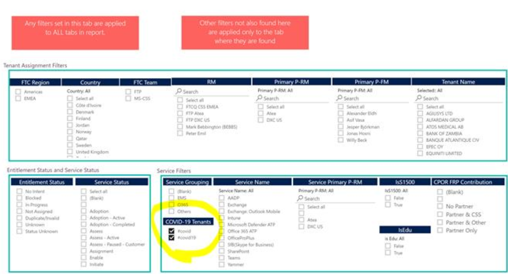

---  
# required metadata  
title: FastTrack Partner COVID-19 Response  
description: FastTrack Playbook - COVID-19 Response
author: Celia Kennedy
ms.author: v-cekenn
manager: pagrim
ms.date: 4/03/2020  
ms.topic: partner-site
ms.prod: non-product-specific  
ms.custom: partner-site
ft.audience: partner
ft.owner: pagrim
---

# Overview

In response to the global **COVID-19 outbreak,** companies, schools, and service providers have turned to remote access communications to protect individuals and deter the spread of the COVID-19 virus. To assist organizations in all regions that are unable to support a remote work model Microsoft has set up a free six-month [Microsoft Teams Cloud Service Provider (CSP) trial.](https://www.microsoft.com/microsoft-365/partners/news/article/acquire-new-and-upsell-current-customers-with-new-microsoft-teams-trial) This trial was announced to the general public March 3, 2020.

The FastTrack Ready Partner team anticipates that many trial customers will require assistance. We know each of you stand ready with your experience and expertise to help! Please reference the [FRP COVID-19 response slide deck](https://www.yammer.com/office365partners/#/files/464469098496). It is our hope that we can assist public health and safety by making working remotely easier.

## Documentation, Tools, and Incentives

### FTOP Notes #covid Hashtag

For customers that request M365 deployment assistance or shifted deployment/adoption priorities due to COVID-19 (e.g. Teams), we're asking the **#covid hashtag** be added to the Engagement Management and/or Service Intent notes fields along with additional details on how COVID-19 has changed the customer's priorities. For general guidance on using the notes tool, click [FTOP Notes](https://partner-docs.microsoft.com/partner-site/fasttrack-playbook/english-playbook/guidance-ftop-notes-guidance-partner.html).

### Required COVID-19 Customer Registration Tool  

For trial SKU's you **must** use the [FRP Covid Registration](https://aka.ms/FRPCovidRegistration) tool to register COVID-19 customers for onboarding incentive consideration and to register tenants for Student Enablement fee consideration.

For new customers **using normal paid SKUs,** partners will register them through CPOR. Partners have also had incentives associated with usage realization. It is important for us to track the impact of COVID-19 on our demand and capacity. We also want to understand shifting customer priorities on workload deployment and adoption.

### COVID-19 On-boarding Incentives

We have added incentives associated with usage realization. It is important for us to track the impact of COVID-19 on demand and capacity. We also want to understand shifting customer priorities on workload deployment and adoption.  

On-boarding incentives are available to FRP Partners when they assist with on-boarding E1/G1/A5 trial SKU's. A Student Enablement fee, equivalent to the value of the Teams incentive for eligible tenants, has been added. The FastTrack Ready Partners [Terms & Conditions](https://aka.ms/fasttrackreadyterms) have been updated to reflect incentives.

**E1/G1 Trial On-boarding Incentive**

- E1/G1/CSP Office 365 - 6-month Trial SKU's will be eligible for on-boarding milestone incentives:
- All O365 services (EXO, ODSP, Microsoft 365 Apps, Teams, Yammer) are eligible
- Tenants must be 150+ seats to qualify
- No Adoption milestone, except XS, eligibility
- Customers must have started their trial **on or after February 1, 2020**
- Tenant must be registered as COVID-19 assistance request
- Standard RFA process

OR

- Using the FastTrack Ready Partner Incentive Claims for Trial/Free Licenses form
- Tenant must be managed in FTOP like any other customer
- Service(s) must achieve milestone **by June 30, 2020**
- Incentives will be calculated in June for qualifying tenants and paid on the June incentive statement that **will be sent in July 2020**

**A5 Trial Faculty & Staff On-boarding Incentive**

- A5 6-month Trial SKU: Eligible for on-boarding milestone incentives for Faculty & Staff seats
- All O365 services (EXO, ODSP, Microsoft 365 Apps, Teams, Yammer) are eligible to earn incentives
- Tenants must be 150+ seats to qualify 
- No Adoption milestone, except XS, eligibility 
- Customers must have started their trial **on or after February 1, 2020**
- Tenant must be registered as COVID-19 assistance request 
- Standard RFA process 

OR

- Using the FastTrack Ready Partner Incentive Claims for Trial/Free Licenses form
- Tenant must be managed in FTOP like any other customer 
- Service(s) must achieve milestone **by June 30, 2020**
- Incentives will be calculated in June for qualifying tenants and paid on the June incentive statement that **will be sent in July 2020**

>[!NOTE]
> Due to high volume, new requests for the Office 365 A5 Trial available for select countries, are currently on hold.  Please email [**educovidsupport@microsoft.com**](educovidsupport@microsoft.com) for customer escalations regarding this suspension.​​​​​​​ ​​​​​​​

**Student Enablement Fee**

- A1/A3/A5/A5 Trial SKU's will be eligible for the Student Enablement fee
- 1-time fee per eligible tenant
- Tenants must be 150+ seats to qualify
- Achieving Onboarding milestone with Student licenses for one or more O365 services triggers fee eligibility
- Fee value is equivalent to the Teams Onboarding incentive for the customer size tier
- Tenant must be registered as COVID-19 assistance request
- Standard RFA process 

OR

- FastTrack Ready Partner Incentive Claims for Trial/Free Licenses form
- Tenant must be managed in FTOP like any other customer
- Service(s) must achieve milestone **by June 30, 2020**
- Incentives will be calculated in June for qualifying tenants and paid on the June incentive statement that **will be sent in July 2020**

## FRP Dashboard: How to monitor COVID-19 Engagements

On April 21, 2020 two changes in the FRP Dashboard were added to assist monitoring the progress for tenants flagged as Covid-19 engagements. 

A filter in the FRP Dashboard will only select tenants with hashtag #covid. *Note: The guidance is to ***use #covid,*** but as some people also used #covid19, both are included in the filter.*

In addition, a dedicated Data Health tab for COVID-19 tenants has been created.

**New dashboard:**

**How to use the filter:**

When the dashboard is filtered on **#covid** engagements you can monitor your tenants for Teams usage and take action on those that are not progressing as expected, for example, those at 1.72 % of usage.

**Data Health for Covid19 engagements**

- The existing Data Health tab in the FRP Dashboard **only shows workloads with an approved CPOR claim** (eligible for incentives)​
- Most **COVID-19 engagements are for E1/G1 trial tenants they don’t have an associated CPOR claim​**
- We added the **COVID-19 Data Health** tab **automatically filtered on tenants with the #covid tag** in the notes

>[!Note]
> The new tab has been added to **help monitor the COVID-19 engagements only.** It **will NOT contribute to the Data Health KPI calculation.** For program eligibility we will continue to use the **existing global Data Health Tab.**

## Resources to help customers achieve success

### General

- [Partner guidance on Trials and supporting remote work](https://aka.ms/partnerremotework)
- [More details, eligibility, and how to access Microsofts offer of free trial offer](https://docs.microsoft.com/en-us/MicrosoftTeams/e1-trial-license)
- [Partner resource page for Microsoft Teams Calling and Meetings](https://www.microsoft.com/microsoft-365/partners/calling-and-meetings)
- [Helping IT send and provision business PCs at home to work securely during COVID-19](https://techcommunity.microsoft.com/t5/enterprise-mobility-security/helping-it-send-and-provision-business-pcs-at-home-to-work/ba-p/1262022)
- [Guidance for supporting remote workers](https://docs.microsoft.com/en-us/MicrosoftTeams/support-remote-work-with-teams)
- [Remote working tips](https://techcommunity.microsoft.com/t5/microsoft-teams-blog/4-tips-for-working-from-home-with-microsoft-teams/ba-p/1202083)
- [Volunteer Microsoft 365 Appsortunities to assist **non-profits** struggling to enable remote work. To donate your deployment expertise to assist non-profits, please email](frpvolunteer@microsoft.com)

### Microsoft Blogs

- [Responding to COVID-19: Partner guidance and resources](https://blogs.partner.microsoft.com/mpn/responding-to-covid-19-partner-guidance-and-resources)
- [Microsoft COVID-19 Response resources](https://news.microsoft.com/covid-19-response)
- [Making it easier for your remote workforce to securely access all the apps they need, from anywhere](https://www.microsoft.com/security/blog/2020/03/31/making-easier-remote-workforce-securely-access-apps-from-anywhere/)
- [Remote work during challenging times​](https://www.microsoft.com/en-us/microsoft-365/blog/2020/03/02/working-remotely-during-challenging-times/)
- [Manage work devices at home during Covid-19 using Configuration Manager](https://techcommunity.microsoft.com/t5/microsoft-endpoint-manager-blog/manage-work-devices-at-home-during-covid-19-using-configuration/ba-p/1262052)
- [Our commitment to customers during COVID-19​](https://www.microsoft.com/en-us/microsoft-365/blog/2020/03/05/our-commitment-to-customers-during-covid-19/)
- [Staying productive while working remotely with Microsoft Teams​](https://www.microsoft.com/en-us/microsoft-365/blog/2020/03/10/staying-productive-while-working-remotely-with-microsoft-teams/)
- [Top 9 ways Microsoft IT is enabling remote work ​](https://www.microsoft.com/en-us/microsoft-365/blog/2020/03/12/top-9-ways-microsoft-it-enabling-remote-work-employees/)
- [Supporting Remote Workers Using Teams](https://docs.microsoft.com/en-us/MicrosoftTeams/support-remote-work-with-teams)
- [Microsoft Teams at 3 – Everything you need connect teammates be more productive](https://www.microsoft.com/en-us/microsoft-365/blog/2020/03/19/microsoft-teams-3-everything-you-need-connect-teammates-be-more-productive/)

### Training

#### Webinars

**Enable security and management for your remote workforce**

- [Register here to review recording](https://m365elite.eventbuilder.com/event/17220)
 
*Session overview:* As a result of the COVID-19 pandemic, organizations all over the world have begun to setup remote work and remote learning for their employees and students. To support the remote-work needs of our customer, this webinar guides partners in the enablement of Security scenarios.

- Azure AD
  - Security baseline for Azure AD
  - Choose the right authentication method
  - Enable remote access to apps

- Intune
  - MAM for Teams
  - Enrollment and compliance for both of those via conditional access, and a little bit of troubleshooting
    - Requirements by platform
    - Compliance policies
    - Conditional Access on compliance and required apps
  - Modern Management basics for Windows 10
 
*Note there will be a 15 minute break between the two segments.*
 
*Intended partner audience:* Architects/Consultants, Deployment engineers and Technical Decision Makers.
 
*Expected outcome:* Help customers secure access to cloud and on-premises apps while working remotely from company devices or BYOD with Azure AD and Intune.

**Support your customers with Remote Work in challenging times**

With COVID-19 impacting people and countries around the world, teams everywhere are moving to remote work. Our Partners are quickly adjusting to support their customers with these needs. In this session, we share with you how Microsoft is enabling our customers and Partners during this challenging time, and discussing best practices on how you can accelerate your remote work solutions with Microsoft guidance and resources to protect customer health, safety, and support customer continuity.
 
During this time when your customers are working from home, learn how you can accelerate their remote work solutions with Microsoft guidance and resources while also protecting customer health, safety, and support customer continuity. [Register to view the recording.](https://m365elite.eventbuilder.com/event/16207)

**Virtual delivery of Microsoft 365 Partner Workshops**

 Partner workshops can now be conducted virtually. To help ease the change in delivery method, the timeline to conduct workshops with completion dates after March 31, 2020, has been extended from 90 to 110 days.

- To learn more about delivering a virtual partner workshop, [watch our webinar on demand](https://www.microsoft.com/microsoft-365/partners/videos/virtual-delivery-of-m365-partner-workshops) and review these key resources:

  - [Download webinar presentations](https://www.microsoft.com/microsoft-365/partners/resources/virtual-delivery-of-m365-partner-workshops)
  - [View virtual delivery guidance for all workshops](https://o365pp.blob.core.windows.net/media/Resources/Microsoft%20365%20Fundamentals/Virtual%20Delivery%20Guidance%20-%20all%20workshops.pdf)
  - [Download Microsoft 365 partner workshop delivery kits](https://www.microsoft.com/microsoft-365/partners/microsoft-365-accelerators#microsoft-365-partner-accelerators-tabs)
  - [Microsoft wants to help you keep your business active and help your customers during this difficult time](www.microsoft.com/microsoft-365/partners/virtual-workshop-delivery-resources​)

More information and resources here: https://www.microsoft.com/microsoft-365/partners/virtual-workshop-delivery-resources
### Refresh Summary

|Date|Who Changed|What Changed|
|---------|---------------|----------------------------|
|05/12/2020| James Collins|  General Maintenance|
|04/27/2020| Celia Kennedy|  Add FRP Dashboard and COVID-19 Data Health Tab|
|04/03/2020| Celia Kennedy|  General Maintenance|

[Home](http://partner-docs.microsoft.com)