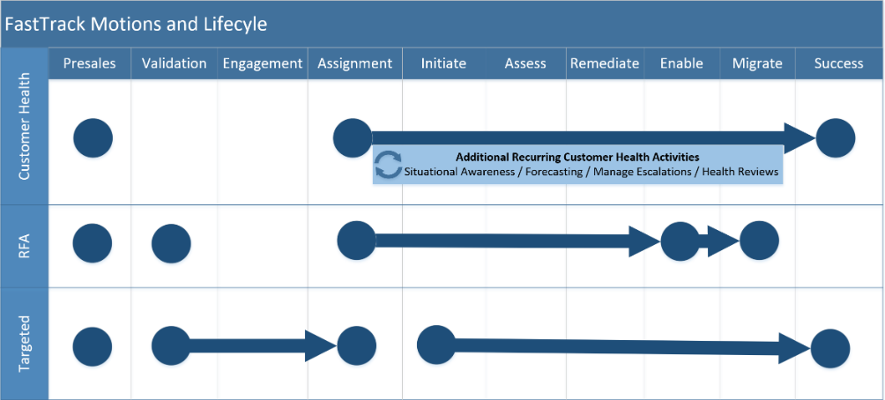

---
# required metadata
title: FastTrack Partner Playbook
description: FTC Playbook for FastTrack Ready Partners
author: Patric Grimwood 
ms.author: Celia Kennedy
manager: v-cekenn
ms.date: 05/02/2019
ms.topic: partner-playbook
ms.prod: non-product-specific
ms.custom: partner-playbook
ft.audience: partner  
ft.owner: pagrim
---

# FastTrack Playbook

## Overview

The FastTrack Center Benefit for Microsoft 365 provides guidance for planning, deployment, and adoption including remote access to Microsoft engineering expertise, best practices, tools, and resources. FastTrack for Microsoft 365 helps organizations and their partners accelerate deployment and gain end-user adoption of Office 365, Enterprise Mobility + Security, and Windows 10. Included in eligible Microsoft 365 subscriptions at no additional cost, FastTrack can help onboard to Microsoft 365 services, migrate data, protect customer's organization from cybersecurity threats, enable effective teamwork, and keep your devices and apps up to date. This includes:

- Ongoing, repeatable benefits included in your subscription.
- Delivery by Microsoft engineers or approved partners.
- Online resources and tools available to all customers.

# FastTrack Motions and Lifecycle

## Engagement Motions

One deployment option does not fit the diverse situations of Microsoft M365 customers. FastTrack utilizes multiple engagement models to best support a customer's cloud deployment journey. 

> [!NOTE]
> It is possible that a customer may engage in multiple motions during their lifecycle.
>
> For example, Commercial Services Monthly Active Usage (**CSMAU**) model searches for customers that meet certain critera and then may utilize the processes from the **Re-engagement** model before passing that customer back to the **Proactive** model.

## FY20 Priority

In FY20, various priorities exist to better empower our customers and ensure their success with M365.  These are:

## Get Modern

- [Overview, Objectives, and Approach](approach-get-modern.md)
- [Microsoft 365 Apps Standalone Engagement](approach-opp-365-standalone.md)
- [Security and Compliance](approach-security-compliance.md)
- Skype for Business to Teams Transition
- Teams Rooms
- Edge Adoption

## Customer Lifecycle

A customer's onboarding journey will progress through various phases. The number
of phases can vary based on the engagement model.

### FastTrack Phases

1. [Initiate](phase-initiate.md)

2. [Assess](phase-assess.md)

3. [Remediate](phase-remediate.md)

4. [Enable](phase-enable.md)

5. [Migrate](phase-migrate.md)

### Adoption Planning

FastTrack provides various adoption services that occur across several different lifecycle phases.

[Adoption Continuum](adoption-continuum-partner.md)

### Guidance

- [Crafting an Effective Entitlement Status Note](status-guidance-entitlement-status-notes.md)

### Refresh Summary

|Date|Who Changed|What Changed|
|---------|---------------|----------------------------|
|05/12/2020| James Collins| General Maintenance|
|11/05/2019| Celia Kennedy| General Maintenance|
|10/04/2019| Celia Kennedy|  General Maintenance|

[Home](http://partner-docs.microsoft.com)
