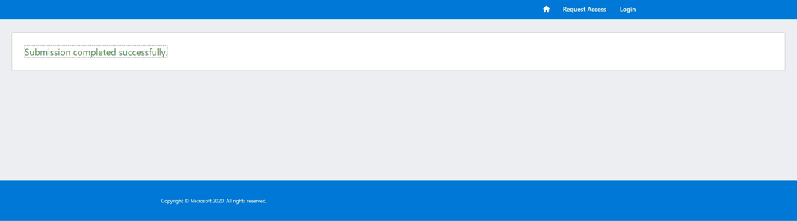
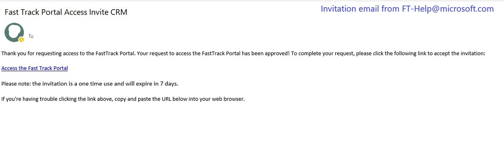
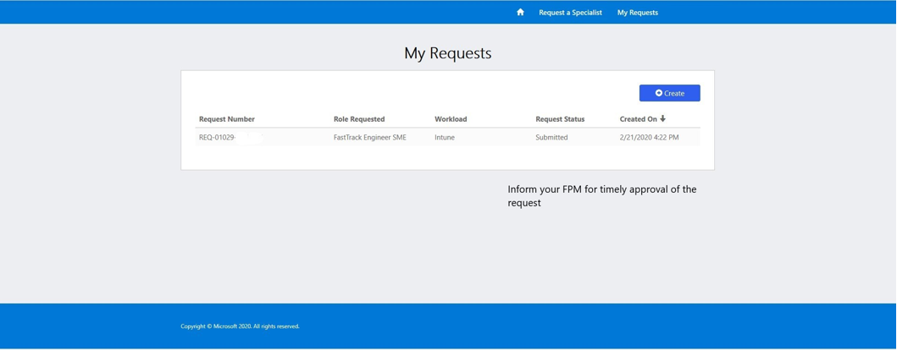

---  
# required metadata  
title: FastTrack Partner Playbook - Subject Matter Expert Resources
description: FastTrack Partner Playbook - Subject Matter Expert Resources
author: Celia Kennedy
ms.author: v-cekenn
manager: pagrim
ms.date: 02/24/2020 
ms.topic: partner-playbook  
ms.prod: non-product-specific  
ms.custom: partner-playbook  
ft.audience: partner
ft.owner: pagrim
---  

# Anforderung von Subject Matter Expert-Ressourcen (SME) von FastTrack

## Bestimmung der erforderlichen SME-Rolle

Ein Hauptvorteil für qualifizierte FastTrack-Partner ist die Verfügbarkeit eines Subject Matter Expert (SME) für umfassende Hilfestellung (technisch und/oder Bereitstellung) für den **qualifizierten FastTrack-Partner (FastTrack Ready Partner, FRP)** und den Kunden. Subject Matter Experts haben Expertenwissen in spezifischen Arbeits-, Kern- oder Sicherheits-/Compliancebereichen gezeigt.

Der FRP kann einen SME anfordern, und der FastTrack Partner Manager (FPM) (ehemals Partner Success Manager (PSM)) ist für die Genehmigung der Anforderung verantwortlich. Wenn die Anforderung genehmigt wurde, wird ein SME zugewiesen. Der SME arbeitet in den meisten Szenarios mit dem FRP und nicht dem Kunden zusammen.

Ein SME kann über die [Seite zur Anforderung einer FTC-Ressource](https://aka.ms/frpsmerequest) angefordert werden und die folgenden Rollen einbeziehen:

- **FastTrack Engineer SME:** unterstützt bei FRP-Arbeitsbereichen  

- **FastTrack-Migrationsressource:** verfügbar, um auf Fragen zur Exchange-Migration zu antworten  

Ein FRP arbeitet mit seinem FPM zusammen, um Rollenanforderungen und Erwartungen zu bestimmen, bevor die Anforderung übermittelt wird.

Unten finden Sie einige zusätzliche Details für **Security & Compliance SME**-Anforderungen:

| Arbeitsbereich | Region | Sprache | Lizenzanzahl | Subject Matter Expert/Schritte für Routing-Anforderung|
|:-----------:|:-----------:|:-----------:|:-----------:|:-----------:|
| AADP P1 & P2 |Nord- und Südamerika, APJ, EMEA | WW FTC unterstützt | Mehr als 150 Arbeitsplätze | Nexus FTC-Ressourcenanforderungstool > AADP-Arbeitsbereich auswählen |
| OATP P1 & P2 |Nord- und Südamerika, APJ, EMEA | Englisch | Mehr als 150 Arbeitsplätze | Nexus FTC-Ressourcenanforderungstool > OATP-Arbeitsbereich |
| MDATP |Nord- und Südamerika, APJ, EMEA | Englisch | Mehr als 150 Arbeitsplätze | Nexus FTC-Ressourcenanforderungstool > MDATP-Arbeitsbereich auswählen |
| AIP P2 |Nord- und Südamerika, APJ, EMEA | Englisch | Mehr als 150 Arbeitsplätze | Nexus FTC-Ressourcenanforderungstool > AIP-Arbeitsbereich auswählen |
| MIG P2 |Nord- und Südamerika, APJ, EMEA | Englisch | Mehr als 150 Arbeitsplätze | Nexus FTC-Ressourcenanforderungstool > Sicherheit und Compliance auswählen |
| MCAS |Nord- und Südamerika, APJ, EMEA | Englisch/begrenzt| Mehr als 10.000 Arbeitsplätze | Nexus FTC-Ressourcenanforderungstool > Sicherheit und Compliance auswählen |
| AATP |Nord- und Südamerika, APJ, EMEA | Englisch/begrenzt | Mehr als 10.000 Arbeitsplätze | Nexus FTC-Ressourcenanforderungstool > Sicherheit und Compliance auswählen |

| Arbeitsbereich | Region | Sprache | Lizenzanzahl | *Nur Ressourcen zur selbstständigen Bereitstellung*|
|:-----------:|:-----------:|:-----------:|:-----------:|:-----------:|
| AIP P1 |Nord- und Südamerika, APJ, EMEA | Englisch | Keine Einschränkung |[Keine Personalressourcen verfügbar – Anleitung zur selbständigen Bereitstellung](https://docs.microsoft.com/en-us/azure/information-protection/)|
| MCAS |Nord- und Südamerika, APJ, EMEA | Nur Englisch | Weniger als 10.000 Arbeitsplätze | [Keine Personalressourcen verfügbar – Anleitung zur selbständigen Bereitstellung](https://docs.microsoft.com/en-us/cloud-app-security/)|
| AATP |Nord- und Südamerika, APJ, EMEA | Nur Englisch | Weniger als 10.000 Arbeitsplätze | [Keine Personalressourcen verfügbar – Anleitung zur selbständigen Bereitstellung](https://docs.microsoft.com/en-us/azure-advanced-threat-protection/)|
| MIG P1|Begrenzt/ausnahmebasiert| Nur Englisch | Mehr als 5.000 Arbeitsplätze | Nexus FTC-Ressourcenanforderungstool > Sicherheit und Compliance auswählen|

## Umfang der SME-Aktivitäten

SME-Unterstützung kann angefordert werden, um FRPs bei Kundenbereitstellungen, bei der Lösung von Bereitstellungsproblemen und bei der Weiterqualifizierung von FRPs zu unterstützen.  

- Technische Expertise für komplexe Probleme, Eskalationen und Szenarios

- Anleitung und Bereitstellungscoaching für:

    - alle FRP-Arbeitsbereiche (remote)
    - Kundengespräche zu Unternehmenswert und Einführung
    - Problemlösung für Arbeitsbereiche

- Partnerentwicklung für neue Arbeitsbereiche

- Anleitung und Coaching zu bewährten Methoden

- Vorteile der FastTrack-Migration – SME-Szenario mit direkter Zusammenarbeit mit Kunde

- SMEs leiten Kundenbeteiligungen **nicht**

- Bei Beteiligung unterstützt ein SME einen FRP, **ersetzt ihn aber nicht**

> [!NOTE]
> Die wiederholte Unterstützungsanforderung von FRPs für dasselbe Thema wird evtl. abgelehnt.

## Übermittlung einer SME-Anforderung

Der zugewiesene Kontakt oder Anforderer von einem FRP kann eine SME-Anforderung über die [Seite zur Anforderung einer FTC-Ressource](https://aka.ms/frpsmerequest) übermitteln.

- Befolgen Sie die Formularanweisungen, und füllen Sie die erforderlichen Felder aus. Bestimmte Arbeitsbereiche erfordern spezifische Details, um die am besten geeignete SME-Zuweisung zu bestimmen.  

- Der Prozess wird verzögert, wenn die angeforderten Informationen unvollständig oder falsch sind. Die Anforderung wird an den Anforderer zurückgegeben, um zusätzliche Details zu erhalten.

- Der FPM genehmigt die SME-Anforderung oder lehnt sie ab.

- Der FPM erhält eine E-Mail zur SME-Anforderung, wenn das Formular übermittelt wurde.  

- Der Anforderer erhält bei erfolgreicher Einreichung eine E-Mail-Benachrichtigung.

## Zugriff auf die Seite zur Anforderung einer FTC-Ressource

Auf der [Seite zur Anforderung einer FTC-Ressource](https://aka.ms/frpsmerequest) müssen Sie die erforderlichen Informationen übermitteln. Kontaktieren Sie Ihren FPM bei Zugriffs- oder Genehmigungsproblemen.

1. Klicken Sie auf **Zugriff anfordern**.

2. Übermitteln Sie die erforderlichen Informationen. Bitte beachten Sie Folgendes: **Wenn die E-Mail-Adresse für Ihren Benutzernamen nicht aktiviert ist, müssen Sie eine alternative Kontakt-E-Mail-Adresse angeben**, um sicherzustellen, dass Sie Benachrichtigungen erhalten.

3. Bildschirm "Einreichung abgeschlossen"

4. Warten auf E-Mail mit Einladung

5. Klicken Sie auf den Einladungslink, und akzeptieren Sie die angeforderten Berechtigungen.

6. Schließen Sie die Registrierung ab. (Einladungscode wird vorab ausgefüllt.)

## Übermittlung einer Anforderung für Themenexpertise

1. Gehen Sie in Ihrem Browser zur [Seite zur Anforderung einer FTC-Ressource](https://aka.ms/frpsmerequest), und melden Sie sich an.

")

2. Um eine SME-Anforderung **zu erstellen** und **zu übermitteln**, klicken Sie unten links unter "Meine Ressourcenanforderungen" auf "Neues Element". (Sehen Sie sich die Abbildung unten zur Verdeutlichung an.)

3. Füllen Sie alle erforderlichen Felder aus, und wählen Sie **Übermitteln** aus.

Füllen Sie alle erforderlichen Felder aus, einschließlich zusätzlicher Informationen zur Identifizierung der angemessenen Ressource für Ihre Anforderung.

- Tenant-ID

    - Tenant-ID des Kunden  

- Tenant-Name

    - Kundenname in FTOP  

- Tenant-Segment

    - "SMC" oder "Enterprise" basierend auf der Größe des Kunden  

- Arbeitsplatzanzahl

    - Anzahl der aktiven Lizenzen des Kunden für diesen Arbeitsbereich  

- Ihr Delivery Team

    - FTP-Partner (Auswahl aus Liste)  

- Name des Partners

    - Unternehmensname (Auswahl aus Liste)  

> [!NOTE]
> Wenn Ihr Unternehmensname nicht in der Liste mit Partnernamen enthalten ist, kontaktieren Sie Ihren FPM.  

- Region

    - Kundenregion:

        - Amer (Amerika)

        - APJ (Asien, Pazifik, Japan)

        - EMEA (Europa, Naher Osten, Afrika)  

- E-Mail-Adresse des Partners

  - Kontakt für SME-Anforderung. Bei Fragen ist dies die Person, die der FPM kontaktiert, um weitere Informationen zu erhalten.  

- Rollen-Anforderung

    - Wählen Sie eine Rolle aus.:  

        - Wählen Sie für Migrations-SMEs "FastTrack-Migrationsressource" aus.  

        - Wählen Sie für arbeitsbereichspezifische SMEs "FastTrack Engineer SME" aus.  

> [!NOTE]
> Wenn Sie Fragen zu Rollen haben, kontaktieren Sie bitte Ihren FPM.

- Angeforderter Arbeitsbereich

    - Wählen Sie einen Arbeitsbereich aus, für den ein SME benötigt wird.

- Primäre Sprache

    - Wählen Sie eine primäre Sprache für den SME aus.  

- Sekundäre Sprache
  
    - Wählen Sie eine sekundäre Sprache für den SME aus.  

- Zusätzliche Informationen zu Ihrer Anforderung oder Beteiligung, die hilfreich sein könnten. Fügen Sie die Informationen in diesem Feld hinzu.:  

    - Geben Sie den FPM an, an den die Anforderung weitergeleitet werden soll.  

    - Alle erwähnenswerten Informationen über die Anforderung für den SME, **einschließlich** der Rechtfertigung für den SME  

    - Fügen Sie für Migrationen alle relevanten Informationen zur E-Mail-Quelle (Lotus Notes usw.) hinzu.

4. Verfolgen Sie die Anforderung.

## SME-Anforderung – Zeitachsen

Nach der Fertigstellung einer Übermittlung wird die Anforderung gesichtet.

- Innerhalb von 5 Minuten nach der Übermittlung der Anforderung sollten Sie eine automatische E-Mail erhalten, die bestätigt, dass die SME-Anforderung übermittelt wurde.  

>[!HINWEIS]
>Falls Sie keine Benachrichtigung erhalten, wenden Sie sich an Ihren FPM und das FastTrack SME Assignment Team unter **ftsmeassign@microsoft.com**, um Hilfe zu erhalten.  

- Der FPM genehmigt die SME-Anforderung oder lehnt sie ab.

- Innerhalb 1 Werktages wird die SME-Anforderung gesichtet. Wenn zusätzliche Informationen erforderlich sind, werden Sie benachrichtigt.

- Die SME-Anforderung wird innerhalb von 5 Tagen nach Übermittlung genehmigt und eine Ressource zugewiesen. Oder die SME-Anforderung wird abgelehnt, und Sie erhalten eine Benachrichtigung.  

- Wenn ein SME zugewiesen wurde, werden Sie direkt vom SME kontaktiert.

- Der FPM schließt die Anforderung auf der Website dann.

## Proaktive SME-Zuweisung durch Microsoft für Partner

Unter bestimmten Umständen wird ein SME proaktiv von Microsoft mit Zustimmung eines FRP zugewiesen. Das Ziel ist, einen Partner durch Coaching über Kundenbeteiligungen weiterzuqualifizieren. Diese Beteiligungen werden für einen spezifischen Zeitraum festgelegt, mit vereinbarten Ergebnissen. 

## SME-Anforderungen – Ablehnungen

Bitte erörtern Sie alle Fragen mit dem FPM, bevor Sie die Anforderung übermitteln, um Ablehnungen basierend auf den unten aufgeführten Problemen zu vermeiden::  

- Wenn Sie den Abschnitt *Zusätzliche Informationen* nicht ausfüllen, stehen evtl. nicht genügend Informationen zur Genehmigung bereit.

- Wenn Sie SME-Unterstützung für dasselbe Thema für mehrere Kunden anfordern.  

## Onboarding eines SME  

Wenn ein SME von Microsoft zugewiesen wurde, erhält der Anforderer eine Benachrichtigung mit den Onboarding-Schritten. Ein SME kann direkt Kontakt aufnehmen. Es wird erwartet, dass der FRP zusammen mit FPM und SME Erwartungen, Ergebnisse, Exit-Kriterien und Zeitachsen genau festlegt (zum Beispiel: Leitfäden für den Kundenkontakt, FE Shadowing, FTOP-Aufgabenausführung) und fallbezogene Kriterien zur Freigabe des SME erstellt, sobald die Aktivitäten abgeschlossen sind.

## Verantwortlichkeiten und Erwartungen während SME-Beteiligung  

Im Folgenden werden die Rollen und Verantwortungsbereiche einer SME-Beteiligung beschrieben.

## Qualifizierter FastTrack-Partner (FRP)

- Wenden Sie sich **zuerst** an den FPM, und halten Sie ihn auf dem Laufenden.

- Wenn ein SME zugewiesen wurde, erhält der FRP eine Benachrichtigung mit den nächsten Schritten.  

- Arbeiten Sie mit dem FPM und SME zusammen, um Erwartungen, Ergebnisse, Exit-Kriterien und Zeitachsen (Leitfäden für den Kundenkontakt, FE Shadowing, FTOP-Aufgabenausführung usw.) und fallbezogene Kriterien zur Freigabe des SME genau festzulegen, sobald die Aktivitäten abgeschlossen sind. 

- Wenn ein SME die Beteiligung beendet, kontaktieren FRPs sie nur direkt in Bezug auf neue oder vorhandene Probleme, wenn sie vorher den FPM konsultiert haben.

- Übernehmen Sie Verantwortung, und lernen Sie von SMEs, um Ressourcen bei jeder Beteiligung weiterzuqualifizieren und zusätzliche Ressourcen beim Partner in Bezug auf das Thema zu schulen.

- Minimieren Sie das Anfordern von SMEs für ähnliche Szenarios, außer bei der Datenmigration.

## FastTrack Partner Manager (FPM)

- Der FPM kümmert sich um Probleme, Bedenken und Eskalationen im Zusammenhang mit der SME-Anforderung.

- Prüfen und genehmigen Sie SME-Anforderungen, oder lehnen Sie diese ab.

- Stellen Sie Engagement von Seiten des Kunden sicher, um spezifische Ressourcen in Bezug auf Erkenntnisse aus der Beteiligung zuzuweisen.

- Arbeiten Sie mit dem SME und Partner zusammen, um Erwartungen, Ergebnisse, Exit-Kriterien und Zeitachsen genau zwischen Kunde, SME und Partner festzulegen.

- Ziehen Sie Partner zur Verantwortung, Erkenntnisse aus jeder Beteiligung zu ziehen, indem Sie deren aktive Teilnahme sicherstellen.

- Überwachen Sie, dass SME **Anforderungen nicht** wiederholt für ähnliche Szenarios erfolgen.

## Subject Matter Expert (SME)

- Arbeiten Sie mit dem Partner und FPM zusammen, um den Kunden zu unterstützen. Es kann Umstände geben, in denen der SME direkt mit dem Kunden zusammenarbeitet und der Partner unterstützt.

- Befolgen Sie die FastTrack-Dienstbeschreibung, und ermöglichen Sie es dem Partner, gemäß der Dienstbeschreibung zu agieren.

- Aktualisieren Sie die Informationen über das FastTrack-Orchestrierungsportal (FTOP), um dem FPM und Partner bei Fertigstellung des Diensts eine Zusammenfassung bereitzustellen.

- SMEs müssen Feedback zur Beteiligung sammeln und dieses mit dem FPM teilen. Der FPM ist im FTOP aufgelistet.

### Zusammenfassung der Aktualisierung

|Datum|Geändert durch|Änderung an|
|---------|---------------|----------------------------|
|03/28/2020| Celia Kennedy| Allgemeine Aktualisierung |
|02/28/2020| Celia Kennedy| Leitfaden für Partner zur SME-Beteiligung |

[Startseite](http://partner-docs.microsoft.com)
