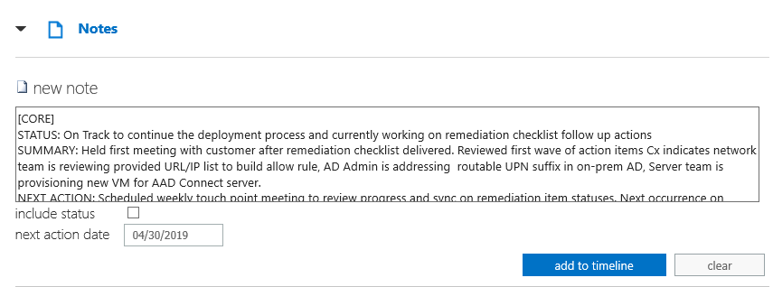

---  
# required metadata  
title: FastTrack Partner Playbook - FE/SME Notes Guidance 
description: FastTrack Partner Playbook - FTOP Notes Guidance 
author: Celia Kennedy
ms.author: v-cekenn
manager: pagrim
ms.date: 10/03/2019  
ms.topic: partner-playbook  
ms.prod: non-product-specific
ms.custom: partner-playbook  
ft.audience: partner
ft.owner: partner
--- 

# Guia de Observações do FE/SME

> [!IMPORTANT]
> Para rastrear e monitorar todos os clientes do M365 que solicitam assistência à implantação ou aceleram os planos de implantação devido ao COVID-19, todas as observações devem incluir a hashtag **#covid**. Além disso, emitimos o guia de observações a seguir:  
>
> Para clientes que expressam a necessidade de **pausar ou interromper a implantação, não adicione #covid** e, em vez disso, atualize o Status do Direito (L1/L2/L3) para refletir essa alteração.  

>**Função:** Gerente Microsoft FastTrack  
>**Ação necessária:** Atualizar observações de **Gerenciamento de Envolvimento** e/ou **Intenção de Serviço** para clientes que aceleraram suas prioridades de implantação/adoção devido ao COVID19. **Incluir a hashtag #covid**  

>**Função:** FE/SME/GMFTA/MVM  
>**Ação necessária:** Atualizar observações de **Ativação Técnica** para clientes que aceleraram suas prioridades de implantação/migração/adoção devido ao COVID19. **Incluir a hashtag #covid**  

>**Função:** Arquiteto Microsoft FastTrack  
>**Ação necessária:** Atualizar observações de **Status Corporativo** usando a **seção Resumo Executivo do modelo** para clientes que aceleraram suas prioridades de implantação/adoção devido ao COVID19. **Incluir a hashtag #covid**  

>**Função:** Gerente de Gateway  
>**Ação necessária:** Atualizar o **Gerenciamento de Envolvimento** quando identificamos clientes que desejam acelerar a implantação de um serviço devido ao COVID19. **Incluir a hashtag #covid**

O guia está sendo comunicado para garantir que estamos seguindo um processo consistente em todas as regiões. Isso melhorará a previsibilidade e reduzirá a confusão sobre quais observações vão para onde e com que frequência elas precisam ser registradas.

Função Principal: **Engenheiro FastTrack; Engenheiro FastTrack SME**  
Aplica-se a: **Todos os Serviços**

## Objetivos
As funções de FE e FE SME devem registrar observações no Portal de Orquestração do Microsoft FastTrack (FTOP) durante toda a duração de seus envolvimentos com os clientes. As observações devem ser registradas ao realizar Discussões sobre Valor de Negócios (BVD), Workshops Técnicos, Workshops de Sucesso, Atividades de remediação, Atividades de ativação e outras atividades específicas para capturar o status do trabalho. Este documento detalha as expectativas para o FE/SME em relação a frequência, localização, conteúdo e formato das observações.

##  Frequência
As observações devem ser registradas no FTOP sempre que um FE/SME interage com um cliente ou stakeholder interno ou realiza uma atividade relacionada ao trabalho. Alguns exemplos são os seguintes:

- Reunião de abertura
- Discussões de BVD
- Workshops Técnicos
- Avaliar atividades
- Reuniões de remediação e ações de acompanhamento
- Reuniões de ativação
- Testes ou reproduções durante a implantação do cliente e atividades relacionadas

##  Local
O FE/SME registrará os detalhes da observação na seção de entrada **Tempo** no FTOP usando a tarefa de acompanhamento de tempo de workload que melhor se alinhar às atividades do guia estratégico que estiver
realizando.

Se nenhum workload na lista for aplicável, use a tarefa Tempo de Integração Principal. Se vários workloads se aplicarem (ou seja, Centro de conformidade, Outlook Mobile no Intune), registre uma observação e use o prefixo na entrada da observação para refletir as outras observações.

**Exemplos**

- As observações das discussões de BVD serão registradas na tarefa de acompanhamento de tempo do workload. 
- As observações para workshops técnicos e atividades de remediação que se aplicam a um workload específico serão registradas na tarefa de acompanhamento de tempo do workload.
- As observações para atividades que não se alinham diretamente a um workload específico, como, entre outros, tenant e licenciamento, rede, sincronização/autenticação de cliente e diretório, serão registradas na tarefa principal de tempo de integração.

##  Conteúdo e Formato de Observações

Cada observação de FE/SME precisa incluir o seguinte conteúdo:

**Modelo para Entradas de Observações**

- WORKLOAD AFETADO
- STATUS: Breve declaração resumida sobre o status do envolvimento
- RESUMO: Incluir uma sinopse das atividades realizadas durante a interação
- PRÓXIMA AÇÃO: Indicar a próxima ação e quando ela está agendada para ocorrer em seguida
- PREOCUPAÇÕES: Inserir as preocupações aqui, quando aplicável

1. Workload Afetado: Prefixar cada entrada de observação com o workload discutido na primeira linha da entrada de observação.

   **Formato Esperado**
   -  [EXO] Exchange Online
   -  [SPO] SharePoint Online
   -  [OD] OneDrive for Business
   -  [YAM] Yammer Enterprise
   -  [OPP] Office 365 ProPlus
   -  [TEAMS] Teams    
   -  [INTUNE] Intune
   -  [AADP] Azure Active Directory Premium
   -  [MCAS] Microsoft Cloud App Security
   -  [AIP] Azure Information Protection
   -  [OLM] Outlook Mobile
   -  [PROJ] Project Online
   -  [WDATP] Windows Defender ATP
   -  [WIN10] Windows 10
   -  [SDS] Classroom/School Data Sync (SDS)
   -  [IDSEC] Segurança de Identidade
   -  [CORE] Para aqueles que não se enquadram nos workloads acima
   -  [OLM+INTUNE] Exemplo para vários workloads afetados

2. Status técnico de workload: Incluir uma das seleções de status a seguir.

   **Formato Esperado**

- STATUS: Breve frase sobre o status do envolvimento
   - No prazo
   - Em pausa
   - Comentários do cliente pendentes
   - Comentários do FastTrack Center (FTC) ou internos pendentes

3. Resumo de detalhes da atividade
   **Formato Esperado**

- RESUMO: Incluir uma sinopse das atividades realizadas durante a interação das atividades

4. Próxima ação/próxima data de ação
   **Formato Esperado**

- PRÓXIMA AÇÃO: Próximas etapas esperadas e quando estão agendadas para ocorrer

5. Preocupações
   **Formato Esperado**

- PREOCUPAÇÕES: Detalhes sobre a natureza da preocupação (software próprio, software ou hardware de terceiros, preocupação de negócios, segurança, recursos do projeto ou financiamento).   

  Observação: Nos casos em que são identificadas preocupações com software próprio, é necessário fazer referência à ID de Insight de FTC correspondente.

**Exemplos de Observações**

- CORE
- STATUS: No prazo para continuar o processo de implantação e atualmente trabalhando nas ações de acompanhamento da checklist de remediação.
- RESUMO: Realizou a primeira reunião com o cliente após a entrega da checklist de remediação. Examinou a primeira onda de itens de ação que o cliente indica que a equipe de rede está examinando; forneceu lista de URLs (URL) / Protocolo da Internet (IP) para criar regra de permissão; o administrador do Active Directory (AD) está abordando o sufixo de nome UPN (UPN) roteável no AD on-premises; a equipe do Servidor está provisionando uma nova máquina virtual (VM) para o servidor do Azure AD Connect.
- PRÓXIMA AÇÃO: Reunião semanal agendada de pontos de contato para examinar o progresso e a sincronização dos status dos itens de remediação. Próxima ocorrência em 30 de abril de 2019.
- PREOCUPAÇÕES: A equipe de rede do cliente relata que seu firewall de terceiros pode não dar suporte a conjuntos de regras baseados em URL curinga, o que eles afirmam ser um requisito, com base nos amplos requisitos do conjunto de regras. O cliente indica que sua implantação será adiada se nenhuma opção de atualização estiver disponível, pois será necessária a substituição, o que exigirá financiamento, aquisição e implantação.

###  Resumo de Atualização

|Data|Quem Mudou|O Que Mudou|
|---------|---------------|----------------------------|
|05/04/2020| Celia Kennedy|  Manutenção Geral|
|03/25/2020| Celia Kennedy| Manutenção Geral|
|09/27/2019| Celia Kennedy| Guia Estratégico do Parceiro Atualizado|

[Início](http://partner-docs.microsoft.com)
