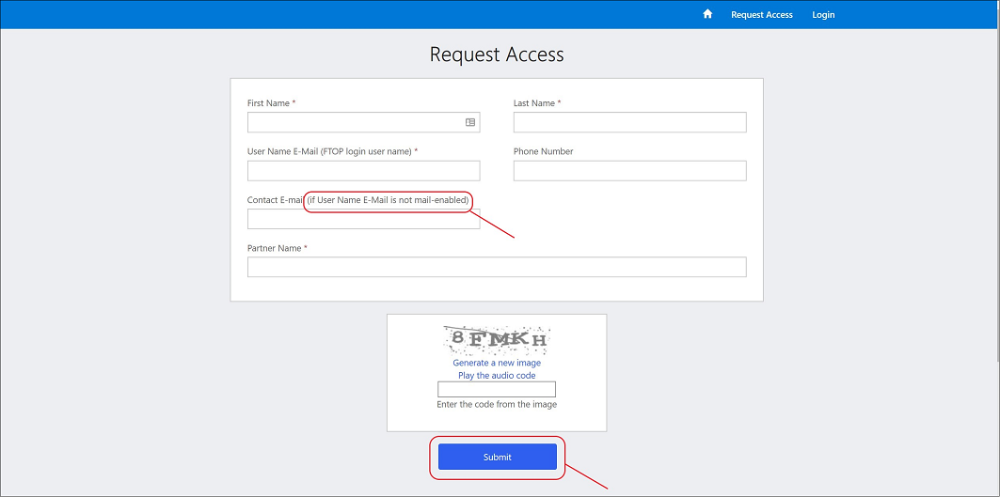
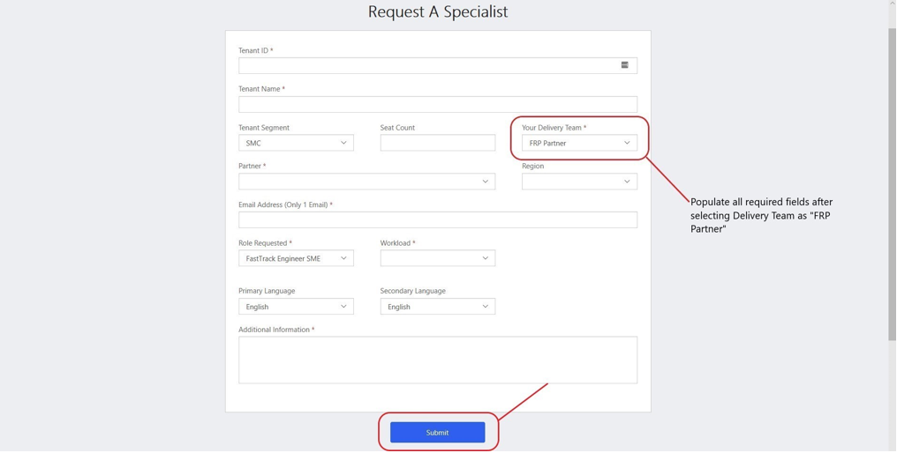

---  
# required metadata  
title: FastTrack Partner Playbook - Subject Matter Expert Resources
description: FastTrack Partner Playbook - Subject Matter Expert Resources
author: Celia Kennedy
ms.author: v-cekenn
manager: pagrim
ms.date: 02/24/2020 
ms.topic: partner-playbook  
ms.prod: non-product-specific  
ms.custom: partner-playbook  
ft.audience: partner
ft.owner: pagrim
---  

# Solicitar Recursos de Especialista no Assunto do Microsoft FastTrack (SME)

##  Determinar Função Necessária do SME

Um benefício importante para os Microsoft FastTrack Ready Partners é a disponibilidade de um Especialista no Assunto (SME) para fornecer um guia técnico e/ou de implantação aprofundado ao **FastTrack Ready Partner (FRP)** e ao cliente. Especialistas no Assunto demonstraram níveis especializados de conhecimento em áreas específicas de workload, centrais ou de segurança e conformidade.

O FRP pode solicitar um SME e o Gerente FastTrack (FPM) (conhecido como Gerente de Sucesso do Cliente (PSM)) é responsável por aprovar solicitações. Depois que a solicitação for aprovada, um SME será atribuído. O SME trabalhará com o FRP e não com o cliente na maioria dos cenários.

Um SME pode ser solicitada por meio da [página de Solicitação de Recurso do FTC](https://aka.ms/frpsmerequest) e pode incluir as seguintes funções:

- **Engenheiro FastTrack SME:** auxilia em qualquer workload de FRP  

- **Recurso de Migração do Microsoft FastTrack:** disponível para responder a perguntas de migração do Exchange  

Um FRP trabalha com seu FPM para determinar os requisitos e expectativas da função antes de enviar a solicitação.

Abaixo estão alguns detalhes adicionais para fazer Solicitações de **SME de Segurança e Conformidade**:

| Workload | Região | Idioma | Contagem de Licenças | Especialista no Assunto/Etapas de Roteamento da Solicitação|
|:-----------:|:-----------:|:-----------:|:-----------:|:-----------:|
| AADP P1 & P2 |Américas, APJ, EMEA | WW FTC com Suporte | Mais de 150 estações | Ferramenta de Solicitação de Recurso de FTC Nexus > Selecionar workload do AADP |
| OATP P1 & P2 |Américas, APJ, EMEA | Inglês | Mais de 150 estações | Ferramenta de Solicitação de Recurso de FTC Nexus > workload do OATP |
| MDATP |Américas, APJ, EMEA | Inglês | Mais de 150 estações | Ferramenta de Solicitação de Recurso de FTC Nexus > Selecionar workload de MDATP |
| AIP P2 |Américas, APJ, EMEA | Inglês | Mais de 150 estações | Ferramenta de Solicitação de Recurso de FTC Nexus > Selecionar workload do AIP |
| MIG P2 |Américas, APJ, EMEA | Inglês | Mais de 150 estações | Ferramenta de Solicitação de Recurso de FTC Nexus > Selecionar Segurança e Conformidade |
| MCAS |Américas, APJ, EMEA | Inglês/Limitado| Acima de 10 mil estações | Ferramenta de Solicitação de Recurso de FTC Nexus > Selecionar Segurança e Conformidade |
| AATP |Américas, APJ, EMEA | Inglês/Limitado | Acima de 10 mil estações | Ferramenta de Solicitação de Recurso de FTC Nexus > Selecionar Segurança e Conformidade |

| Workload | Região | Idioma | Contagem de Licenças | *Apenas Recursos de Autoimplantação*|
|:-----------:|:-----------:|:-----------:|:-----------:|:-----------:|
| AIP P1 |Américas, APJ, EMEA | Inglês | No restriction (Sem restrição) |[Não há recursos disponíveis para as pessoas - guia de autoimplantação](https://docs.microsoft.com/en-us/azure/information-protection/)|
| MCAS |Américas, APJ, EMEA | Somente em inglês | Abaixo de 10 mil estações | [Não há recursos disponíveis para as pessoas - guia de autoimplantação](https://docs.microsoft.com/en-us/cloud-app-security/)|
| AATP |Américas, APJ, EMEA | Somente em inglês | Abaixo de 10 mil estações | [Não há recursos disponíveis para as pessoas - guia de autoimplantação](https://docs.microsoft.com/en-us/azure-advanced-threat-protection/)|
| MIG P1|Limitado/Baseado em Exceção| Somente em inglês | Acima de 5 mil estações | Ferramenta de Solicitação de Recurso de FTC Nexus > Selecionar Segurança e Conformidade|

## Escopo das Atividades do SME

A assistência de SME pode ser solicitada para ajudar FRPs nas implantações de clientes, ajudar a desbloquear problemas de implantação e ajudar a capacitar FRPs.  

- Conhecimento técnico referente a problemas complexos, escalonamentos e cenários

- Guia e treinamento sobre entrega para:

    - Todas os workloads de FRP remotamente
    - Conversas sobre adoção e valor comercial com o cliente
    - Desbloquear workloads

- Desenvolvimento de parceiros para novos workloads

- Guia e treinamento sobre práticas recomendadas

- Entrega de benefício de Migração do Microsoft FastTrack – cenário de SME em que eles trabalham diretamente com um cliente

- Os SMEs **não** liderarão envolvimentos de clientes

- Quando envolvido, um SME auxiliará um PRF, mas **não substituirá** o PRF

> [!NOTE]
> Os FRPs que solicitam assistência repetida para o mesmo tópico podem ter sua solicitação negada.

##  Enviar uma Solicitação de SME

O contato ou solicitante designado de um FRP pode enviar uma solicitação de SME usando a [página de Solicitação de Recursos de FTC.](https://aka.ms/frpsmerequest)

- Siga as instruções do formulário e preencha os campos obrigatórios, observando que determinados workloads exigirão detalhes específicos para determinar a atribuição de SME "mais adequada".  

- O processo será atrasado se as informações solicitadas estiverem incompletas ou incorretas. A solicitação será devolvida ao solicitante para a obtenção de detalhes adicionais.

- O FPM aprovará ou negará a solicitação de SME.

- O FPM receberá um email sobre a solicitação de SME assim que o formulário for enviado.  

- O solicitante receberá uma notificação por email após o envio bem-sucedido.

## Obter acesso à página de Solicitação de Recursos de FTC

Na [página de Solicitação de Recursos de FTC](https://aka.ms/frpsmerequest), você precisará enviar as informações necessárias. Entre em contato com o FPM se houver quaisquer problemas de acesso ou aprovação.

1. Clique em **Solicitar Acesso.**

2. Envie as informações necessárias. Observe que **se o email de seu nome de usuário não estiver ativado, você deverá fornecer um endereço de email de contato alternativo** para garantir que receba notificações.

3. Tela de Envio Concluído

4. Aguarde o Email de Convite

5. Clique no Link do Convite e Aceite as Permissões Solicitadas

6. Preencha o Registro (O Código do Convite será pré-preenchido)

## Enviar uma solicitação de Especialista no Assunto

1. No navegador, acesse a [Página de Solicitação de Recurso de FTC](https://aka.ms/frpsmerequest) e faça logon.

")

2. Para **criar** e **enviar** uma solicitação de SME, no canto inferior esquerdo, em Minhas Solicitações de Recursos, clique em "novo item". (Veja a imagem abaixo para esclarecimentos.)

3. Preencha todos os campos obrigatórios e selecione **Enviar.**

Preencha todos os campos obrigatórios, incluindo informações adicionais que podem ajudar a identificar qualquer recurso apropriado para sua solicitação.

- ID do tenant

    - A ID do tenant do cliente  

- Nome do Tenant

    - O nome do cliente como é exibido no FTOP  

- Segmento de Tenant

    - Selecione SMC ou Enterprise com base no porte do cliente  

- Contagem de Estações

    - Número de licenças ativas que o cliente tem para este workload  

- Sua Equipe de Entrega

    - Selecione o Parceiro FTP da lista  

- Nome do Parceiro

    - Selecione o nome de sua empresa na lista  

> [!NOTE]
> Se o nome de sua empresa não estiver na lista Nome do Parceiro, entre em contato com o FPM.  

- Região

    - Selecione a região do cliente:

        - Amer (Américas)

        - APJ (Ásia-Pacífico e Japão)

        - EMEA (Europa, Oriente Médio, África)  

- Endereço de Email do Parceiro

  - O ponto de contato para a solicitação de SME. Se houver dúvidas, essa é a pessoa com quem o FPM entrará em contato para obter mais informações.  

- Solicitação de Função

    - Selecione uma função:  

        - Para SME de Migração, selecione Recurso de Migração do Microsoft FastTrack  

        - Para SMEs específicos de workload, selecione SME Engenheiro FastTrack  

> [!NOTE]
> Se você tiver dúvidas sobre a função, entre em contato com o FPM.

- Workload Solicitado

    - Selecione um workload para o qual um SME é necessário

- Idioma Principal

    - Selecione um idioma principal para o SME  

- Idioma Secundário
  
    - Selecione um idioma secundário para o SME  

- Informações adicionais sobre sua solicitação ou o envolvimento que podem ser úteis. Inclua as informações nesta caixa:  

    - Nomeie o FPM para o qual a solicitação deve ser roteada  

    - Qualquer informação digna de nota sobre o pedido de SME, **incluindo** a justificativa para o SME  

    - Para migrações, inclua qualquer informação relevante sobre a origem do email (Lotus Notes etc.)

4. Acompanhe a Solicitação.

## Timelines de Solicitação de SME

Após a conclusão de um envio, a solicitação passa por um processo de triagem.

- Dentro de 5 minutos após o envio da solicitação, você deve receber um email automático confirmando que a solicitação de SME foi enviada.  

> [!OBSERVAÇÃO]
>Se uma notificação não for recebida, entre em contato com o FPM e a equipe de Atribuição de SME do Microsoft FastTrack em: **ftsmeassign@microsoft.com** para obter assistência.  

- O FPM aprovará ou negará a solicitação de SME.

- No prazo de um dia útil, a solicitação de SME será submetida à triagem. Se forem necessárias informações adicionais, você será notificado.

- Dentro de 5 dias após o envio, a solicitação de SME será aprovada e um recurso será atribuído, ou a solicitação de SME será negada e você será notificado.  

- Depois que um SME for designado, você será contatado diretamente pelo SME.

- O FPM encerrará a solicitação no site.

## Atribuição proativa de SME pela Microsoft para parceiros

Em certas circunstâncias, um SME será atribuído de forma proativa pela Microsoft, com o acordo com um FRP. Isso é feito com o objetivo de capacitar um parceiro para treiná-lo por meio de envolvimentos com clientes. Esses envolvimentos são definidos por um período específico, com resultados acordados. 

## Negação de Solicitação de SME

Discuta qualquer dúvida que você possa ter com o FPM antes de enviar a solicitação para evitar negações com base nos problemas listados abaixo:  

- Se você não preencher a seção *Informações adicionais*, talvez não haja informações suficientes para aprová-la.

- Se você solicitar assistência de SME para o mesmo tópico para vários clientes.  

##  Integração de um SME  

Depois que um SME for atribuído pela Microsoft, o solicitante receberá uma notificação com as etapas de integração. Um SME pode entrar em contato diretamente. Espera-se que o FRP participe com o FPM e SME para definir claramente expectativas, resultados, critérios de saída e timelines (por exemplo,: guia voltado para o cliente, sombreamento de FE, execução de tarefas de FTOP) e quaisquer critérios pertinentes para liberar o SME assim que as atividades estiverem concluídas.

## Responsabilidades e expectativas durante o Envolvimento do SME  

A seguir, estão as funções e responsabilidades de um envolvimento com um SME.

## FastTrack Ready Partner (FRP)

- Entrar em contato com o FPM **primeiro** e mantê-lo informado.

- Depois que um SME for atribuído, o FRP receberá uma notificação com as próximas etapas.  

- Participar com o FPM e SME para definir claramente expectativas, resultados, critérios de saída e timelines (guia voltado para o cliente, sombreamento de FE, execução de tarefas de FTOP etc.) e quaisquer critérios pertinentes para liberar o SME assim que as atividades estiverem concluídas. 

- Depois que um SME encerra o envolvimento, os FRPs não entram em contato diretamente com ele para quaisquer problemas novos ou existentes sem consultar o FPM.

- Responsabilizar-se pelo aprendizado com os SMEs para capacitar os recursos em todos os envolvimentos e treinar recursos adicionais do Parceiro sobre o assunto.

- Minimizar a solicitação de SMEs para cenários semelhantes, exceto para a migração de dados.

## Gerente de Parceiro FastTrack (FPM)

- O FPM tratará de questões, preocupações e encaminhamentos relacionados à solicitação de SME.

- Examinar e aprovar ou negar solicitações de SME.

- Garantir o envolvimento do parceiro para atribuir recursos específicos aos aprendizados do envolvimento.

- Colaborar com o SME e o Parceiro para definir claramente expectativas, resultados, critérios de saída e timelines entre o Cliente, o SME e o Parceiro.

- Responsabilizar os Parceiros pelo aprendizado de cada envolvimento, garantindo sua participação ativa.

- Monitorar se as solicitações de SME **não são feitas** para cenários semelhantes repetidamente.

## Especialista no Assunto (SME)

- Colaborar com o parceiro e o FPM para dar suporte ao cliente. Pode haver circunstâncias em que o SME trabalha diretamente com o cliente, com o parceiro em uma função de suporte.

- Seguir a descrição de Serviço do Microsoft FastTrack e permitir que o parceiro entregue a Descrição de Serviço.

- Atualizar as informações por meio do Portal de Orquestração do Microsoft FastTrack (FTOP) para fornecer um resumo ao FPM e ao parceiro após a conclusão do serviço.

- Os SMEs devem capturar comentários sobre o envolvimento e compartilhá-los com o FPM. O FPM está listado no FTOP.

###  Resumo de Atualização

|Data|Quem Mudou|O Que Mudou|
|---------|---------------|----------------------------|
|05/04/2020| Celia Kennedy|  Manutenção Geral|
|03/28/2020| Celia Kennedy| Manutenção Geral |
|02/28/2020| Celia Kennedy| Guia para o Parceiro de Envolvimento de SME |

[Início](http://partner-docs.microsoft.com)
