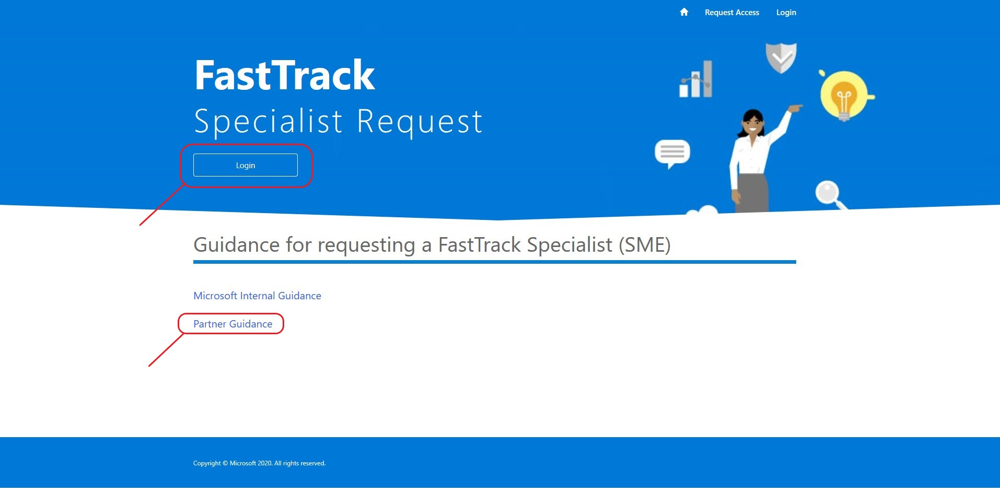

---
# required metadata  
title: FastTrack Partner Playbook - Subject Matter Expert Resources
description: FastTrack Partner Playbook - Subject Matter Expert Resources
author: Celia Kennedy
ms.author: v-cekenn
manager: pagrim
ms.date: 02/24/2020 
ms.topic: partner-playbook  
ms.prod: non-product-specific  
ms.custom: partner-playbook  
ft.audience: partner
ft.owner: pagrim
---

# 请求 FastTrack 主题专家 (SME) 资源

## 确定所需的 SME 角色

成为 FastTrack 就绪合作伙伴的一个重要好处是，主题专家 (SME) 可为 **FastTrack 就绪合作伙伴 (FRP)** 和客户提供高深的技术和/或部署指导。主题专家具备特定工作负载、核心或安全/合规领域的专家级知识。

FRP 可申请一位 SME，FastTrack 合作伙伴经理 (FPM)（以前称作合作伙伴成功经理 (PSM)）负责批准请求。批准请求后，将分配一位 SME。SME 在大多数情况下与 FRP（而非客户）合作。

SME 可通过 [FTC 资源请求页面](https://aka.ms/frpsmerequest)申请，包括以下角色：

- **FastTrack 工程师 SME：**协助完成任何 FRP 工作负载

- **FastTrack 迁移资源：**可响应 Exchange 迁移问题

FRP 在提交请求前与其 FPM 合作确定角色要求和期望。

下面是**安全与合规 SME** 请求的一些额外细节：

| 工作负载| 地区| 语言| 许可证计数| 主题专家/路由请求步骤|
|:-----------:|:-----------:|:-----------:|:-----------:|:-----------:|
| AADP P1 和 P2|美洲、APJ、EMEA| 支持 WW FTC| 多于 150 个席位| Nexus FTC 资源请求工具 > 选择 AADP 工作负载|
| OATP P1 和 P2|美洲、APJ、EMEA| 英语| 多于 150 个席位| Nexus FTC 资源请求工具 > OATP 工作负载|
| MDATP|美洲、APJ、EMEA| 英语| 多于 150 个席位| Nexus FTC 资源请求工具 > 选择 MDATP 工作负载|
| AIP P2|美洲、APJ、EMEA| 英语| 多于 150 个席位| Nexus FTC 资源请求工具 > 选择 AIP 工作负载|
| MIG P2|美洲、APJ、EMEA| 英语| 多于 150 个席位| Nexus FTC 资源请求工具 > 选择“安全与合规”|
| MCAS|美洲、APJ、EMEA| 英语/有限| 多于 10,000 个席位| Nexus FTC 资源请求工具 > 选择“安全与合规”|
| AATP|美洲、APJ、EMEA| 英语/有限| 多于 10,000 个席位| Nexus FTC 资源请求工具 > 选择“安全与合规”|

| 工作负载| 地区| 语言| 许可证计数| *仅限自助部署资源*|
|:-----------:|:-----------:|:-----------:|:-----------:|:-----------:|
| AIP P1|美洲、APJ、EMEA| 英语| 无限制|[无可用人力资源 - 自助部署指南](https://docs.microsoft.com/en-us/azure/information-protection/)|
| MCAS|美洲、APJ、EMEA| 仅限英语| 低于 10,000 个席位| [无可用人力资源 - 自助部署指南](https://docs.microsoft.com/en-us/cloud-app-security/)|
| AATP|美洲、APJ、EMEA| 仅限英语| 低于 10,000 个席位| [无可用人力资源 - 自助部署指南](https://docs.microsoft.com/en-us/azure-advanced-threat-protection/)|
| MIG P1|有限/基于例外情况而定| 仅限英语| 多于 5,000 个席位| Nexus FTC 资源请求工具 > 选择“安全与合规”|

## SME 活动范围

可请求 SME 协助 FRP 完成客户部署、解决部署问题并提升 FRP 能力。

- 关于复杂问题、上报事宜和场景的技术专业知识

- 为以下任务提供指南和辅导：

    - 所有远程 FRP 工作负载
    - 客户业务价值和应用对话
    - 解除工作负载障碍

- 合作伙伴的新工作负载开发

- 最佳实践指南和辅导

- FastTrack 迁移权益交付 – SME 直接与客户合作的场景

- SME **不**会领导客户接洽工作

- 在接洽工作中，SME 将协助 FRP，**而非替代** FRP

> [!NOTE]
> FRP 重复申请同一主题的协助可能会遭到拒绝。

## 提交 SME 请求

由 FRP 分配的联系人或请求者可使用 [FTC 资源请求页面](https://aka.ms/frpsmerequest)提交 SME 请求。

- 按照表单说明，填写必填字段，注意某些工作负载需要具体细节来确定“最适合”分配的 SME。

- 如果请求信息不完整或不正确，将导致该流程延误。该请求将返回给请求者，以要求提供更多细节。

- FPM 会批准或拒绝 SME 请求。

- 在表单提交后，FPM 将收到有关 SME 请求的电子邮件。

- 在成功提交后，请求者将收到一条电子邮件通知。

## 访问 FTC 资源请求页面

从 [FTC 资源请求页面](https://aka.ms/frpsmerequest)，你将需要提交所需的信息。有任何访问或批准问题，请联系 FPM。

1.单击**请求访问**。

2.提交所需信息。请注意，**如果你的用户名电子邮件不支持电子邮件，必须提供替代联系人电子邮件地址**以确保你收到通知。

3.提交完成屏幕

4.等待邀请电子邮件

5.单击邀请链接并接受请求的权限

6.完成注册（邀请代码将预先填充）

## 提交主题专业知识请求

1.在你的浏览器中，转到 [FTC 资源请求页面](https://aka.ms/frpsmerequest)并登录。

2.要**创建**和**提交** SME 请求，请在左下角“我的资源请求”下单击“新建项目”。（参见下图的说明。）

3.填写所有必填字段并点击**提交**。

填写所有必填字段，包括有助于为你的请求找到合适资源的额外信息。

- 租户 ID

    - 客户的租户 ID

- 租户名称

    - FTOP 中显示的客户名称

- 租户细分市场

    - 根据客户规模选择“SMC”或“企业”。

- 席位数量

    - 客户拥有的此工作负载的活动许可证数量

- 你的交付团队

    - 从列表中选择“FTP 合作伙伴”

- 合作伙伴名称

    - 从列表中选择贵公司的名称。

> [!NOTE]
> 如果贵公司的名称不在“合作伙伴名称”列表中，请联系你的 FPM。

- 地区

    - 选择客户所在的地区：

        - Amer（美洲）

        - APJ（亚太地区及日本）

        - EMEA（欧洲、中东、非洲地区）  

- 合作伙伴电子邮件地址

  - SME 请求的联系点。如果有问题，FPM 将联系此人获取更多信息。

- 角色请求

    - 选择一个角色:  

        - 对于迁移 SME，选择“FastTrack 迁移资源”

        - 对于特定于工作负载的 SME，选择“FastTrack 工程师 SME”

> [!NOTE]
> 如果你对角色有疑问，请联系你的 FPM。

- 请求的工作负载

    - 选择需要 SME 的工作负载

- 主要语言

    - 选择 SME 的主要语言

- 第二语言
  
    - 选择 SME 的第二语言

- 有关请求或接洽的更多有用信息。将信息填入此框:  

    - 指出应收到请求的 FPM

    - 有关 SME 请求的任何重要信息，**包括** 需要 SME 的理由

    - 对于迁移，填入有关电子邮件来源（Lotus Notes 等）的任何相关信息

4.跟踪请求。

## SME 请求时间线

完成提交后，请求将经历分类流程。

- 提交请求后的 5 分钟内，你应该会收到自动发送的电子邮件，证明 SME 请求已提交。

>[!注意]
> 如果未收到通知，请联系 FPM 和 FastTrack SME 分配团队以寻求帮助， 邮箱为 **ftsmeassign@microsoft.com**。  

- FPM 会批准或拒绝 SME 请求。

- 1 个工作日内将完成 SME 请求分类，如果需要更多信息，你会收到通知。

- 提交请求后的 5 天内，SME 请求将得到批准，之后将分配资源，如果请求被拒绝，你会收到通知。

- 分配 SME 后，SME 会直接联系你。

- 然后，FPM 会在网站上关闭该请求。

## Microsoft 主动为合作伙伴分配 SME

在特定情况下，Microsoft 会与 FRP 达成协议，主动分配 SME；其目的是辅导合作伙伴完成客户接洽，提升其能力水平。这类接洽有特定的时限，并商定了成果。

## SME 请求遭拒

在提交请求之前，请与 FPM 讨论你的任何问题，以避免因下列问题而遭到拒绝:  

- 如果不填写*其他信息*部分，可能信息不足，无法得到批准。

- 面对多位客户，就同一主题申请 SME 协助。

## 对接 SME  

Microsoft 分配 SME 后，请求者将收到对接步骤通知。SME 可能直接联系请求者。FRP 应该与 FPM 和 SME 一起清晰设定预期、成果、退出标准和时间线（例如: 面向客户的指南、FE 跟随学习、任务执行等）及任何相关标准，以便 SME 在完成活动后返回。

## SME 接洽期间的责任和预期

下表介绍了与 SME 接洽的角色和职责。

## FastTrack 就绪合作伙伴 (FRP)

- **首先**联系 FPM，保证他们知情。

- 分配 SME 后，FRP 将收到后续步骤的通知。

- 与 FPM 和 SME 一起清晰设定预期、成果、退出标准和时间线（例如面向客户的指南、FE 跟随学习、任务执行等）及任何相关标准，以便 SME 在完成活动后返回。

- SME 结束接洽后，FRP 必须先咨询 FPM，然后才能就新问题或现有问题直接联系他们。

- 在每次接洽中向 SME 学习，以提高资源的技能，并就该主题培训合作伙伴的其他资源。

- 尽量不要因相似的场景而申请 SME，数据迁移除外。

## FastTrack 合作伙伴经理 (FPM)

- FPM 将处理与 SME 请求相关的问题、疑虑和上报事宜。

- 审查并批准或拒绝 SME 请求。

- 确保合作伙伴承诺分配特定资源从接洽活动中学习。

- 与 SME 和合作伙伴合作，在客户、SME 和合作伙伴之间清晰设定预期、成果、退出标准和时间线。

- 确保合作伙伴积极参与，使其担起从每次接洽中学习的责任。

- 监督 SME **请求不因**相似场景而重复提出。

## 主题专家 (SME)

- 与合作伙伴和 FPM 合作支持客户。有时候，SME 直接与客户合作，而合作伙伴起辅助作用。

- 遵循 FastTrack 服务说明并让合作伙伴按服务说明工作。

- 通过 FastTrack 编排门户 (FTOP) 更新信息，以便在完成服务后向 FPM 和合作伙伴提供摘要。

- SME 捕捉有关接洽的反馈并分享给 FPM。FPM 在 FTOP 中列出。

### 刷新摘要

|日期|变更人|变更内容|
|---------|---------------|----------------------------|
|04/30/2020| Celia Kennedy|  常规维护|
|03/28/2020| Celia Kennedy| 常规维护|
|02/28/2020| Celia Kennedy| 面向 SME 接洽合作伙伴的指南|

[主页](http://partner-docs.microsoft.com)
