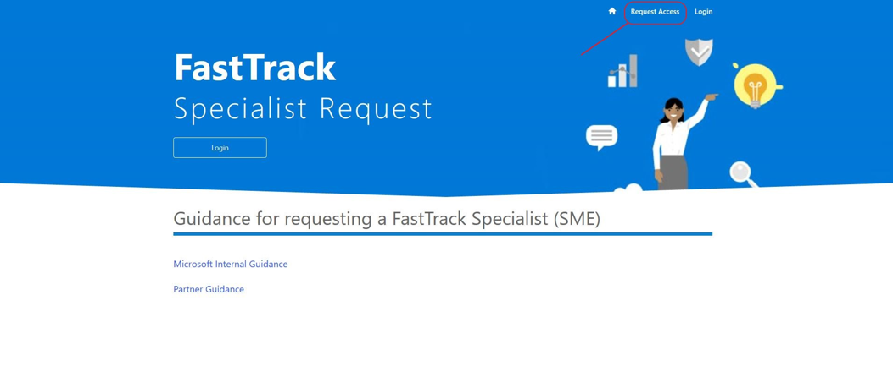
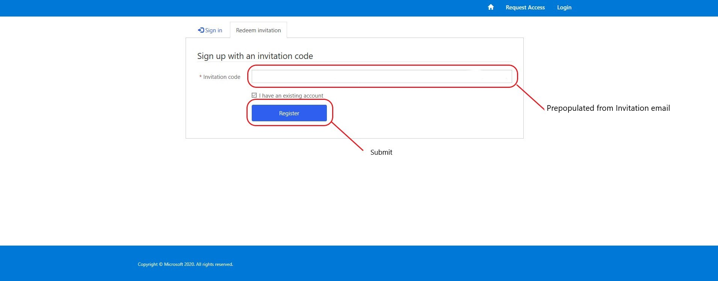
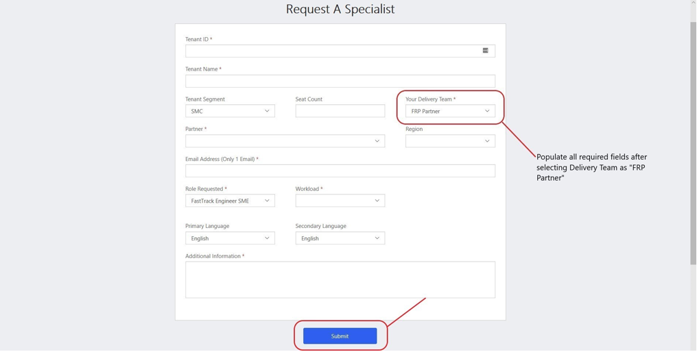

---  
# required metadata  
title: FastTrack Partner Playbook - Subject Matter Expert Resources
description: FastTrack Partner Playbook - Subject Matter Expert Resources
author: Celia Kennedy
ms.author: v-cekenn
manager: pagrim
ms.date: 02/24/2020 
ms.topic: partner-playbook  
ms.prod: non-product-specific  
ms.custom: partner-playbook  
ft.audience: partner
ft.owner: pagrim
---  

# Solicitar recursos de expertos SME de FastTrack (SME)

##  Determinar el rol de SME requerido

Un beneficio importante para los Socios listos para usar FastTrack es la disponibilidad de un Experto en la materia (SME) para brindarle al **Socio listo para FastTrack (FRP)** y al cliente orientación técnica a profundidad o de implementación. Los expertos en la materia han demostrado altos niveles de conocimiento en cargas de trabajo específicas, áreas centrales o de seguridad y cumplimiento.

El FRP puede solicitar un SME y el Administrador de socios de FastTrack (FPM) (conocido anteriormente como Administrador de éxito del socio (PSM)) es responsable de aprobar las solicitudes. Una vez aprobada la solicitud, se asignará un SME. El SME trabajará con el FRP en vez de con el cliente en la mayoría de los escenarios.

Se puede solicitar un SME a través de la [página de Solicitud de recursos del FTC](https://aka.ms/frpsmerequest) y puede incluir uno de los siguientes roles:

- **Ingeniero de FastTrack SME** ayuda en cualquier carga de FRP  

- **Recurso de migración de FastTrack:** disponible para responder a las preguntas de migración de Exchange  

Un FRP trabaja con sus FPM para determinar los requisitos y expectativas de rol antes de enviar la solicitud.

A continuación se encuentran detalles adicionales para realizar una solicitud de **SME de seguridad y cumplimiento**:

| Cargas de trabajo | Región | Idioma | Número de licencias | Experto en la materia: Pasos para solicitar enrutamiento|
|:-----------:|:-----------:|:-----------:|:-----------:|:-----------:|
| AADP P1 y P2 |América, APJ, EMEA | WW FTC con soporte | Más de 150 puestos | Herramienta de solicitud de recursos Nexus FTC > Seleccione carga de trabajo de AADP |
| OATP P1 y P2 |América, APJ, EMEA | Inglés | Más de 150 puestos | Herramienta de solicitud de recursos Nexus FTC >Carga de trabajo de OATP |
| MDATP |América, APJ, EMEA | Inglés | Más de 150 puestos | Herramienta de solicitud de recursos Nexus FTC >Seleccione carga de trabajo de MDATP |
| AIP P2 |América, APJ, EMEA | Inglés | Más de 150 puestos | Herramienta de solicitud de recursos Nexus FTC > Seleccione carga de trabajo de AIP |
| MIG P2 |América, APJ, EMEA | Inglés | Más de 150 puestos | Herramienta de solicitud de recursos Nexus FTC > Seleccione seguridad y cumplimiento |
| MCAS |América, APJ, EMEA | Inglés: Limitado| Más de 10 mil puestos | Herramienta de solicitud de recursos Nexus FTC > Seleccione seguridad y cumplimiento |
| AATP |América, APJ, EMEA | Inglés: Limitado | Más de 10 mil puestos | Herramienta de solicitud de recursos Nexus FTC > Seleccione seguridad y cumplimiento |

| Cargas de trabajo | Región | Idioma | Número de licencias | *Recursos de auto implementación solamente*|
|:-----------:|:-----------:|:-----------:|:-----------:|:-----------:|
| AIP P1 |América, APJ, EMEA | Inglés | Sin restricción |[No hay recursos de personal disponibles - guía de auto implementación](https://docs.microsoft.com/en-us/azure/information-protection/)|
| MCAS |América, APJ, EMEA | Inglés solamente | Menos de 10 mil puestos | [No hay recursos de personal disponibles - guía de auto implementación](https://docs.microsoft.com/en-us/cloud-app-security/)|
| AATP |América, APJ, EMEA | Inglés solamente | Menos de 10 mil puestos | [No hay recursos de personal disponibles - guía de auto implementación](https://docs.microsoft.com/en-us/azure-advanced-threat-protection/)|
| MIG P1|Basado en excepción/limitada| Inglés solamente | Más de 5 mil puestos | Herramienta de solicitud de recursos Nexus FTC > Seleccione seguridad y cumplimiento|

## Ámbito de las actividades de un SME

Se puede solicitar un SME para ayudar a los FRP con las implementaciones del cliente, asistir con problemas de desbloqueo de implementación y ayudar a mejorar las habilidades de los FRP.  

- Experiencia técnica para problemas complejos, escalamientos y escenarios

- Guía y entrenamiento para la entrega:

    - Todos los FRP realizan sus cargas de trabajo de forma remota
    - Conversaciones con el cliente de valor empresarial y adopción
    - Desbloquear cargas de trabajo

- Desarrollo del socio de nuevas cargas de trabajo

- Prácticas recomendadas y entrenamiento

- Entrega del beneficio de migración de FastTrack - Escenario de SME donde trabajan directamente con un cliente

- Los SME **no** dirigirán las interacciones con el cliente

- Cuando participa un SME, este asistirá a un FRP, **no lo reemplazará**

> [!NOTE]
> Es posible que se niegue la solicitud de asistencia a los FRP que soliciten asistencia para un mismo tema repetidamente.

##  Enviar una solicitud de SME

El contacto asignado o solicitante de un FRP puede enviar una solicitud de SME en la [página de Solicitud de recursos FTC.](https://aka.ms/frpsmerequest)

- Siga las instrucciones, complete los campos requeridos, teniendo en cuenta que ciertas cargas de trabajo requerirán detalles específicos para determinar la asignación de SME que "mejor se ajuste".  

- El proceso se retrasará si la información solicitada está incompleta o incorrecta. Se devolverá la solicitud al creador para obtener los detalles adicionales.

- El FPM aprobará o negará la solicitud de SME.

- El FPM recibirá un correo electrónico con relación a la solicitud de SME una vez que el formulario haya sido enviado.  

- El solicitante recibirá una notificación por correo electrónico una vez realizado correctamente el envío.

## Obtenga acceso a la página de Solicitud de recursos del FTC.

Desde la [página del FTC Solicitud de recursos](https://aka.ms/frpsmerequest) necesitará enviar la información requerida. Póngase en contacto con su FPM para cualquier problema de acceso o aprobación.

1. Haga clic en **Solicitar acceso.**

2. Envíe la información requerida. Tenga en cuenta que **si el correo electrónico de su nombre de usuario no es está habilitado debe proporcionar una dirección de correo electrónico de contacto alternativo** para asegurar que recibirá notificaciones.

3. Pantalla de envío finalizado

4. Esperar el correo electrónico de invitación

5. Haga clic en el vínculo de la invitación para aceptar los permisos solicitados

6. Finalice el registro (El código de la invitación se llenará)

## Envíe una solicitud de un experto en la materia

1. En su navegador, vaya a la [Página de solicitud de recursos del FTC](https://aka.ms/frpsmerequest) e inicie sesión.

")

2. Para **crear** y **enviar** una solicitud de SME, en la esquina inferior izquierda, bajo Mis solicitudes de recursos, haga clic en "nuevo elemento". (Vea la imagen a continuación como clarificación.)

3. Complete todos los campos requeridos y **Envíe**.

Llene los campos requeridos, incluya la información adicional que pueda ayudar a identificar algún recurso adecuado para su solicitud.

- Id. del inquilino

    - La id. de inquilino del cliente  

- Nombre del inquilino

    - El nombre del cliente como se visualiza en el FTOP  

- Segmento de inquilino

    - Seleccione SMC o Enterprise según el tamaño del cliente  

- Número de puestos

    - Número de licencias activas que posee el cliente para esta carga de trabajo  

- Tu Equipo de entrega

    - Selecciona socio FTP de la lista  

- Nombre del asociado

    - Seleccione el nombre de su compañía de la lista  

> [!NOTE]
> Si el nombre de la compañía no está en la lista de Nombres de socios póngase en contacto con su FPM.  

- Región

    - Seleccione la región del cliente:

        - Amer (Américas)

        - APJ (Asia-Pacífico Japón)

        - EMEA (Europa, Oriente Medio, África)  

- Dirección de correo electrónico del socio

  - El punto de contacto para la solicitud de SME Si hay preguntas, esta es la persona con la que el FPM se pondrá en contacto para obtener más información.  

- Solicitud de rol

    - Seleccione un rol:  

        - Para un SME de migración, seleccione Recurso de migración de FastTrack  

        - Para SME de cargas específicas, selecciones SME ingeniero de FastTrack  

> [!NOTE]
> Si tiene preguntas sobre qué rol, póngase en contacto con su FPM.

- Carga de trabajo solicitada

    - Seleccionar una carga de trabajo para la cual se necesita un SME

- Idioma principal

    - Seleccione el idioma principal para el SME  

- Idioma secundario
  
    - Seleccione un idioma secundario para el SME  

- Información adicional de su solicitud o de la interacción que pudiese ser de ayuda. Incluya la información en este campo:  

    - Nombre al FPM al que se debe enrutar la solicitud  

    - Cualquier información relevante acerca de su solicitud de un SME, **incluyendo** la justificación para un SME  

    - Para migraciones, incluya cualquier información relevante acerca del origen del correo electrónico (Lotus Notes, etc.)

4. Dar seguimiento a la solicitud.

## Líneas de tiempo de las solicitudes de SME

Después de que el envío se haya completado, la solicitud pasa por un proceso de clasificación.

- A los cinco minutos de haber enviado su solicitud deberá recibir un correo electrónico automatizado validando la solicitud de SME.  

> [NOTA]
> Si no se recibe una notificación, póngase en contacto con su FPM y el equipo de asignación de SME de FastTrack en: **ftsmeassign@microsoft.com** para obtener asistencia.  

- El FPM aprobará o negará la solicitud de SME.

- En un plazo de 1 día laboral la solicitud de SME será clasificada, se le notificará si se requiere información adicional.

- La solicitud será aprobada dentro de un plazo de 5 días después de enviarla y se le asignará un recurso o se negará la solicitud de SME y se le notificará.  

- Una vez asignado, el SME se pondrá en contacto directamente con usted.

- Entonces el FPM cerrará la solicitud en el sitio web.

## Asignación de SME proactiva por Microsoft para Socios

En ciertas circunstancias, Microsoft asignará un SME de forma proactiva de acuerdo con una FRP; esto tiene como objetivo mejorar las habilidades del socio proporcionando entrenamiento a través de interacciones con el cliente. Estas interacciones se establecen para un periodo de tiempo específico, con resultados acordados desde el inicio. 

## Denegación de solicitud de SME

Discuta cualquier pregunta que tenga con el FPM antes de enviar su solicitud para evitar denegaciones basadas en los problemas que se enumeran a continuación:  

- Si no llena la sección de *Información adicional*, es posible que no haya suficiente información para aprobarla.

- Si solicita asistencia de SME sobre el mismo tema para múltiples clientes.  

##  Incorporar a un SME  

Una vez que Microsoft haya asignado un SME, el solicitante recibirá una notificación con los pasos de incorporación. Un SME se comunicará con usted directamente.  Se espera que el FRP participe con el FPM y el SME para establecer claramente las expectativas, resultados, criterios de salida y líneas de tiempo (por ejemplo: guía dirigida al cliente, acompañamiento de FE, ejecución de tareas de FTOP) y cualquier criterio pertinente para lanzar el SME una vez que las actividades se hayan finalizado.

## Responsabilidades y expectativas durante la interacción del SME  

Los siguientes son los roles y responsabilidades de una interacción con un SME.

## Socio listo para usar FastTrack (FRP)

- Póngase en contacto con el FPM **primero** y manténgalo informado.

- Una vez asignado el SME, el FRP recibirá una notificación con los siguientes pasos.  

- Participe con el FPM y el SME para establecer expectativas, resultados, criterios de salida y líneas de tiempo claramente (guía dirigida al cliente, acompañamiento de FE, ejecución de tareas de FTOP) y cualquier criterio pertinente para lanzar el SME una vez que las actividades se hayan finalizado. 

- Una vez que el SME cierre la interacción, los FRP no se comunican con ellos directamente para ningún problema nuevo o existente sin consultar al FPM.

- Tome la responsabilidad de aprender de los SME para mejorar las habilidades de los recursos en cada interacción y para entrenar al socio con recursos adicionales sobre la materia.

- Minimizar solicitar un SME para escenarios similares, excepto para datos de migración.

## Administrador de socios de FastTrack (FPM)

- Los FPM administrarán los problemas, preocupaciones y escalamientos relacionados con la solicitud de SME.

- Revise y apruebe o niegue las solicitudes SME.

- Asegure el compromiso del socio para asignar recursos específicos hacia el aprendizaje de la interacción.

- Colabore con el SME y el socio para establecer claramente las expectativas, resultados, criterios de salida y líneas de tiempo entre el cliente, SME y el socio.

- Responsabilice a los socios con la tarea de aprender en cada interacción asegurando su participación activa.

- Monitoree que **no se realicen solicitudes** de SME para escenarios similares repetidamente.

## Experto en la materia (SME)

- Colabore con el socio y el FPM para apoyar al cliente. Existen muchas circunstancias en las que el SME trabaja directamente con el cliente, con el socio en un rol de secundario.

- Siga la descripción de servicio de FastTrack y habilite al socio para entregar el servicio según lo descrito.

- Actualice la información vía el Portal de organización de FastTrack (FTOP) para dar un resumen al FPM y al cliente al finalizar el servicio.

- Los SME capturan los comentarios acerca de la interacción y los comparten con los FPM. El FPM se enumera en el FTOP.

###  Resumen de actualización

|Fecha|Quién realizó el cambio|Qué cambió|
|---------|---------------|----------------------------|
|03/28/2020| Celia Kennedy| Mantenimiento general |
|02/28/2020| Celia Kennedy| Guía del socio de interacciones de SME |

[Inicio](http://partner-docs.microsoft.com)
