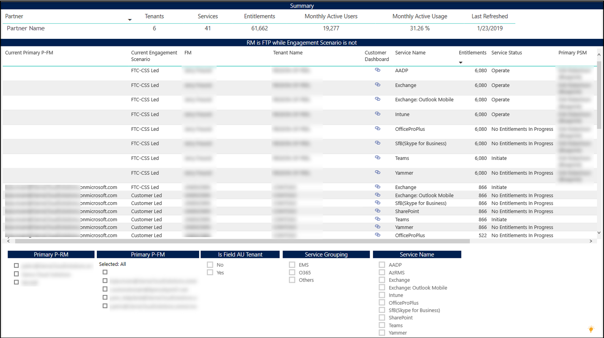

---
# required metadata
title: FastTrack Partner Power BI Report Guide
description: Engagement Scenario is not FTC-FTP Led Tab
author: Celia Kennedy
ms.author: v-cekenn
manager: pagrim
ft.owner: pagrim
ms.date: 12/31/2019
ms.topic: engagement-scenario-not-ftc-ftp-led-tab
ms.prod: non-product-specific
ms.custom: engagement-scenario-not-ftc-ftp-led-tab
ft.audience: partner
ft.owner: pagrim
---

### Engagement Scenario is not FTC-FTP Led Tab

Use this report to view services on tenants where you are assigned, where the engagement scenario is not set to FTP Led or Assist. **Action should be taken to ensure that all services being delivered by your organization are appropriately set to FTP Led or Assist.** This is especially important as **payment is not made if this is not set to FTP Led.**

Microsoft Fasttrack Center has 5 Engagement Scenarios to reflect who is leading delivery of the benefit:

- **FTP Led or Assist** – You, the FastTrack Ready Partner (FRP) are delivering the benefit
- **Customer Led** – The customer has opted to manage their own deployment and adoption
- **CSS Led or Assist** – The FastTrack Center (FTC) team, part of Microsoft’s CSS organization is delivering the benefit 
- **CXP** – The Customer Experience Team (CXP) from within Microsoft engineering is delivering the benefit 
- **Non-Fasttrack Partner Led** – A partner, outside of the FRP program is helping the customer with deployment and adoption 

There can be instances where more than one delivery team has engaged with a customer over time or where different teams are focused on different services, and it shows up in this report. 

At the bottom of the page, click the **Engagement Scenario is not FTC-FTP Led tab.**

This table shows a list of all services on tenants with a partner assigned, where the Engagement Scenario is not set as FTC-FTP Led.

### Next Step

#### Choose a Power BI Report Tab

The following provides you with a description of all tabs in Power BI Dashboard and how to interpret the data in each.

- [FRP Dashboard](frp-dashboard.md)
- [Intro Tab](intro-tab.md)
- [Report Level Filters Tab](report-level-filters-tab.md)
- [Performance Overview Tab](performance-overview-tab.md)
- [Performance by Usage Milestone Tab](performance-by-usage-milestone-tab.md)
- [Service Usage Tab](service-usage-tab.md)
- [New Subscription Tab](new-subscription-tab.md)
- [Conversion Rate Tab](conversion-rate-tab.md)
- [Usage Trend Charts Tab](usage-trend-charts-tab.md)
- [RM is NOT FTP Tab](rm-not-ftp-tab.md)
- [Engagement Scenario is not FTC-FTP Led Tab](engagement-scenario-not-ftc-ftp-led-tab.md)
- [Overall Status Notes Updates Tab](overall-status-notes-updates-tab.md)
- [10% Forecast Tab](10-percent-forecast-tab.md)
- [40% Forecast Tab](40-percent-forecast-tab.md)
- [Performance Tab](performance-tab.md)
- [Version History Tab](version-history-tab.md)

### Other Resources

- [Partner SharePoint Modernization Report Guide](partner-sharepoint-modernization-report-guide.md)

### Refresh Summary

|Date|Who Changed|What Changed|
|---------|---------------|----------------------------|
|05/15/2020| Celia Kennedy| General Maintenance|
|12/31/2019| Celia Kennedy| Guide Updated|

[Home](http://partner-docs.microsoft.com)
