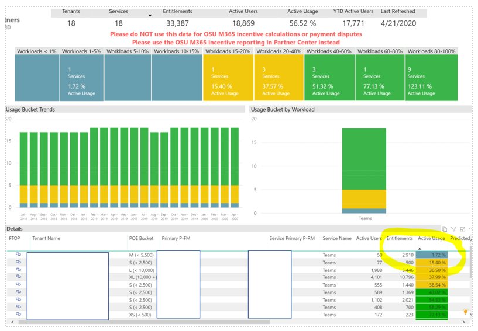
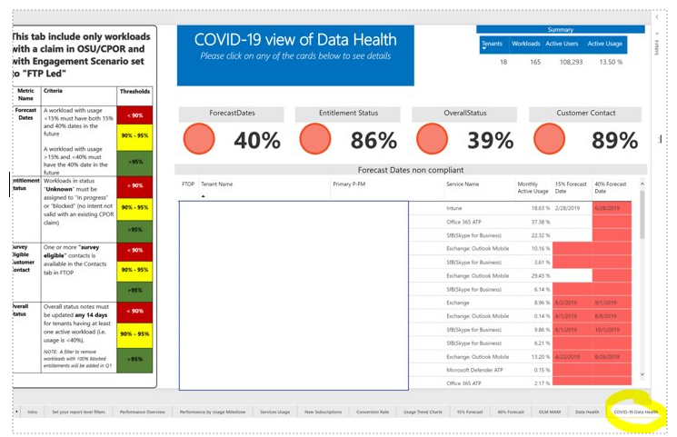

---  
# required metadata  
title: FastTrack Partner COVID-19 Engagements
description: FastTrack Playbook - COVID-19 Engagements
author: Celia Kennedy
ms.author: v-cekenn
manager: pagrim
ms.date: 4/29/2020  
ms.topic: partner-site
ms.prod: non-product-specific  
ms.custom: partner-site
ft.audience: partner
ft.owner: pagrim
---

## How to Monitor and Report COVID-19 Engagements

On April 21, 2020 two changes in the FRP Dashboard were added to assist monitoring the progress for tenants flagged as Covid-19 engagements. 

A filter in the FRP Dashboard will only select tenants with hashtag #covid. *Note: The guidance is to ***use #covid,*** but as some people also used #covid19, both are included in the filter.*

In addition, a dedicated Data Health tab for COVID-19 tenants has been created.

### New Dashboard

### How to use the filter

When the dashboard is filtered on **#covid** engagements you can monitor your tenants for Teams usage and take action on those that are not progressing as expected, for example, those at 1.72 % of usage.

## Data Health for COVID-19 Engagements

- The existing Data Health tab in the FRP Dashboard **only shows workloads with an approved CPOR claim** (eligible for incentives)​
- Most **COVID-19 engagements are for E1/G1 trial tenants they don’t have an associated CPOR claim​**
- We added the **COVID-19 Data Health** tab **automatically filtered on tenants with the #covid tag** in the notes

>[!Note]
> The new tab has been added to **help monitor the COVID-19 engagements only.** It **will NOT contribute to the Data Health KPI calculation.** For program eligibility we will continue to use the **existing global Data Health Tab.**

|Date|Who Changed|What Changed|
|---------|---------------|----------------------------|
|04/27/2020| Celia Kennedy|  Add FRP Dashboard and COVID-19 Data Health Tab|
|04/03/2020| Celia Kennedy|  General Maintenance|

[Home](http://partner-docs.microsoft.com)