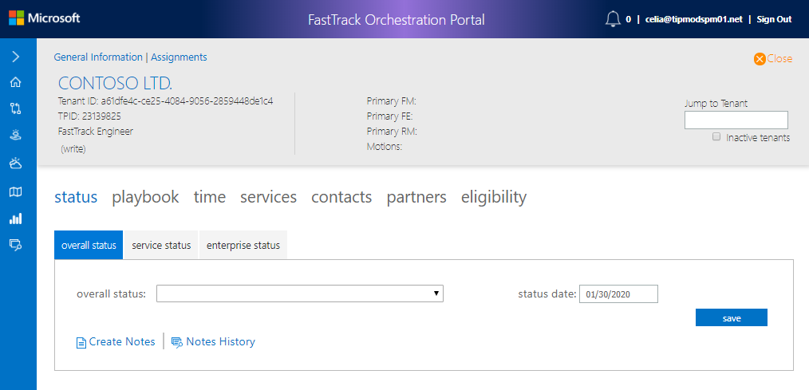
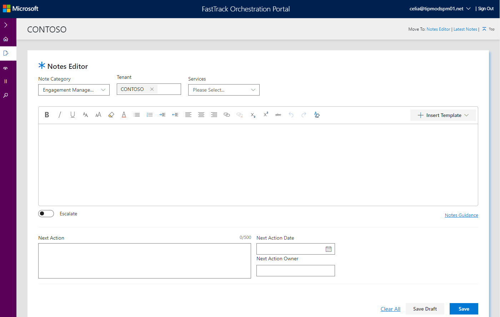
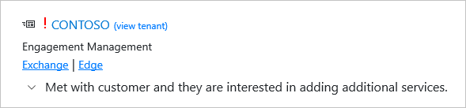
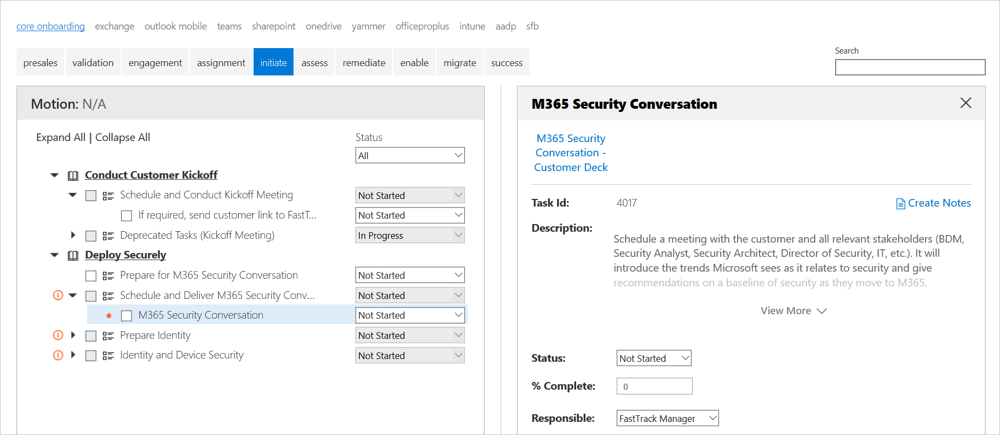

---
# required metadata
title: FTOP User Guide - Notes Library
description: Create Notes
author: Celia Kennedy
ms.author: v-cekenn
manager: pagrim
ms.date: 1/20/2020
ms.topic: ftop-user-guide
ms.prod: non-product-specific
ms.custom: ftop-partner-user-guide
ft.audience: partner
ft.owner: pagrim

---
# Create Notes

## Overview

The **Create Notes** screen is for creating notes and updating drafts from within the tenant view. When you first open the Notes Editor, it will be blank until you make your selections from the drop-down menus.

>[!NOTE]
>This page can also be accessed from tasks within FTOP. You will find a link to **Create Notes** from the Status tab with **Overall status** selected.

## Procedures

#### Status Tab

When you create a note from the Overall status tab, the Notes Editor launches with the Note Category preselected as Engagement Management and the tenant you were viewing populated.

### Creating a Note

You will select **Note Category, Tenant, and Services** from the drop-down menus, you can insert a template if you wish, then draft your note and specify next steps.

>[!NOTE]
>When Note Category is set to Engagement Management or Technical Enablement a template can be selected.

#### Select from drop-down menu

Specify your selections from the drop-down menus.

|Drop-down Menu |Menu Items and Descriptions  |
|---------|---------|
|Notes Category  |Engagement Management Technical Enablement Service Intent Environment  |
|Tenant  |Automatically filled in with the tenant you have selected.  |
|Services  |List of services available. Select the services associated with the tenant that you would like your note to reference.  |

At this point you are ready to compose your note.

#### Enter content into text box

>[!IMPORTANT]
>Insert the template before you start; otherwise, your content will be overwritten.

This area is used to write your note. Author your note in the note text box using rich text formatting, including linking.

#### Turn on escalated flag

Turn on the escalate flag if you want your note to appear on the Latest Notes and Search Notes Library screen. It will be marked red exclamation point and if it is less than one week old it will also have the recent note indicator.

>[!TIP]
>To learn more, refer to [**Notes Guidance**](https://aka.ms/FRPNotesGuidance).

#### Specify next steps

|Next Step  |Description|
|---------|---------|
|Next Action     |Specify your next action in 500 characters or less. |
|Next Action Date  |Pick the desired date from the calendar. |
|Next Action Owner   |Pick the next action owner from the list.|

#### Set actions

|Action  |Description|
|---------|---------|
|Clear All     |Clears all content from data and fields. |
|Save Draft  |Saves your draft, only you will be able to see it and you can save up to 10 drafts.|
|Save   |Saves your note. It will display in Latest Notes and within a few minutes it will display in a search. It cannot be deleted.|

### Creating a Note from within Status Tab.

#### Status Tab

When you create a note from the Overall status tab, the Notes Editor launches with the Note Category preselected as Engagement Management and the tenant you were viewing populated.

#### Playbook Task ID

When you create a note from within the Playbook Task ID, the Notes Editor opens with Engagement Management Notes Category, tenant you were viewing, but **no** Services populated.

The data flows from the Task ID you were viewing.

#### Create note from Time Tab

You can create a note from Service Time Entry.

The data flows from the Task ID you were viewing.

#### Create note from Services Tab

You can add or view Technical Enablement notes from Technical Services Notes. If you select **Add a New Technical Enablement Note**, the Notes Editor opens with the Note Category Technical Enablement and the tenant populated.

>[!NOTE]
>Add entitlement status note are now part of the Notes Library.

## Next steps

To learn about the Notes History, see [Notes History](notes-library-latest-notes.md).
