---
# required metadata
title: Partner Center Org ID Credentials for FRPs
description: appendix
author: Celia Kennedy
ms.author: v-cekenn
manager: pagrim
ft.owner: pagrim
ms.date: 1/03/2020
ms.topic: appendix
ms.prod: non-product-specific
ms.custom: appendix
ft.audience: partner
ft.owner: pagrim
---

## Appendix

### Azure Active Directory (Azure AD)

“Azure Active Directory (Azure AD) is Microsoft’s multi-tenant cloud based directory and identity management service. Azure AD also includes a full suite of identity management capabilities including multi-factor authentication, device registration, self-service password management, self-service group management, privileged account management, role based access control, application usage monitoring, rich auditing and security monitoring and alerting.”  Azure AD provides authentication (AuthN) and authorization (AuthZ) functions for Microsoft cloud services in addition to housing partner and customer tenants, domains, users, entitlements, etc.

#### Tenants

A tenant is the Azure AD instantiation of a partner or customer, meaning it is a dedicated instance of Azure AD that an organization receives and owns when it signs up for a Microsoft cloud service such as Azure or Office 365.  Each partner is typically represented by a single partner tenant. Each customer is also represented by a single customer tenant whether created (provisioned) by a partner or directly by Microsoft.

#### FastTrack Ready Partner Onboarding through Partner Center

**Enrollment Process**

Enrolling for an Azure AD tenant as a partner is accomplished by submitting a request form at https://partnercenter.microsoft.com/pcv/register/joinnow/enrollmentWelcome/valueaddedreseller.

This process enrolls the partner in Partner Center and enables the partner to set up their marketing profile and it will enable additional Partner Center capabilities in the future.

The below list of representative screenshots walks through the end-to-end enrollment process. The actual user experience may vary somewhat, but it should provide the reader with a good understanding of the end-to-end flow.

- **Step 1:** Navigate to [Partner Center](https://partnercenter.microsoft.com/pcv/register/joinnow/enrollmentWelcome/valueaddedreseller) and click **Next.**

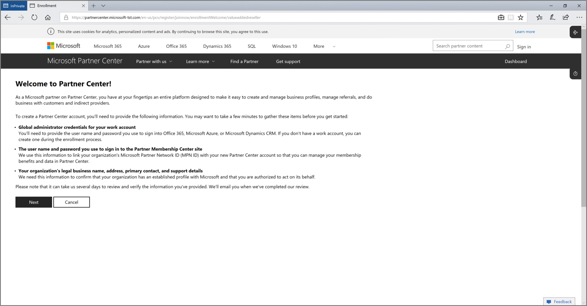

- **Step 2:** If you already have an Azure AD tenant (i.e. an Org ID account), click the **Sign in Button** and enter your login credentials. If you do not have an Azure AD tenant, click the **Create one** link.

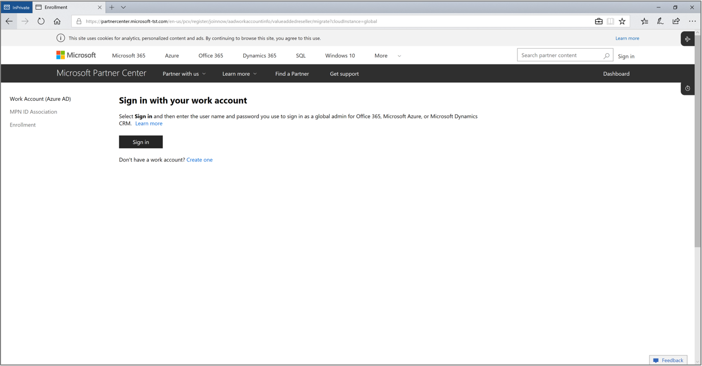

**Steps 3** through **5** describe the steps to create a new Azure AD **partner** tenant if you clicked the **Create one** link. If you already have an Azure AD partner tenant and have signed in instead, skip to **Step 6.**

- **Step 3:** Enter relevant enrollment details including business address and Partner Center admin.

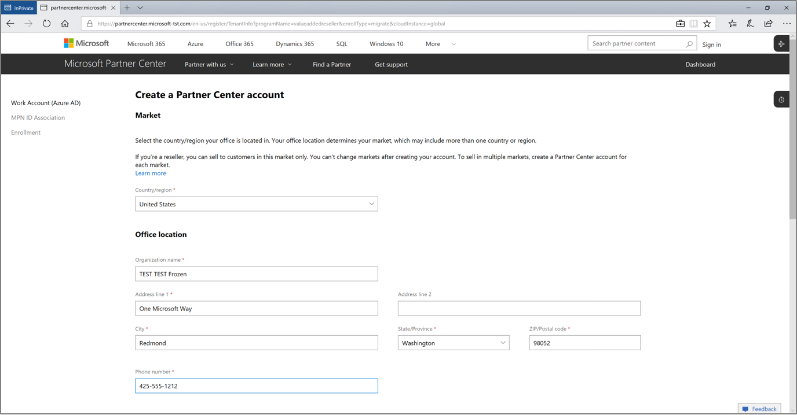

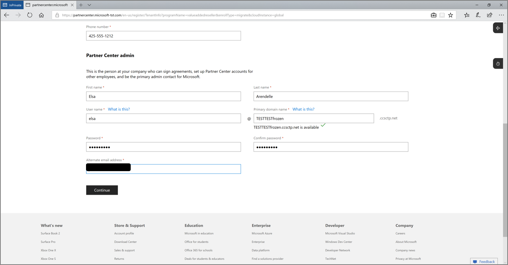

- **Step 4:** Verify your mobile phone number and then click **Create account.**

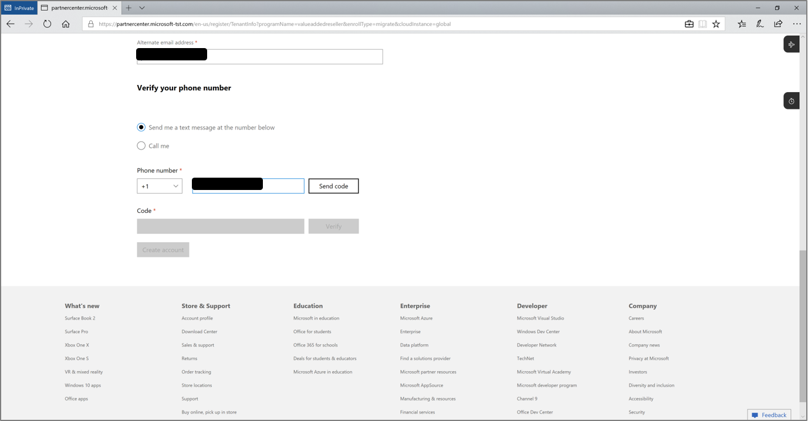

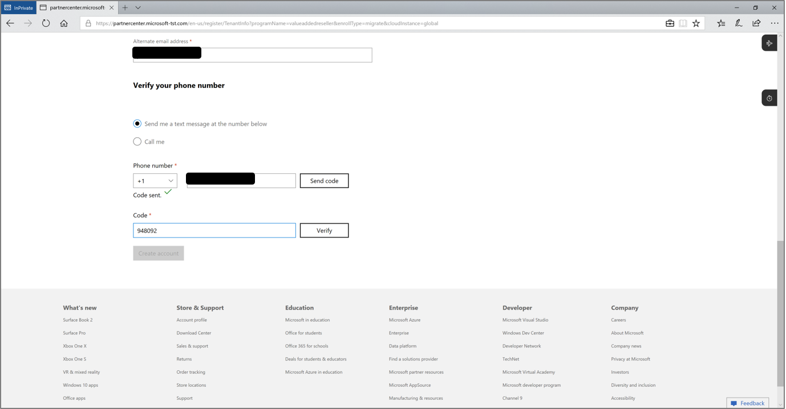

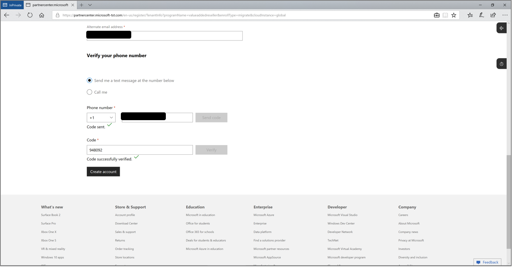

- **Step 5:** You are now ready to enroll in Partner Center. Click **Continue** to proceed with enrollment.

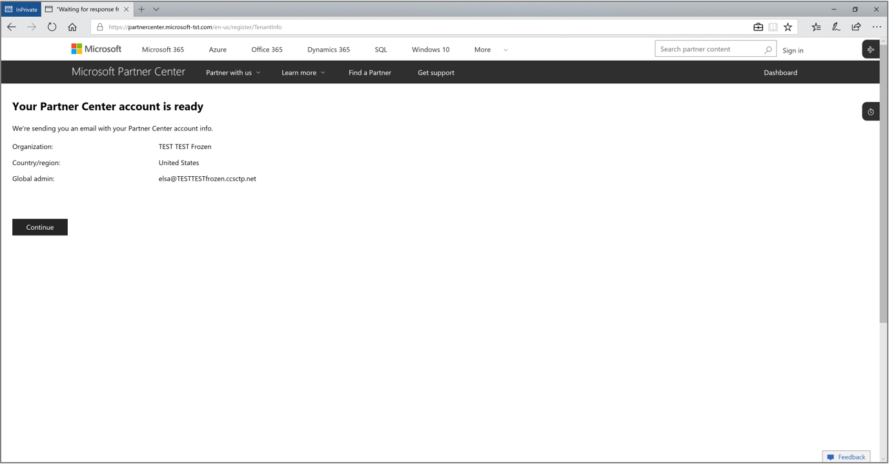

- **Step 6:** Log in using your Org ID credentials.

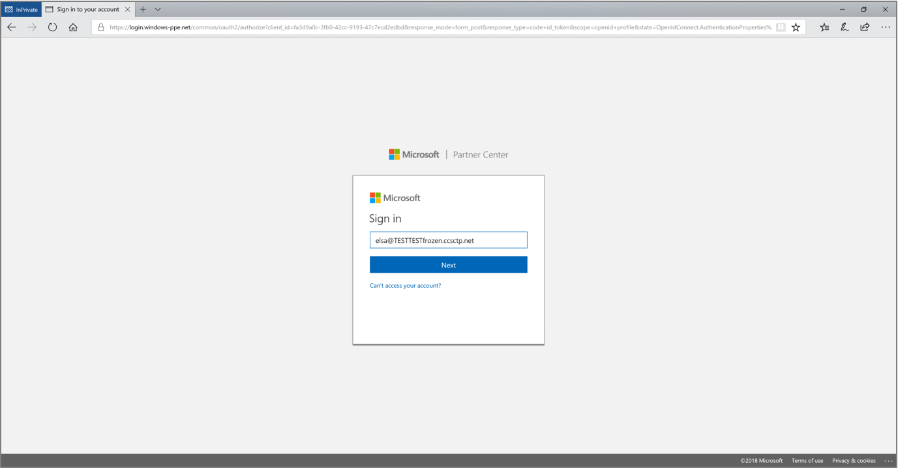

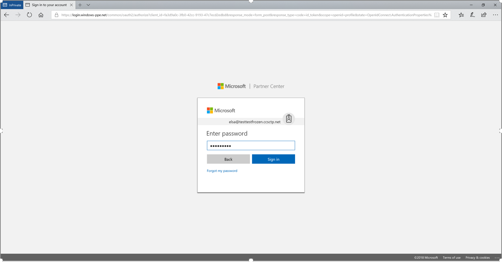

- **Step 7:** Enter enrollment details and click **Enroll now.**

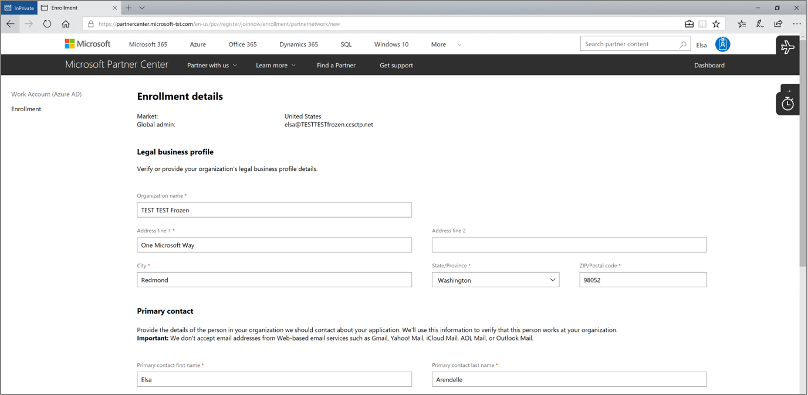

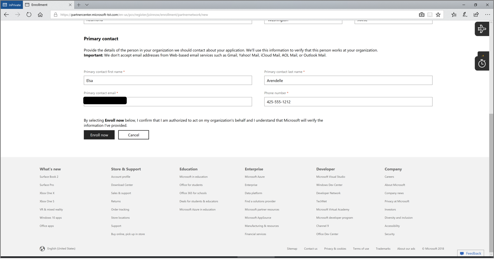

- **Step 8:** Verify your primary e-mail address.

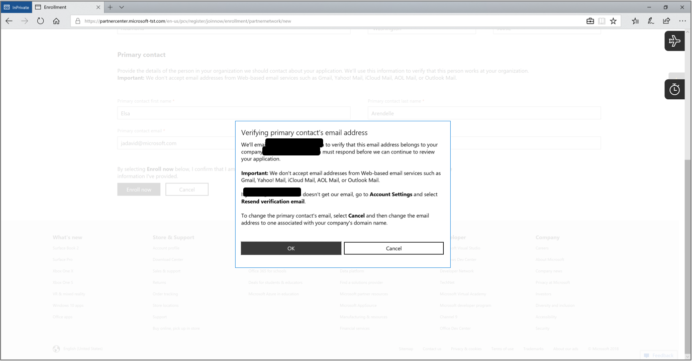

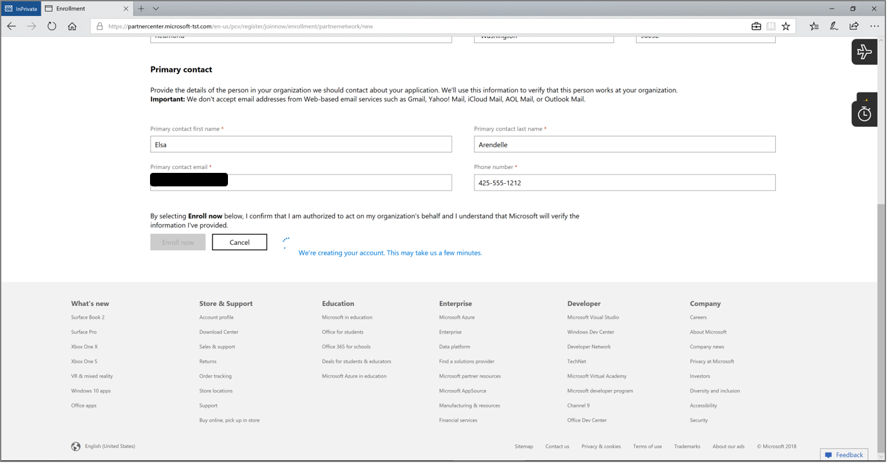

- **Step 9:** Accept terms by clicking **Accept and Continue.**

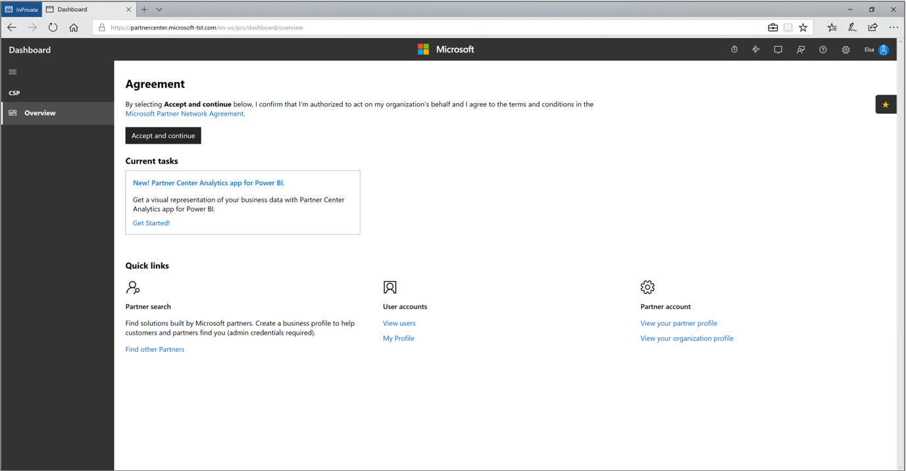

- **Step 10:** Your dashboard will be ready soon and you will have established your Partner Center Org ID credentials by onboarding to Partner Center.

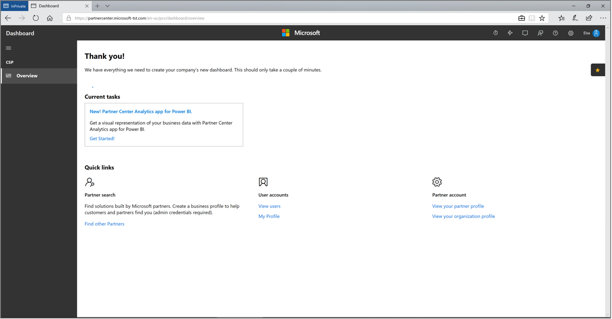

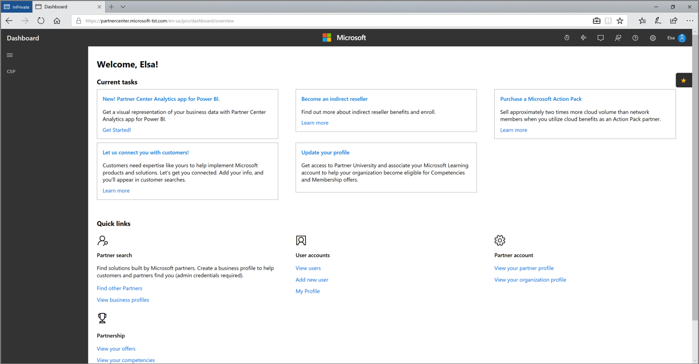

### Refresh Summary

|Date|Who Changed|What Changed|
|---------|---------------|----------------------------|
|1/3/2020| Celia Kennedy| Guide Updated|

[FTOP Partner User Guide](http://partner-docs.microsoft.com/partner-site/ftop-partner-user-guide/index.html)