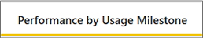
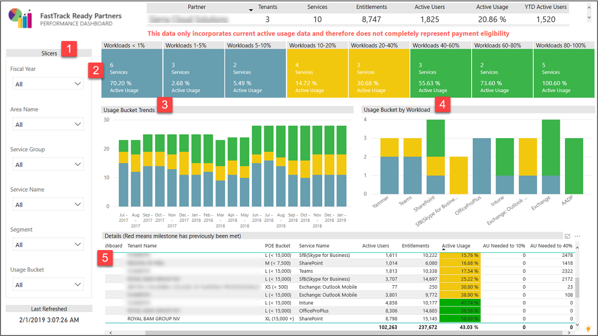
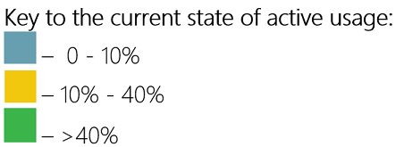

---
# required metadata
title: FastTrack Partner Power BI Report Guide
description: Performance by Usage Milestone Tab
author: Celia Kennedy
ms.author: v-cekenn
manager: pagrim
ft.owner: pagrim
ms.date: 12/31/2019
ms.topic: performance-by-usage-milestone-tab
ms.prod: non-product-specific
ms.custom: performance-by-usage-milestone-tab
ft.audience: partner
ft.owner: pagrim
---

### Performance by Usage Milestone Tab

This report shows the distributions of Workloads across the different usage buckets based on their % Active Usage. The report only shows the workloads that have the Engagement Scenario set as **FRP Led or FRP Assist.**

At the bottom of the report, click the **Performance by Usage Milestone tab.**

 Page level slicers (filters) on Fiscal Year, Area, Service Group, Service, Customer Segment and Active Usage buckets. The default selection for all the filters is ‘(All)’.

 This chart shows the distribution of # of Workloads across different buckets of Active Usage. Blue is less than 10%, Yellow is between 10% and 40% and Green is above 40%.

 **Usage Bucket Trends** chart shows the monthly changes in # of workloads across Active Usage Bucket. The chart has the capability to drill to quarterly view and Customer Segment View.

 **Usage Bucket by Workload** chart shows the # of Workloads by Service and their Active Usage bucket.

 **Details** shows the list of tenants and their workloads with QE, Active Users and Active Usage.  The details includes metrics to show how many Active Users are required to meet 10% milestone and 40% milestone.

### Next Step

#### Choose a Power BI Report Tab

The following provides you with a description of all tabs in Power BI Dashboard and how to interpret the data in each.

- [FRP Dashboard](frp-dashboard.md)
- [Intro Tab](intro-tab.md)
- [Report Level Filters Tab](report-level-filters-tab.md)
- [Performance Overview Tab](performance-overview-tab.md)
- [Performance by Usage Milestone Tab](performance-by-usage-milestone-tab.md)
- [Service Usage Tab](service-usage-tab.md)
- [New Subscription Tab](new-subscription-tab.md)
- [Conversion Rate Tab](conversion-rate-tab.md)
- [Usage Trend Charts Tab](usage-trend-charts-tab.md)
- [RM is NOT FTP Tab](rm-not-ftp-tab.md)
- [Engagement Scenario is not FTC-FTP Led Tab](engagement-scenario-not-ftc-ftp-led-tab.md)
- [Overall Status Notes Updates Tab](overall-status-notes-updates-tab.md)
- [10% Forecast Tab](10-percent-forecast-tab.md)
- [40% Forecast Tab](40-percent-forecast-tab.md)
- [Performance Tab](performance-tab.md)
- [Version History Tab](version-history-tab.md)

### Other Resources

- [Partner SharePoint Modernization Report Guide](partner-sharepoint-modernization-report-guide.md)

### Refresh Summary

|Date|Who Changed|What Changed|
|---------|---------------|----------------------------|
|05/15/2020| Celia Kennedy| General Maintenance|
|12/31/2019| Celia Kennedy| Guide Updated|

[Home](http://partner-docs.microsoft.com)
