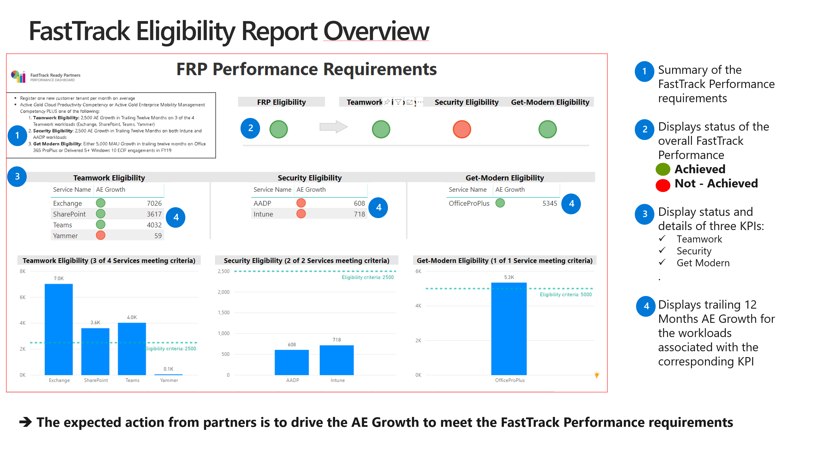
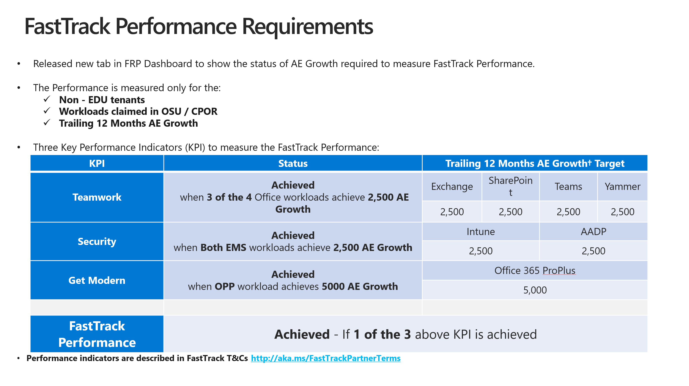

---
# required metadata
title: FastTrack Partner Power BI Report Guide
description: Performance Tab
author: Celia Kennedy
ms.author: v-cekenn
manager: pagrim
ft.owner: pagrim
ms.date: 03/02/2020
ms.topic: performance-tab
ms.prod: non-product-specific
ms.custom: performance-tab
ft.audience: partner
ft.owner: pagrim
---

### Performance Tab

As stated in the FastTrack Ready Partner **Terms & Conditions,** partners must meet the performance requirements for the duration of their participation in the Program. One of the requirements is to meet the one of the following performance workload benchmarks:

- Teamwork Eligibility: 2,500 AE Growth in Trailing Twelve Months on 3 of the 4 Teamwork workloads (Exchange, SharePoint, Teams, Yammer)
- Security Eligibility: 2,500 AE Growth in Trailing Twelve Months on both Intune and AADP workloads
- Get Modern Eligibility: 5,000 MAU Growth in trailing twelve months on Office 365 ProPlus 

We have launched a new report in the FRP Dashboard which will help you to track/monitor the above performance metrics. For more information, use the FRP Dashboard Overview Slides or listen in to the [February Partner Call recording.](https://m365elite.eventbuilder.com/event/7885)

### Next Step

#### Choose a Power BI Report Tab

The following provides you with a description of all tabs in Power BI Dashboard and how to interpret the data in each.

- [FRP Dashboard](frp-dashboard.md)
- [Intro Tab](intro-tab.md)
- [Report Level Filters Tab](report-level-filters-tab.md)
- [Performance Overview Tab](performance-overview-tab.md)
- [Performance by Usage Milestone Tab](performance-by-usage-milestone-tab.md)
- [Service Usage Tab](service-usage-tab.md)
- [New Subscription Tab](new-subscription-tab.md)
- [Conversion Rate Tab](conversion-rate-tab.md)
- [Usage Trend Charts Tab](usage-trend-charts-tab.md)
- [RM is NOT FTP Tab](rm-not-ftp-tab.md)
- [Engagement Scenario is not FTC-FTP Led Tab](engagement-scenario-not-ftc-ftp-led-tab.md)
- [Overall Status Notes Updates Tab](overall-status-notes-updates-tab.md)
- [10% Forecast Tab](10-percent-forecast-tab.md)
- [40% Forecast Tab](40-percent-forecast-tab.md)
- [Performance Tab](performance-tab.md)
- [Version History Tab](version-history-tab.md)

### Other Resources

- [Partner SharePoint Modernization Report Guide](partner-sharepoint-modernization-report-guide.md)

### Refresh Summary

|Date|Who Changed|What Changed|
|---------|---------------|----------------------------|
|05/15/2020| Celia Kennedy| General Maintenance|
|12/31/2019| Celia Kennedy| Guide Updated|

[Home](http://partner-docs.microsoft.com)