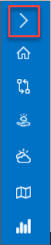
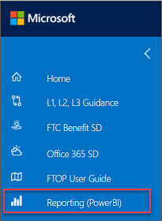

---
# required metadata
title: FastTrack Partner Power BI Report Guide
description: Guide to access Power BI Reports in FTOP
author: Celia Kennedy
ms.author: v-cekenn
manager: pagrim
ft.owner: pagrim
ms.date: 12/31/2019
ms.topic: partner-power-bi-report-guide
ms.prod: non-product-specific
ms.custom: partner-power-bi-report-guide
ft.audience: partner
ft.owner: pagrim
---

# Guide to access Power BI Reports in FTOP

Use this guide to access reports in Power BI within the FastTrack Orchestration Portal (FTOP) to identify opportunities, track progress against active use goals, and gain insights on customer usage trends. 

For terms and acronyms used in this guide and in Power BI, see:

- [Appendix A: FastTrack Ready Program Term Definitions](appendix-a.md)
- [Appendix B: FastTrack Ready Program Acronyms](appendix-b.md)

> [!NOTE]
> For privacy reasons, some areas in the screen captures in this guide are obscured.
  
## Sign in to FTOP and Open Power BI

To perform the procedures in this document, you’ll first need to log into FastTrack Orchestration Portal (FTOP). Here’s how:

1. In your browser, go to http://ftop.microsoft.com.
2. Log in using your Org ID credentials (user principal name1 + password).

> [!NOTE]
> These credentials are Microsoft Organization IDs (Org ID), established through the Partner Center. If you don’t have Org ID credentials contact your FastTrack Program Manager (FPM) or see the [Partner Center Org ID Credentials for FastTrack Ready Partners Guide](/../../partner-center-org-id-credentials/index.md).

1. In FTOP, in the left navigation pane, click the arrow  to display the menu of options.

2. In the expanded menu, click **Reporting (Power BI).**

3. In Power BI, click FTOP – **FRP Dashboard.**

### Power BI Report Tabs

The following provides you with a description of all tabs in Power BI Dashboard and how to interpret the data in each.

- [FRP Dashboard](frp-dashboard.md)
- [Intro Tab](intro-tab.md)
- [Report Level Filters Tab](report-level-filters-tab.md)
- [Performance Overview Tab](performance-overview-tab.md)
- [Performance by Usage Milestone Tab](performance-by-usage-milestone-tab.md)
- [Service Usage Tab](service-usage-tab.md)
- [New Subscription Tab](new-subscription-tab.md)
- [Conversion Rate Tab](conversion-rate-tab.md)
- [Usage Trend Charts Tab](usage-trend-charts-tab.md)
- [RM is NOT FTP Tab](rm-not-ftp-tab.md)
- [Engagement Scenario is not FTC-FTP Led Tab](engagement-scenario-not-ftc-ftp-led-tab.md)
- [Overall Status Notes Updates Tab](overall-status-notes-updates-tab.md)
- [10% Forecast Tab](10-percent-forecast-tab.md)
- [40% Forecast Tab](40-percent-forecast-tab.md)
- [Performance Tab](performance-tab.md)
- [Version History Tab](version-history-tab.md)

### Other Resources

- [Partner SharePoint Modernization Report Guide](partner-sharepoint-modernization-report-guide.md)

### Refresh Summary

|Date|Who Changed|What Changed|
|---------|---------------|----------------------------|
|05/15/2020| Celia Kennedy| General Maintenance|
|12/31/2019| Celia Kennedy| Guide Updated|

[Home](http://partner-docs.microsoft.com)