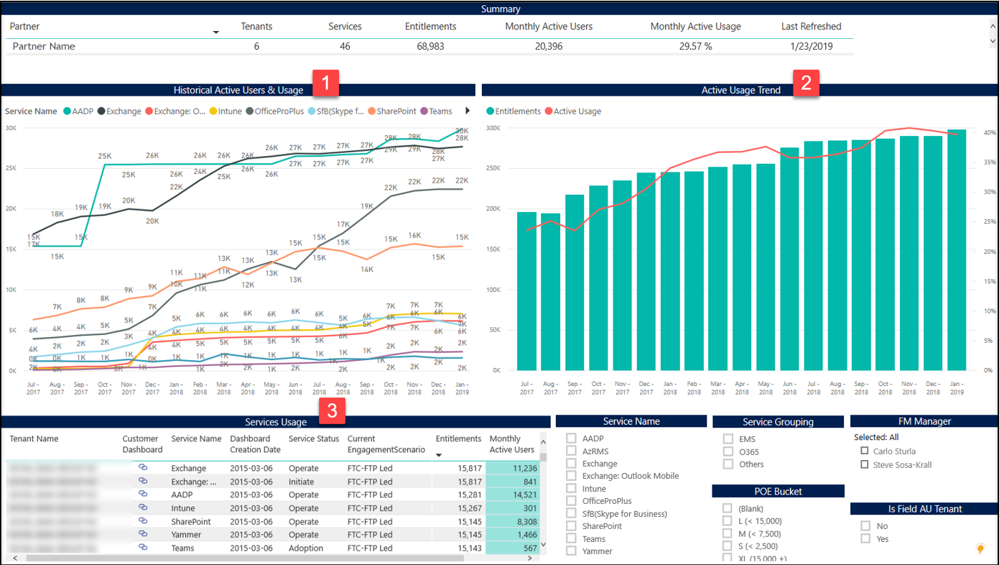

---
# required metadata
title: FastTrack Partner Power BI Report Guide
description: Usage Trend Charts Tab
author: Celia Kennedy
ms.author: v-cekenn
manager: pagrim
ft.owner: pagrim
ms.date: 12/31/2019
ms.topic: usage-trend-charts-tab
ms.prod: non-product-specific
ms.custom: usage-trend-charts-tab
ft.audience: partner
ft.owner: pagrim
---

### Usage Trend Charts Tab

This report shows you monthly trends of % Active Usage for all tenants and workloads.

At the bottom of the report, click the **Usage Trend Charts tab.**

 **Historical Active Users & Usage** shows the historical monthly trend of Active Users for each workload starting from previous fiscal year to current fiscal month.

 **Active Usage Trend** shows the historical monthly trend of cumulative % Active Usage and Entitlements across all workloads.

 **Service Usage** table gives you the details of each Tenant-Service pair with their Service Status, Current Engagement scenario, Current Entitlements and Current total Active Users.

You can filter this report further by Service Group, Service Name, Service P-RM, POE Size of Workload and FM Manager.

### Next Step

#### Choose a Power BI Report Tab

The following provides you with a description of all tabs in Power BI Dashboard and how to interpret the data in each.

- [FRP Dashboard](frp-dashboard.md)
- [Intro Tab](intro-tab.md)
- [Report Level Filters Tab](report-level-filters-tab.md)
- [Performance Overview Tab](performance-overview-tab.md)
- [Performance by Usage Milestone Tab](performance-by-usage-milestone-tab.md)
- [Service Usage Tab](service-usage-tab.md)
- [New Subscription Tab](new-subscription-tab.md)
- [Conversion Rate Tab](conversion-rate-tab.md)
- [Usage Trend Charts Tab](usage-trend-charts-tab.md)
- [RM is NOT FTP Tab](rm-not-ftp-tab.md)
- [Engagement Scenario is not FTC-FTP Led Tab](engagement-scenario-not-ftc-ftp-led-tab.md)
- [Overall Status Notes Updates Tab](overall-status-notes-updates-tab.md)
- [10% Forecast Tab](10-percent-forecast-tab.md)
- [40% Forecast Tab](40-percent-forecast-tab.md)
- [Performance Tab](performance-tab.md)
- [Version History Tab](version-history-tab.md)

### Other Resources

- [Partner SharePoint Modernization Report Guide](partner-sharepoint-modernization-report-guide.md)

### Refresh Summary

|Date|Who Changed|What Changed|
|---------|---------------|----------------------------|
|05/15/2020| Celia Kennedy| General Maintenance|
|12/31/2019| Celia Kennedy| Guide Updated|

[Home](http://partner-docs.microsoft.com)
