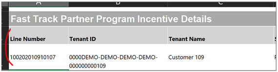
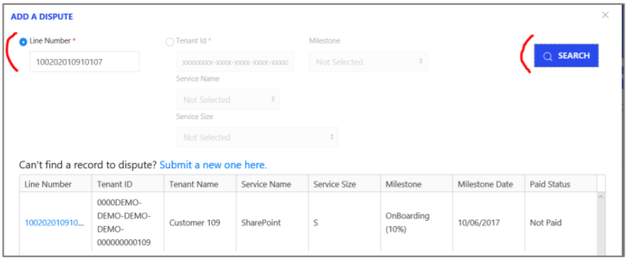
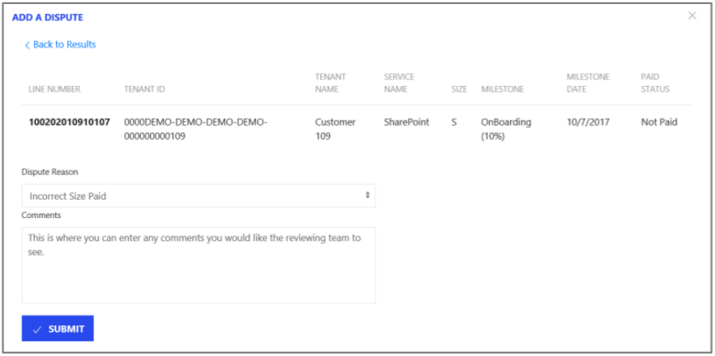
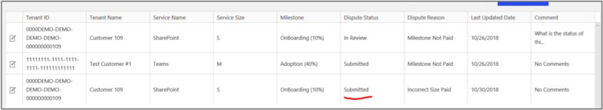

---
# required metadata
title: FastTrack Partner Payment Disputes Site Guide
description: Dispute Submission Line Number Search
author: Celia Kennedy
ms.author: v-cekenn
manager: pagrim
ft.owner: pagrim
ms.date: 01/15/2020
ms.topic: dispute-submission-line-number-search
ms.prod: non-product-specific
ms.custom: dispute-submission-line-number-search
ft.audience: partner
ft.owner: pagrim
---

# Line Number Search

On the Details Tab within each statement, you can find the **Line Number associated with each milestone payment.**

Select **Add a Dispute** in the pop-up box and click on the **radio button** next to Line Number.

Enter the Line Number and click **Search**. Once you click Search, that milestone will be displayed in the table. To dispute this payment, please click on the **line number within the table.** This will take you into the details of this record.

Within the details, you will be able to **select the appropriate reason for disputing** this milestone. You will also be able to provide an additional comments for the review team. Once you have completed the **Dispute Reason and Comments,** please click **Submit** and this dispute will be submitted for review.

The submitted milestone payment dispute will now show in the Partner View table.

**Note:**

- By entering the first 5 numbers in the Line Number, a list of all milestones (paid and unpaid) will show in the table below.

## Next Steps

- [Registration and Login](registration-and-login.md)
- [Partner video](https://www.microsoft.com/microsoft-365/partners/videos/fasttrack-ready-partner-payment-disputes-site)
- [Dispute Submission](dispute-submission-overview.md)
    - [Line Number Search](dispute-submission-line-number-search.md)
    - [Tenant ID Search](tenant-id-search.md)
    - [Submit a New One](submit-a-new-one.md)
    - [Submission Errors](submission-errors.md)
- [Dispute Submission Status and Challenging](dispute-submission-status-and-challenging.md)

### Refresh Summary

|Date|Who Changed|What Changed|
|---------|---------------|----------------------------|
|12/31/2019| Celia Kennedy| Guide Updated|

[Home](http://partner-docs.microsoft.com)
