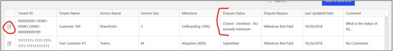
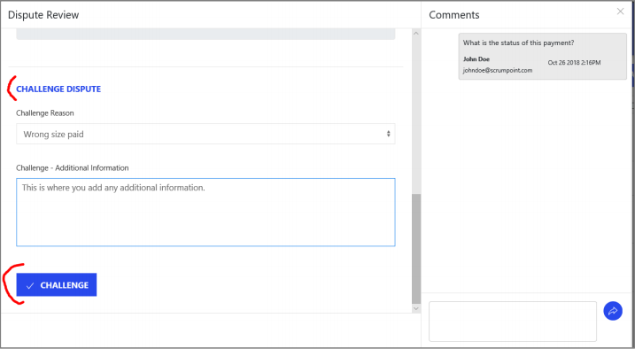
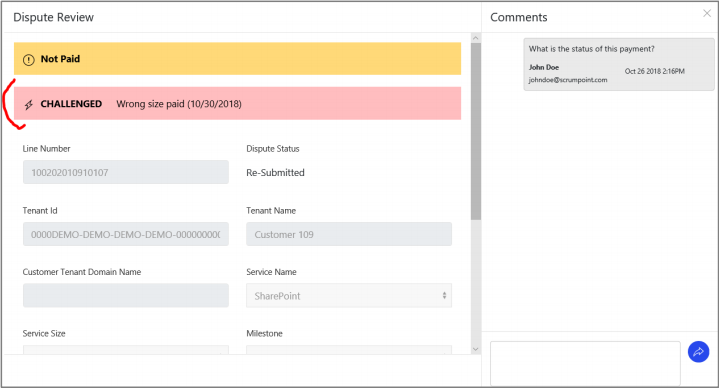

---
# required metadata
title: FastTrack Partner Payment Disputes Site Guide
description: Dispute Submission Status and Challenging Disputes
author: Celia Kennedy
ms.author: v-cekenn
manager: pagrim
ft.owner: pagrim
ms.date: 01/15/2020
ms.topic: dispute-submission-status-and-challenging-disputes
ms.prod: non-product-specific
ms.custom: dispute-submission-status-and-challenging-disputes
ft.audience: partner
ft.owner: pagrim
---

## Submission Status

Dispute submissions will be for one of the following statuses:

|**Status**       |**Action** |
|:---------------------------------|:---------------------------------|
|**Submitted**|A new dispute has been submitted by the partner. It has not been opened by the review team yet.|
|**Re-Submitted**|This is when a dispute has been challenged and has not been opened by the review team yet.|
|**In Review**|This has been opened by the review team.|
|**More Information Needed**|The review team needs additional information from the partner to determine if the milestone is eligible for payment or not.|
|**Payment Pending**|This dispute has been approved and is pending payment.|

## Closed Disputes

A milestone can be challenged by the partner if it is in a **closed status.**

|**Closed Status**       |**Reason for Closure** |
|:---------------------------------|:---------------------------------|
|**Declined**|AU exceeds minimum: If an Onboarding (10%) dispute is submitted but the service was at or above 10% active usage at the Partner Eligibility date, it is not eligible for payment. If an Adoption (40%) dispute is submitted but the service was at or above 20% active usage at the Partner Eligibility date, it is not eligible for payment.|
|**Declined**|Workload size not eligible: The service size selected is not eligible for the milestone selected.|
|**Reversed**|The milestone payment was reversed from the partner’s statement.|
|**Paid**|The milestone payment was paid on the partner’s statement.|
|**Declined**|Not eligible for 40%: The service selected is not eligible for the Adoption (40%) milestone according to the offer Terms & Conditions.|
|**Declined**|Milestone not met: The milestone submitted is not eligible for payment because it has not met the 10% or 40% usage according to Microsoft system.|
|**Declined**|Paid to another partner: The milestone is not eligible for payment because it has already been paid to another partner.|
|**Declined**|SP/OD Mutually Exclusive: If the submitted milestone is SharePoint, it is not eligible for payment because OneDrive was already paid for the same milestone. If the submitted milestone is OneDrive, it is not eligible for payment because SharePoint was already paid for the same milestone.|
|**Cancelled**|The milestone submission has been cancelled.|

## Challenging a Reviewed Milestone

If a previously submitted milestone dispute has been reviewed and deemed ineligible for payment by the review team, a partner may challenge this decision. The partner is only able to challenge the milestone dispute if it is in **closed status.**

To challenge a milestone dispute, find it in the Partner View table and open the dispute to view all associated details.

Once the pop up opens with additional information, scroll down to the bottom to Challenge Dispute. Select a Challenge reason and provide additional information if necessary. Once complete, click Challenge and the milestone dispute will be re-submitted to the reviewing team.

Once the milestone dispute is challenged, the Dispute Status will update to re-submitted.

## Next Steps

- [Registration and Login](registration-and-login.md)
- [Partner video](https://www.microsoft.com/microsoft-365/partners/videos/fasttrack-ready-partner-payment-disputes-site)
- [Dispute Submission](dispute-submission-overview.md)
    - [Line Number Search](dispute-submission-line-number-search.md)
    - [Tenant ID Search](tenant-id-search.md)
    - [Submit a New One](submit-a-new-one.md)
    - [Submission Errors](submission-errors.md)
- [Dispute Submission Status and Challenging](dispute-submission-status-and-challenging.md)

### Refresh Summary

|Date|Who Changed|What Changed|
|---------|---------------|----------------------------|
|12/31/2019| Celia Kennedy| Guide Updated|

[Home](http://partner-docs.microsoft.com)
