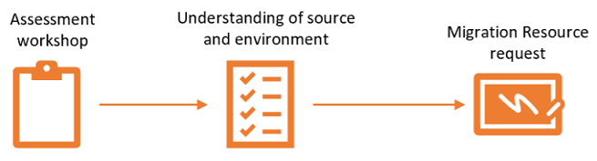
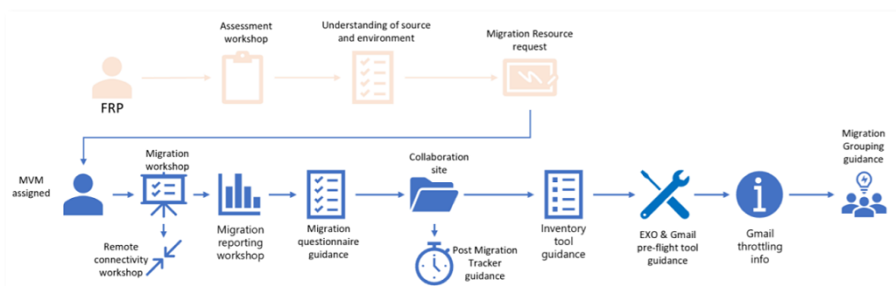
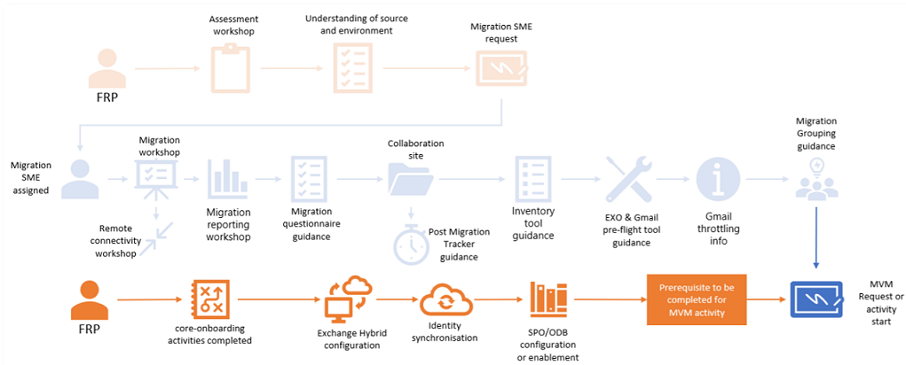
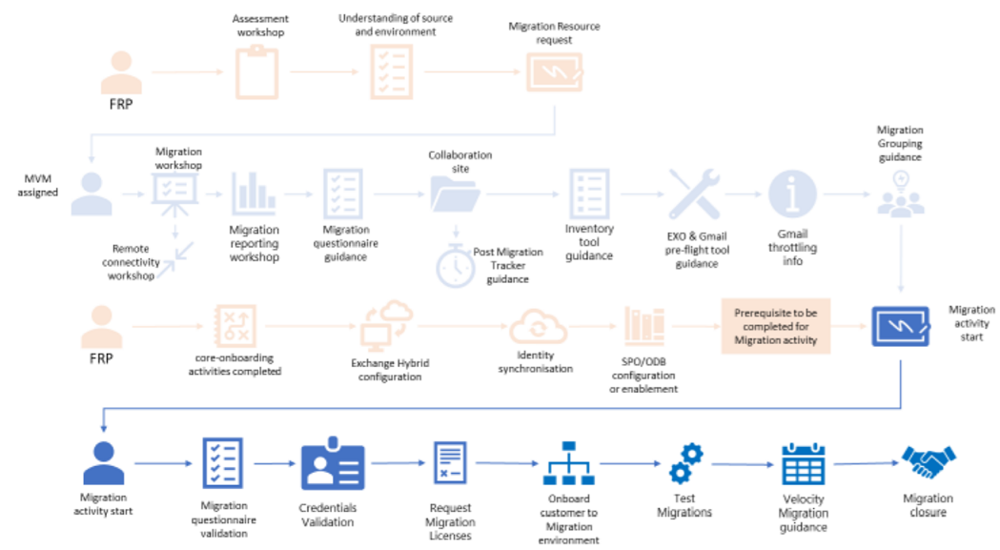

---
# required metadata
title: Migration Playbook
description: Roles and Responsibilities
author: Celia Kennedy
ms.author: v-cekenn
manager: pagrim
ms.date: 02/18/2019
ms.topic: frp
ms.prod: non-product-specific
ms.custom: frp
ft.audience: partner
---

# Roles and Responsibilities

The following are the roles and responsibilities of the personas involved in a customer onboarding migration event.

## FastTrack Ready Partner (FRP)

The FRP is responsible for leveraging the FastTrack Migration benefit to the assigned customer. The **ideal moment** is at the point that a technical assessment is conducted, and it is clear what the current source of mail and content is to request the SME request and get the appropriate Migration Resource assigned.

- Complete technical assessment completed *(Playbook FTOP Task ID 1699)*
  
Request migration resource to provide guidance of the FT Migration benefit and the options of self-service migration. The Migration Resource will provide migration guidance around:

- Needed migration prerequisites and migration process only
- Request additional SME support for topics such identity, network or other topics.

To request a Migration Resources please follow the guidance [**here**](https://aka.ms/FRPHubSMERequestProcess) for requesting the resource. Only request the Migration Resource if the customer has the intent to use the FT Migration benefit. The resource that is assigned is a Migration Velocity Manager (MVM).Resource if the customer has the
intent to use the FT Migration benefit. The resource that is assigned is a Migration Velocity Manager (MVM).

## Migration Velocity Manager (MVM)

The MVM will guide the customer through the preparation for migration by delivering a series of workshops and providing guidance documentation and assist in the decision to either Self-Migrate or use the FT Data Migration benefit.

- Conducts Migration Workshops that includes the FastTrack Migration onboarding timeline and Migration scope *(Playbook FTOP Task ID E2E: 1629, IMAP: 1635, Gmail: 2006, GroupWise: 2118, N2E: 2277, Box: 3169, GDrive: 2467; FileShare:3009)*

- Conducts the Migration Hub workshop, the workshop can be delivered together with the Migration workshop *(Playbook FTOP Task ID 4027)*

- Review the secure credential management requirements optional *(Playbook FTOP Task ID 3614)*

- Elaborates the secure remote connectivity needed for the migration *(Playbook FTOP Task ID 3312)*

- Conducts migration Power BI reporting workshop and provides dedicated generic customer access *(Playbook FTOP Task ID 4008)*

- Assist the customer with providing the completed Migration questionnaire *(Playbook FTOP Task ID 1034)*

- Assist with Migration collaboration site either located on customers SPO site or FastTrack portal migration library *(Playbook FTOP Task ID 2979)*

- Assist with Post-Migration issue tracker creation and use *(Playbook FTOP Task ID 3615)*

- Provides and review pre-flight tool for EXO and *(Playbook FTOP Task ID 3143)*

- Provides list of known migration errors *(Playbook FTOP Task ID 3282)*

- Assist the customer with inventory tool for content migration, known SPO/OD4B limitation, specific source environment test tools *(Playbook FTOP Task ID Box:3169, GDrive 2467, FileShare: 3009)*

- Provide the customer with Gmail related information such as Throttling info and how-to setup environment for migration with mail routing and forwarding *(Playbook FTOP Task ID 2006)*

- Provide guidance documentation to the customer with E2E Mailbox/user grouping and schedule creation *(Playbook FTOP Task ID 3203 &3208)*

## FastTrack Ready Partner (FRP)

During the period that the MVM is providing the above guidance the FRP should complete the below tasks and before the Migration Velocity Manager can start to onboard the customer to the environment.

- Complete Core Onboarding activities to ensure that all Enablement tasks are completed and is mandatory before any migration activities can take place.

- Complete On-premise Exchange Hybrid configuration if applicable **(Playbook FTOP Task ID 3160, 3159, 3158, 3157)*

- Complete the Identity synchronization *(Playbook FTOP Task ID 1141)*

Partners are expected to maintain the customer relationship during the Migration process and assist the customer during the migration for any issues related to the onboarding and identity issues that creates blockers during the migration, the FRP will not remediate any migration issues, this is a responsibility of the customer.

## Migration Velocity Manager (MVM)

Is guiding you through the FastTrack Data Migration process and is assisting with the Migration onboarding process.

- Request temporary O365 licenses for migration purpose only if applicable *(Playbook FTOP Task ID 3217)*

- MVM request BT resources for Rich coexistence for N2E only if approved by FastTrack Architect *(Playbook FTOP Task ID 3308)*

- MVM will assist the customer and partner with Migration questionnaire completion and validation *(Playbook FTOP Task ID 1672)*

- MVM onboard customer to Migration environment *(Playbook FTOP Task ID 3392)*

- MVM to raise and monitor build request for FastTrack dedicated Azure migration environment and validation *(Playbook FTOP Task ID 3306)*

- MVM Performs Test migration and validation *(Playbook FTOP Task ID 2474)*

- Transition customer to Migration Team and create Migration documentation *(Playbook FTOP Task ID 3954)*

- Request and instructs FastTrack Velocity Migration team around migration specifics *(Playbook FTOP Task ID 3306)*

- MVM to conduct non-user mailbox migration for Notes to EXO *(Playbook FTOP Task ID 3305)*

- Manages scheduled events provided by customer or partner *(Playbook FTOP Task ID 1871)*

- Manages Post-migration issues with the Migration support team *(Playbook FTOP Task ID 2481)*

- Migration phase closure activities including decommission environment and credential removal *(Playbook FTOP Task ID 2323)*

## FastTrack Ready Partner (FRP)

- Assist customer with Post mail - migration activities that if applicable are setting the correct DNS records and mail flow *(Playbook FTOP Task ID 1370)*

#### Next Steps

- [Migration Process Description](migration-process-description.md)
- [Paused and Offboarding Migration Projects](paused-and-offboarding-migration-projects.md)

#### Refresh Summary

|Date|Who Changed|What Changed|
|---------|---------------|----------------------------|
|02/18/2019| Celia Kennedy| Migration Playbook published in markdown |
|10/22/2019| Celia Kennedy| General Maintenance |

[Home](http://partner-docs.microsoft.com)