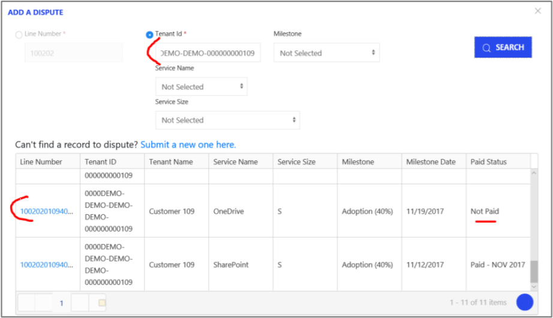
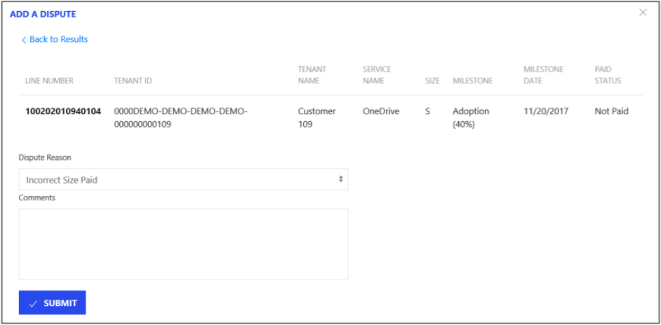

---
# required metadata
title: FastTrack Partner Payment Disputes Site Guide
description: Dispute Submission - Tenant ID Search
author: Celia Kennedy
ms.author: v-cekenn
manager: pagrim
ft.owner: pagrim
ms.date: 01/15/2020
ms.topic: dispute-submission-tenant-id-search
ms.prod: non-product-specific
ms.custom: dispute-submission-tenant-id-search
ft.audience: partner
ft.owner: pagrim
---

# Tenant ID Search

Please use the **Tenant ID Search** if you are looking for a milestone you do not have a Line Number for.

**Note:**

You must enter the Tenant ID in the correct character format, for example, 8-4-4-4-12.

If you enter **only** the Tenant ID, you will see **all** milestones in the system related to that Tenant ID. You can click on the Line Number next to each milestone to see more information **or** submit a dispute against that milestone.

- The example below searches for the Tenant ID 0000DEMO-DEMO-DEMO-DEMO-000000000109. The table displays all milestones associated with this Tenant ID. To submit a dispute against one of these milestones, click on the Line Number.

Within the details, you will be able to **select the appropriate reason for disputing this milestone.** You will also be able to provide additional comments for the review team. Once you have **completed the Dispute Reason and Comments, please click Submit** and this dispute will be submitted for review.

## Next Steps

- [Registration and Login](registration-and-login.md)
- [Partner video](https://www.microsoft.com/microsoft-365/partners/videos/fasttrack-ready-partner-payment-disputes-site)
- [Dispute Submission](dispute-submission-overview.md)
    - [Line Number Search](dispute-submission-line-number-search.md)
    - [Tenant ID Search](tenant-id-search.md)
    - [Submit a New One](submit-a-new-one.md)
    - [Submission Errors](submission-errors.md)
- [Dispute Submission Status and Challenging](dispute-submission-status-and-challenging.md)

### Refresh Summary

|Date|Who Changed|What Changed|
|---------|---------------|----------------------------|
|12/31/2019| Celia Kennedy| Guide Updated|

[Home](http://partner-docs.microsoft.com)