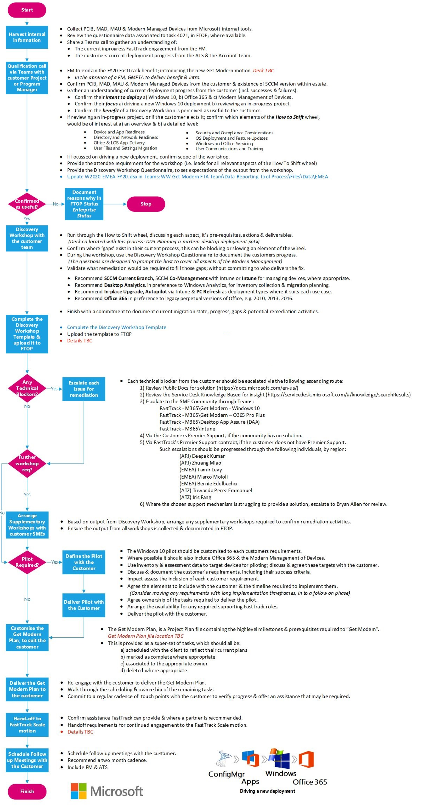

---  
# required metadata  
title: FastTrack Playbook - Get Modern 
description: FastTrack Playbook - Get Modern 
ms.author: maconcei  
manager: eduardod  
ms.date: 9/24/2019  
ms.topic: playbook  
ms.prod: non-product-specific  
ms.custom: internal-playbook  
ft.audience: internal  
ft.owner: mikelamb
---   
[!INCLUDE [Playbook Feedback](./includes/questions-feedback.md)]

# **Get Modern FastTrack Architect Approach Deployment**

**Program Manager: Mike Lamb, Caden Li**

## Overview

The FastTrack Get Modern FastTrack Architect (GMFTA) team is a customer
facing, onsite role. The mission is to work closely with customers
before and during an onsite visit, to set up a comprehensive, effective
and agreed upon Windows 10 deployment plan, and see through the
execution by remote FastTrack technical team members. Get Modern
FastTrack Architect (GMFTA) members will also assist unblocking customer
side challenges and escalations by working closely with customer
stakeholders and Microsoft engineering teams.

## Objectives 

The following is a list of objectives for this document:

  - How to work together with other FastTrack teams, such as:
    
      - FastTrack Architects (FTA)
    
      - FastTrack Gateway
    
      - FastTrack Center (FTC-CSS)
    
      - FastTrack Ready Partners (FRP)

  - Steps to plan a successful customer visit.

  - Deliver a comprehensive, discussion-based review of the customer
    current plan for Windows 10 adoption

  - Level set the customer on new technology that could accelerate their
    current plan

  - Build a (or customer an existing) Get Modern plan that accelerates
    their deployment of Windows 10 & Office 365, preferably using Modern
    Management practices

  - Help with blocking issues and escalations

  - Provide data and insights to Microsoft leadership and engineering
    teams

## Approach 

Primary Role: **Get Modern FastTrack Architect (GMFTA)**  
Applies To: **Get Modern (Windows, Office 365 ProPlus & Intune)**

There are two methods of engagement for the Get Modern FTA; reactive
engagement from CSS delivery or a proactive engagement assigned by the
Get Modern program team. Both methods are inputs to the same executions
steps for the Get Modern FTA.

**Engagement Method 1: Proactive**

  - Assignment by the Get Modern program team.

  - The GMFTAs will facilitate an internal sync with other FastTrack
    resources assigned to the customer (FM, FE, SME, FTA) and the ATS,
    to understand the current status of any in-flight activities as well
    as explain the objective of the proactive assignment. At a minimum,
    the same data collected by the Gateway Team should be validated on
    this internal sync.

  - The GMFTAs contact the account team to coordinate the targeted
    motion in collaboration with the other FastTrack resources assigned
    to the customer (FM, FE, SME, FTA).

**Engagement Method 2: Reactive**

1.  A Re-engagement Manager from the FastTrack Gateway team will contact the assigned GMFTA to discuss the customer as part of their initial customer research as they execute the Get Modern Gateway Approach.
     
    a.  The GM FTA should promptly reply to the query, assisting the Gateway team by providing insight into the customer’s current status regarding their Get Modern journey & deployment plans.

2.  The Gateway team will continue their process of internal outreach, customer research and then engage the account team to coordinate the Get Modern benefit. At this time the GMFTA will be asked to join the collaboration with the account team as part of the FastTrack team (GW, FM, SME, FTA) and the ATS.
    
    a.  If the account team is unable to qualify the customer with the Gateway team’s Get Modern Customer Validation, they’ll be asked to introduce the Get Modern benefit & FastTrack team (including GMFTA) to the customer. 
    
    b.  Qualifying customers will be assigned to CSS or FRP for remote delivery. 
    
    c.  Customers who do not qualify will be referred to a partner and provide the Get Modern deployment guidance. 

3.  If no FM or GMFTA are assigned at this stage in the Gateway Approach, the Gateway team will request both assignments. 

4.  The Gateway team will facilitate a warm handoff to include the GMFTA, FM, FE, SME, FTA and the ATS, then disengage. 

**Get Modern FTA Execution**

The following flow chart details the tasks to be undertaken the Get Modern FastTrack Architect. This process starts where the Engagement Method above finishes. There should be no delay between these two processes as they are designed to flow from each other

## Refresh Summary

| **Date**  | **Who Changed** | **What Changed** |
| --------- | --------------- | ---------------- |
| 6/09/2019 | Mike Lamb       | Playbook updated |
| 5/14/2019 | Mike Lamb       | Playbook Created |
