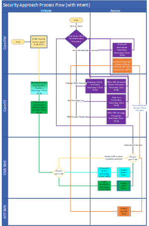

---  
# required metadata  
title: FastTrack Playbook - FY20 Approaches
description: FastTrack Playbook - FY20 Approaches
author: Maria Conceição
ms.author: maconcei
manager: eduardod  
ms.date: 4/3/2020  
ms.topic: playbook  
ms.prod: non-product-specific  
ms.custom: internal-playbook  
ft.audience: internal  
ft.owner: mareich
---  
[!INCLUDE [Playbook Feedback](./includes/questions-feedback.md)]

# Security and Compliance

## Overview

The Security and Compliance Approach is the way by which the Priorities for Intune, Azure Active Directory Premium (AADP), Cloud Managed Monthly Active Devices (MAD) and Security & Compliance E5 will be delivered. It describes the FastTrack scale way to deliver on Intune, AADP and MAD. In FY20, it will also be the approach to deliver on the Microsoft 365 E5 Security and Compliance workloads to be incubated.

## Objectives

-  Understand customer Enterprise Mobility Suite (EMS) and Security & Compliance deployment requirements and how Microsoft 365 security solutions address them.

-  Assess customer's current knowledge of Identity, Device and Information security.

-  Explain to the customer:
    -  Importance of security.
    -  Why a security and compliance baseline should be established.
    -  Why productivity and collaboration workloads should deploy securely.

-  Route the customer to the appropriate resources to enable value (active usage/devices) quickly.

-  Guide customer through a secure deployment.

## Approach
Primary Roles: **FastTrack Manager, FastTrack Engineer, EMS SME, ATP SME, Compliance SME**
 
The Security & Compliance Approach will be run through the Customer Health, Targeting and RFA motions.

The Customer will follow Assess, Remediate and Enablement steps across the applicable workloads intended to deploy. Within the FastTrack, these workloads include AADP, Intune, Office 365 Advanced Threat Protection (OATP), Azure Information Protection (AIP), and Microsoft Defender Advanced Threat Protection (MDATP).  Remaining Security & Compliance workloads (Azure Advanced Threat Protection (AATP), Microsoft Cloud App Security (MCAS), Microsoft Information Protection (MIP), Microsoft Information Governance (MIG)), will be supported via specialized SME resources in the Customer Experience Engineering (CXE) team in FY20.

(Click the below image to enlarge.)  

### Playbook Processes

- [Initiate Deploy Securely](initiate-deploy-securely.md)
- [Conduct Security and Compliance Workshops](assess-conduct-security-and-compliance-workshops.md)

### Request Subject Matter Expert for Security and Compliance
To get support for your customer on Security and Compliance workloads in FY20, here are directions to request a resource, which will follow a routing model that provides resources across FastTrack, Get To Production (GTP), Incubation, and Self-Help.  

The resource request process supports the following Security and Compliance workloads: AADP, OATP, MDATP, MIP, MIG, MCAS, and AATP.  

A few considerations for submitting your request:  

- If your customer needs assistance on multiple workloads, create a request for each workload separately. Provide as much detail as possible in the request form for improved routing and speed to engagement.
- Workloads that are still in Incubation predominantly have English speaking resource coverage, but we continue to build out support for additional languages, so if uncertain, please submit a request for language of need and the routing model triage will determine if we have support or not.
- Identity SME request process does not change. Continue to request Identity SMEs, if you need assistance on ensuring customers are educated and understand identity constructs.
- Prerequisites before submitting requests for the following:
  - Data Loss Prevention (DLP) – M365 FE conduct Task 3748. If more advanced scenarios required, SME request can be initiated. If customer has an active M365, EMS, or AIP stand-alone licensing SKU submit request under Microsoft Information Protection (MIP). If customer has ONLY an active O365 licensing SKU – submit Collab request for assistance
  - Exchange Online Protection (EOP) – M365 FE conduct Collab request. If more advanced scenarios required, submit request under Exchange. An OATP SME will be able to help with the SME request.
  - Retention Policies & eDiscovery (E3) – submit request under Microsoft Information Governance.

| Workload | Region | Language | License Count | Routing Request Steps | Which team supports? |
| - | - | - | - | - | - |
| AADP P1 | Americas, APJ, EMEA | WW FTC Supported | More than 150 seats | FTC Resource Request Tool > Select AADP workload | EMS SME |
| AADP P2 | Americas, APJ, EMEA | WW FTC Supported | More than 150 seats | FTC Resource Request Tool > Select AADP workload | Identity SME/EMS SME |
| OATP P1 | Americas, APJ, EMEA | WW FTC Supported | More than 150 seats | Engage Generalist FE | M365 FE |
| OATP P2 | Americas, EMEA, APJ | WW FTC Supported | More than 150 seats | FTC Resource Request Tool > Select OATP workload | ATP SME or CAT |
| MDATP | Americas, EMEA, APJ | WW FTC Supported | More than 150 seats | FTC Resource Request Tool > Select MDATP workload | ATP SME or CAT |
| MIP P1 | Americas, APJ, EMEA | English Only | More than 150 seats | Customer self-deployment guidance available: [https://docs.microsoft.com/en-us/azure/information-protection/](https://docs.microsoft.com/en-us/azure/information-protection/) Internal Compliance Q&A Tool: [https://complianceqnatool.azurewebsites.net/](https://complianceqnatool.azurewebsites.net/) FTC Resource Request Tool > MIP workload for limited incubation support | Incubation SME |
| MIP P2 | Americas, APJ, EMEA | WW FTC Supported | More than 150 seats | Internal Compliance Q&A Tool: [https://complianceqnatool.azurewebsites.net/](https://complianceqnatool.azurewebsites.net/) FTC Resource Request Tool > Select MIP workload | Compliance SME or CXE |
| MCAS | Americas, APJ, EMEA | English Only | Below 10k seats | No people resources available - self-deployment guidance: [https://docs.microsoft.com/en-us/cloud-app-security/](https://docs.microsoft.com/en-us/cloud-app-security/) | N/A |
| MCAS | Americas, APJ, EMEA | English/Limited | Above 10k seats | FTC Resource Request Tool > Select Security and Compliance  | GTP |
| AATP | Americas, APJ, EMEA | English Only | Below 10k seats | No people resources available - self-deployment guidance: [https://docs.microsoft.com/en-us/azure-advanced-threat-protection/](https://docs.microsoft.com/en-us/azure-advanced-threat-protection/) | N/A |
| AATP | Americas, APJ, EMEA | English/Limited | Above 10k seats | FTC Resource Request Tool > Select Security and Compliance  | GTP |
| MIG P1 | Limited/Exception Based | English Only | Above 5k seats | Self-deployment guidance: [https://aka.ms/compliancedocs](https://aka.ms/compliancedocs) FTC Resource Request Tool > Select MIG for limited incubation support | Incubation SME |
| MIG P2 | Americas, APJ, EMEA | WW FTC Supported | Above 150 seats | Internal Compliance Q&A Tool: [https://complianceqnatool.azurewebsites.net/FTC](https://complianceqnatool.azurewebsites.net/FTC)  FTC Resource Request Tool > Select MIG | Compliance SME or CXE |
