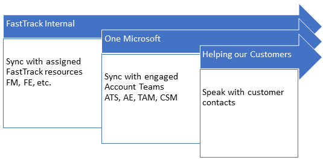
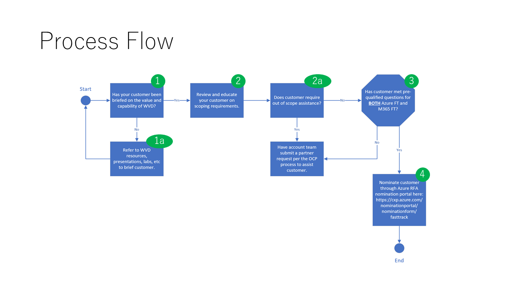

---  
# required metadata  
title: FastTrack Playbook - COVID FastTrack Architect 
description: FastTrack Playbook - COVID FastTrack Architect 
ms.author: ryanme  
manager: eduardod  
ms.date: 4/1/2020  
ms.topic: playbook  
ms.prod: non-product-specific  
ms.custom: internal-playbook  
ft.audience: internal  
ft.owner: ryanme
---   
[!INCLUDE [Playbook Feedback](./includes/questions-feedback.md)]

# FastTrack Architects

FastTrack Architects should work with their assigned customers to understand any current struggles and/or needs they are facing because of the COVID-19 pandemic, highlighting the discussions around enabling Remote Work: Productivity with Teams, Enabling Devices for Remote Work (including Windows Virtual Desktop), and Securing your Data. If there is both a GM FTA and a Health FTA assigned to a customer, work together to decide who will take the lead role in the COVID actions.  

When an FTA is assigned to a customer in FTOP they need to take these steps to engage:  

1. **Prioritize customers** in the following order:
   1. Top priority is customers who are facing potential business stoppage and already asked Microsoft to help through RFA or communication with the account team.
   1. Customers who are at-risk for FY20 Q4 renewal.
   1. Customers who have ongoing, active projects with FastTrack resources.
1. **Sync with FastTrack team members** to ensure define a cohesive approach to engage account team and customers
1. Gain further customer understanding through Microsoft only **discussion with Account Team** members such as ATS, AE, TAM and CSMs. *(FTOP Task 4115)*
1. **Reach out directly to the customer** to start the engagement process described below in the following section. *(FTOP Task 4116)*
1. Come away from the conversation with agreed-upon next steps, expectations, and target dates (This document will refer to this collection of information as the **workload/feature rollout plan**.) (*FTOP Task 4117*)
1. **Align appropriate resources** to help achieve the goals of the customer, according to the rollout plan.  These Microsoft resources may be inside or outside of the FTC, like SMEs or CAT teams. (*FTOP Task 4118*)

  

## Customer Engagement Detail Steps  

The engagement should consist of 4 parts:  

- Sync with Account Team – *FTOP Task 4115*
- Strategic Deployment conversation with customer – *FTOP Task 4116*
- Agree upon Workload/Feature Rollout Plan – *FTOP Task 4117*
- Request or Assign Resources – *FTOP Task 4118*

## Internal sync with FastTrack resources and Account Team  

The FTA will need to first facilitate a sync between FastTrack resources and the Account Team members.  The objective should be to inform one another of situational awareness that has been gained so far, and a unified/One Microsoft approach for the customer conversation.  

**Q4 At-Risk deals** should be identified here as well.  Be sure to discuss the customer’s upcoming renewal dates and understand the potential risks to any renewal, upsell, or license expansion.  

### Strategic Deployment conversation with customer  

In this step, FTA will take below actions to understand the customer’s needs and capture them in our toolset.  

1. If the customer’s needs fit into the following scenarios:
   1. Productivity through Teams
   1. Enabling Devices for Remote Work (including WVD – see section below)
   1. Securing your data
1. Document the asks in FTOP Technical Enablement Notes under the corresponding services, plus [#COVID tag](https://microsoft.sharepoint.com/teams/ftccm/ftcinfo/Lists/Posts/Post.aspx?ID=1886)
1. If customer’s needs do not fit in above scenarios, determine which service the need falls under. For example, for urgent Windows Servicing request, document that under Windows Service with #COVID.
1. Determine if customer’s need is not in scope for FastTrack service. If not in scope, document the exception in **FastTrack Insight tool**. Make recommendation to leverage Premier or Partner service/ECIF to fill the gap for customer need.

If the customer is blocked or stalled by complications arising as a result of COVID-19, capture that by use of the L1/L2/L3 option specific to this reason. Guidance for COVID-19 L3 documentation is in this [FTC Info Post](https://microsoft.sharepoint.com/teams/ftccm/ftcinfo/Lists/Posts/Post.aspx?ID=1888).

### Agree upon Workload/Feature Rollout Plan  

A rollout plan, or a more formal deployment plan is used to define what customers want to achieve, how they will deploy the technical scenario, who should deliver and timeline.  

In most cases, customers already have a plan that needs assistance from Microsoft to validate and share best practice. FTA should work with the customer on the plan they already have.  

If customers do not have an existing plan and want one from Microsoft, please [leverage these materials](https://transform.microsoft.com/enable-teams-anywhere) for the following scenarios:  

1. Productivity through Teams  
1. Enabling Devices for Remote Work  
1. Securing your data  

Update customer usage forecast in **Forecast tool**.

### Request or Assign Resources  

Once customers have an agreed upon rollout/deployment plan, FTA should identify the resource needs together with customers to implement the plan, by taking following steps:  

1. Match delivery needs with FastTrack scope, and include FastTrack Manager as well as FastTrack Subject Matter Experts to deliver in scope items.  
1. Identify delivery resources for out of FastTrack scope items. The resources are usually Partners, Microsoft Services (Premier/PFE/MCS) and customer team members.  
1. Stay engaged throughout the implementation.  
1. Capture customer insights via **FastTrack Insight tool**.

**Note:** If you have already completed these activities, you are not required to go back and complete the tasks retroactively.

### Growth  

Reach out to the account teams proactively to support E5 opportunity as appropriate.  

1. Assess E5 opportunity for all the customers you are actively engaged in.  
   1. Support your account team if the customer requires advanced features to implement their COVID response or has specifically requested a feature they are not licensed for. Prioritize customers that have upcoming renewals /anniversaries in FY20 ([https://aka.ms/ftgrowthopspbi](https://aka.ms/ftgrowthopspbi))
   1. Do not proactively reach out to your account team if the customer is blocked, or is putting an advanced feature on hold due to their COVID plan

>[!NOTE]
>Task Reference: 4108 (Engage with Account Team for E5 Growth)  

### Implementing Windows Virtual Desktop (WVD)

One solution for helping customers Enable Devices for Remote Work is to help them with Windows Virtual Desktop (WVD). FTAs are a key part of this evolving process and technology and start by nominating a customer using the following process.

## WVD Nomination Process Flow:  

  

### STEP 1. If a customer needs to be briefed on the capabilities of WVD use this resource. ([https://transform.microsoft.com/products/windows-virtual-desktop](https://transform.microsoft.com/products/windows-virtual-desktop))  

- 1a.  If needed, refer to the available WVD Resources under [COVID-19 Response Playbook Resources](covid-resources.md)  

### STEP 2. FTA to review WVD FastTrack Scope with Customer  

**In Scope (To be executed by WVD SMEs)**  

- WVD Native Deployments ONLY (e.g. Not working with Citrix or VMware)
- Deploy Office 365 ProPlus and Windows 10 to WVD Multi-session environment.
- Configure Office 365 ProPlus FSLogix capabilities.
- Deploy Teams to host pool.
- Deploy Edge to host pool.
- Deploy M365 security capabilities
- Provide overview of MDATP for WVD Multi-session (Coming soon)
- Provide overview of Intune support for WVD (Coming soon)

**Out of Scope**  

- Third party application virtualization/deployment.
- Custom images.
- SCCM and MDT.
- Migrations and scenarios involving VMware and Citrix.
- Linux scenarios.
- Project management of the customer's Windows Virtual Desktop deployment

**2a.**  If Out of Scope support is needed, FTA to follow up with the Account Team to submit a Partner request via the OCP process. ([https://ocpsupport.azurewebsites.net/Support/Create?hasAcctKey=False](https://ocpsupport.azurewebsites.net/Support/Create?hasAcctKey=False))

### STEP 3. FTA to work with the Customer to go through the M365 Nomination Pre-Qualification Questions to ensure they meet the following requirements for both FastTrack Azure and FastTrack M365.  

**FastTrack Azure:**  

- Has an active, paid Azure subscription
- Located in a region where Azure FastTrack is available.
  - As of today, FastTrack for Azure is available in all Azure commercially supported regions with the following exceptions:
    - Not available in mainland China
    - Available in Russia, Hong Kong, Taiwan, Macao, and India by exception and in English only
    - Engagements in local language are dependent on resource availability
- Has one of the following licenses:
  - M365 E3, E5, A3, A5
  - Windows 10 E3, E5, A3, A5  

**FastTrack M365:**  

- Has one of the following licenses: (150+ & 150+ VMs minimum)  
  - M365 E3, E5, A3, A5  
  - Windows 10 E3, E5, A3, A5  
- Azure subscription that contains a virtual network  

### STEP 4. If all FastTrack Azure and M365 pre-qualification requirements defined in Step 3 are met, FTA will submit the Customer through the  [Azure Nomination Portal](https://cxp.azure.com/nominationportal/nominationform/fasttrack).  

- Customer TPID, Enrollment ID, or Subscription ID will be needed to get started  

If the Pre-Qualification requirements defined in Step 3 are **not** met, FTA will  follow up with the Account Team to submit a Partner request via the OCP process. ([https://ocpsupport.azurewebsites.net/Support/Create?hasAcctKey=False](https://ocpsupport.azurewebsites.net/Support/Create?hasAcctKey=False))

### WVD FAQs:  

1. What if an FTA is already engaging with a customer on Windows Virtual Desktop, what do they do?  
 Response: If FTA is actually engaged and feels comfortable completing the engagement, then they can remain engaged and leverage Azure FT if needed.  

1. Can we further explain how an FTA could leverage [https://microsoft.sharepoint.com/teams/MicrosoftRemoteWork/SitePages/WVD-Q4-Azure-Offer.aspx](https://microsoft.sharepoint.com/teams/MicrosoftRemoteWork/SitePages/WVD-Q4-Azure-Offer.aspx)?  
 Response: This is an ECIF offering where field teams can nominate a customer with the assistance of a partner or Microsoft Services to onboard to WVD.  

1. How do FTAs work with FTC, now and in the future?  
 Response: FTAs will be able to educate customers on WVD today with the resources they now have access to. Assuming a customer meets the pre-qualifying criteria, the FTAs will then submit the Azure nomination RFA form for a FastTrack engagement. Will revisit as we move to scale.  

1. We heard WVD FTC Service would start incubation in the Americas. When it comes to EMEA and Asia, what should FTAs do in those locations?  
 Response: We are planning a rapid expansion to move to scale as quickly as possible to support EMEA and APJ in the coming weeks. FTAs in those regions should follow the same steps to educate a customer on the benefits of WVD, pre-qualify a customer, and submit the Azure nomination form for a FastTrack engagement.  

As conversations move or evolve to interweave other workloads and motions that support helping the customer with remote working, such as WIN10/OPP + E5 Security, these are positive paths to pursue:  

1. Tracking the COVID impact  
   - Review the [FTC Info post](https://microsoft.sharepoint.com/teams/ftccm/ftcinfo/Lists/Posts/Post.aspx?ID=1881) for tracking accelerated workloads as well as the [FTC Info](https://microsoft.sharepoint.com/teams/ftccm/ftcinfo/Lists/Posts/Post.aspx?ID=1888) post for decelerated workloads.  
   - Workload **acceleration, expansion** - add **#COVID** to the Notes field with details of the impact, Example **#COVID** customer choosing to prioritize OLM, TEAMS by +40k by XX Date.  
   - Workload **pause, deprioritized** - update **L1/L2/L3** to Blocked / IT Change Management and Resourcing / COVID.  
2. Architects should ensure that large scale Teams deployments from Health & Targeted customers are captured [here](https://forms.office.com/Pages/ResponsePage.aspx?id=v4j5cvGGr0GRqy180BHbR-D25PtjkoVBsDR7fOK7U1hUOVlFQzlETVlUR0UwNEVFTk1GR01LV1YxOC4u). Update as needed.  

**COVID-19 Talking Points**: Reactive-only responses to queries about coronavirus impact on capacity supply & demand. [https://aka.ms/ftacovidtalkingpoints](https://aka.ms/ftacovidtalkingpoints)