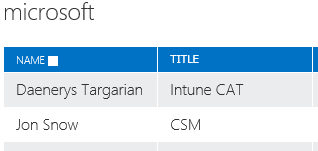
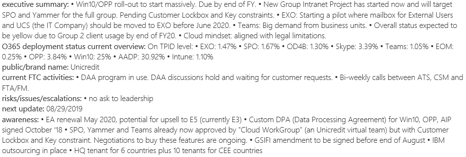
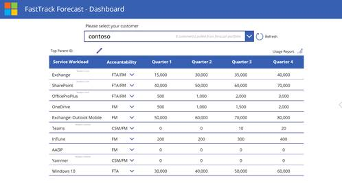

---  
# required metadata  
title: FastTrack Playbook - Customer Health Recurring Activities
description: FastTrack Playbook - Customer Health Recurring Activities
author: Mark Eichenberger
ms.author: mareich
manager: eduardod  
ms.date: 9/25/2019  
ms.topic: playbook  
ms.prod: non-product-specific  
ms.custom: internal-playbook  
ft.audience: internal  
ft.owner: mareich
---  

[!INCLUDE [Playbook Feedback](./includes/questions-feedback.md)]

# Customer Health - Recurring Activities

Primary Roles: **FastTrack Architect, FastTrack Manager**  
Applies To: **Exchange, SharePoint, Win10, Office ProPlus, AADP, Intune**

FastTrack resources assigned to S1500 customers (Health Owners) should seek to understand the holistic status of each customer, intent of each of their workloads across M365, current consumption (usage or activations), and intended future consumption (forecasting).

The output of the aforementioned situational awareness occurs through the following activities, any of which can be recurring.

| **Activity**                                                        | **Frequency Expectation**                     | 
|---------------------------------------------------------------------|-----------------------------------------------|
| Understand and document Situational Awareness                       | During Initiate Phase; and ongoing            |  
| Align situational awareness to the FY priorities                    | During Assess Phase; and ongoing as needed    |
| Understand and drive what it will take to move the customer forward | During Assess Phase; and ongoing as needed    |
| Update FTOP:   Customer Progress, Customer Perspective, and Enterprise Status Notes      | Red and Yellow Customers: Every 2 weeks; or sooner as needed   Green and Blue Customers: Quarterly; or sooner as needed | 
| Update Projected Usage in Forecasting Site                          | Quarterly; or sooner as needed                | 
| Manage Internal and External Escalations                            | During Initiate Phase; and ongoing as needed  |
| Prepare for, attend, and present customer details in regional Customer Review Meetings  | As selected by regional leads; typically minimum of 6-week interval between recurrence  |

## Understand and Document Situational Awareness

Situational Awareness (SA) is being aware of what is happening at your customer, and anything that relates to deployment in terms of where you are in the life cycle, timelines and progress made to date or impeded, whether something around you is a potential risk and hinders or prevents progress or outcomes of your customer moving forward with customer health.

- Detailed [Situational Awareness guidance](/role-guide/fta-situational-awareness.html)

## Align Situational Awareness to the FY priorities

Health Owners are encouraged to go through the exercise of reading and understanding the current FY priorities and targets. With that knowledge, organize the acquired situational awareness as it pertains to each FY priority.

As additional situational awareness is gained over the course of the engagement, this activity should recur. Though the FY priorities and targets are not expected to change significantly, opportunities to contribute to those targets should continually be explored.

The latest table of FY20 FastTrack Priorities and targets can be found at [http://aka.ms/FTMetrics](http://aka.ms/FTMetrics) under the “FY20 FT Priorities” tab.

**Example**: The customer initially only has intent to deploy EXO and OPP. After 6 months of successful onboarding, the customer is now interested in moving from Windows 7 to Windows 10. This is a new facet to Situational Awareness as well as an opportunity to contribute to FY20 FastTrack targets.

## Understand and drive what it will take to move the customer forward

> [!Note]
> The highest priority in the Customer Health motion is to make healthy customers.

Armed with fresh situational awareness and support from all engaged parties, plan to execute steps toward health in accordance with the FastTrack Lifecycle phases.

Study related FastTrack materials and collaborate with peers to create
the customer-specific strategy that will bridge the customer from a
place of intent to achieving success.

After each task is completed or threshold reached, repeat this planning
exercise.

## Update FTOP

FTOP should be used to capture information and key data points, as
Situational Awareness is being developed, with the understanding that
different roles within the FTC expect to reference it at any time.

### **Contacts**

All involved FastTrack team members should work to keep this repository
clean and up-to-date, but the Health Owner has accountability.

**New for this year:** Adding special SME resources, like Intune CAT or
GTP, to the Microsoft section of the contacts tab. The free text field
for “Title” should be used to designate what type of resource the
contact is.

**Example Contacts:**

### **Enterprise Status**

The winner tenant (a.k.a. referencing tenant) will carry Customer
Health-related qualitative data for the entire TPID. When updating this
status on the winner tenant, please include situational awareness
relevant to *all tenants that roll-up to the TPID*.

**The WHY:** Enterprise Status is pulled through the database for Power
BI reporting, as part of an effort to compile situational awareness data
points into one single view for leadership. This was automatically
pulled into S400 ppt slides in FY19, but it has graduated to a Power BI
dashboard in FY20. Overall Status, by contrast, does not have this
database connection.

**“Enterprise” terminology:** The plan for this year was to change
“Enterprise Status” to “Customer Health Status” to align with our
approach and goals. However, we were not able to secure the change to
FTOP prior to the launch of the program.

**Enabling Enterprise Status fields in FTOP:** If the FTOP tenant does
not currently have available fields under the Enterprise Status tab,
please navigate to the flags tab in FTOP and change the value of the “Is
Enterprise” flag.  
Level 3 denotes less than 50,000 users; Level 4 denotes greater than or
equal to 50,000 users.

**Executive Summary:** Provide crisp executive level summary with
high-level topics, brief descriptions, progress within the account,
impact, and next action(s).  
(As well as additional data points specified in the [Situational Awareness Resources](/role-guide/fta-situational-awareness-resources.html) table.)

**Risks**: Highlight any risks or issues within the account and blockers
that prevent the customer from progressing to next customer health
score. Describe efforts to respond to, resolve and elevate
escalations.  
(As well as additional data points specified in the [Situational Awareness Resources](/role-guide/fta-situational-awareness-resources.html) table.)

**Awareness**: What does leadership need to be aware of for this
customer? Consider including current strategy, partner activity, company
restructuring/re-organization, recent milestones achieved, etc.  
(As well as additional data points specified in the [Situational Awareness Resources](/role-guide/fta-situational-awareness-resources.html) table.)

**Cadence:** Every 2 weeks for Red and Yellow customers; Every Quarter
for Green and Blue customers; or upon significant milestone or event

**Example:**

## Update Forecast Data

The Health Owner should provide forecasts of their customers' active usage numbers across Microsoft 365 services on a quarterly basis or when significant events have occurred. This allows the FastTrack Team to better understand customer intent and potential adoption of all workloads across the portfolio of engagements. The customer forecast data is also reviewed in the Regional Customer Health Review Meetings.

**Prerequisites:** Before completing the initial forecast, please review both the Situational Awareness guidance article and its associated Situational Awareness Resources article.

**Cadence:** Quarterly; or on significant milestone or events which may
adjust the current forecast

**Detailed Tool Guidance**: ​ [Customer Health Forecasting](motion-customer-health-forecasting.md)

**Tool Link:** [http://aka.ms/ftcforecast](http://aka.ms/ftcforecast)
  

## Manage Internal and External Escalations​

To effectively manage escalations, first understand context by carefully
listening and gather relevant information from whoever is involved (such
as the Account Team (ATU), Customer, Partner, Services, etc.). 

This is accomplished by remaining aware of the progress of each
escalation and, where necessary, invoking additional resources to assist
towards the resolution.

Please refer to [Escalation Management](/role-guide/fta-escalation-mgmt.html) process.

## Regional Customer Health Review Meetings

Weekly customer health review meetings will be held by Regional and Area
Liaison leadership.

The customer health Power BI will be used as a visual aid for the
discussion, which will focus around the plan to move status
from red/yellow to green/blue.

Attendance is mandatory for those whose customer(s) has/have
been nominated for a specific meeting (agenda is set at least a week in
advance). Otherwise, attendance is optional.

The FTA/FM should prepare to present and discuss the following: 

  - Customer health status today and expected progress with due dates.  
    This is requested to be presented as the opening sentence with the
    following structure:  
    “Customer \[Contoso\]’s overall health is Red, with groups 1, 2 & 3
    being Red, Yellow and Red, respectively. I forecast to achieve a
    change in the overall customer health from Red to Yellow by the end
    of \[month/year\]”

  - Customer's subscription renewal dates 

  - Customer's cloud business reason and mindset: Overall business
    reason for moving to the cloud, and intent or propensity to move to
    the cloud across our workloads 

  - High/lowlights of workload statuses, especially if blocked or with
    no intent and when significant progress has been made 

  - Risks, challenges, issues, blockers, opportunities, breakthroughs,
    wins, successes 

  - Asks of FastTrack leadership team, help needed 

**Prerequisites:** To prepare for a customer review presentation, please
review both the [Situational Awareness guidance](/role-guide/fta-situational-awareness.html) article and its associated [Situational Awareness Resources](/role-guide/fta-situational-awareness-resources.html) article.

**Cadence:**  Weekly and as required by leadership

**Recurring Activity:**  Mandatory when presenting, otherwise optional