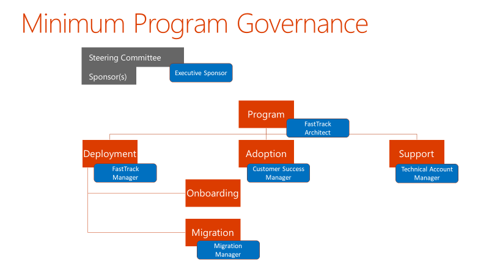

---  
# required metadata  
title: FastTrack Playbook - Customer Health Governance
description: FastTrack Playbook - Customer Health Governance
author: Mark Eichenberger
ms.author: mareich
manager: eduardod  
ms.date: 8/6/2019  
ms.topic: playbook  
ms.prod: non-product-specific  
ms.custom: internal-playbook  
ft.audience: internal  
ft.owner: mareich
---  
[!INCLUDE [Playbook Feedback](./includes/questions-feedback.md)]
# Customer Health - Governance 

## Overview

The FastTrack Architect or FastTrack Manager will work with a customer's
(and partner(s)) Leadership to establish a Governance Model and
Reporting rhythm to support their Microsoft 365 deployment journey,
including documenting a risk/issues, escalation management and
communication plan.

Engagement Governance Reviews are essential for driving successful
outcomes and managing customer expectations and satisfaction.

The FastTrack Delivery Team is available to customers for program
support in the form of executive review meetings, project planning
meetings, migration schedule workshops, and program reporting hygiene.

The recommended regular meetings with the customer and partner(s) are:

-   Onboarding and Migration Status meetings, and

-   Governance, Strategy, and Health Briefing meetings.

## Objectives

-   Set, reset and manage customer expectations on an ongoing basis, to
    avoid deployment blockers and escalations as well as establishing
    and maintaining accurate situational awareness of the customer
    program and beyond.

    -   Understand Customer Health

    -   Technical/Business reviews

    -   Customer/Partner milestones and deliverables status

    -   Issues, risks and blockers

    -   Key accomplishments

    -   Updates to customer plans and target dates for identifying
        acceleration opportunities and forecasting

    -   Gauging customer satisfaction as well as detecting and managing
        any issues early on before they turn into escalations

-   Establish a governance model early, set a clear strategy, and agree
    on regular Governance, Strategy and Health Briefings cadence with
    the customer leadership.

## Approach

### Assess scope, stakeholders, parties involved

Primary Role: **FastTrack Architect/FastTrack Manager**\
Applies To: **All services**

The FTA/FM should understand the scope of the FastTrack engagement and
how that fits with a bigger scope of the customer's Program (e.g.
Digital Transformation).

With that, the FTA/FM will work with the Microsoft Account Team to
identify the stakeholders (sponsor, decision makers, influencers,
project managers) of all parties involved and agree on the ownership and
management of the relations.

**Cadence:** After initial assessment, an evaluation should happen at
any major change and/or phase change.

**Recurring Activity:** Mandatory

### Identify escalation paths to all parties involved

Primary Role: **FastTrack Architect/FastTrack Manager**\
Applies To: **All services**

Parties involved may not be just limited to the customer project team
and FastTrack. Determine all parties involved, such as customer
operations & support, external services providers (e.g. for Network),
external consultancy, and other Microsoft groups (e.g. Premier).

**Cadence:** Do this once, get it right first time. Reconsider when
significant scope expansion or shift and/or parties change

**Recurring Activity:** Mandatory

### Define minimum required governance

Primary Role: **FastTrack Architect/FastTrack Manager**\
Applies To: **All services**

Depending of the scope and parties involved, the FTA/FM should define
which Governance model should be applied for the FastTrack engagement.
Be aware of the management methodology used by the customer (Waterfall,
PMI, PRINCE2, LEAN, Scrum, Agile, \...).

**Cadence:** Do this once, first time right. Reconsider when significant
scope and/or parties change.

**Recurring Activity:** Mandatory

### Schedule Onboarding and Migration status meetings

Primary Role: **FastTrack Manager**\
Applies To: **All services**

The purpose of setting up the Onboarding and Migration status meetings
is to track and drive progress of the customer onboarding and data
migration to Microsoft 365.

FM schedules the recurring Onboarding and Migration status call with
relevant participants from the Customer, Partner(s) and Microsoft.
Participants could include: ATU, CSU, FastTrack Partner, FastTrack
Subject Matter Experts, FastTrack Engineers, customer Technical Leads,
customer Program/Project Leads, and customer sponsor.

The meetings will be predominantly remote however in certain
circumstances there may be a requirement for onsite attendance to
facilitate this meeting;

-   Highly secure Government customer

-   Customer having restricted network access to remote capabilities
    (i.e. Skype or Teams)

-   Identified specific need to be onsite as requested by the customer

**Note:** When going **onsite** there must be specific outcomes to make it efficient and justifiable. 
- Please follow the link provided for [FastTrack On-site Process Request](https://microsoft.sharepoint.com/teams/jljextgroup/Shared%20Documents/PlayBook/FY20%20Health%20Playbooks%20FTA%20&%20FM(h)/FastTrack%20Draft%20Playbooks/12.%20FastTrack%20Enterprise%20-%20Onsite%20process%20request.docx)

**Cadence:** Every 1 - 2 weeks, depending upon engagement life cycle
phase\
**Purpose:** Review onboarding and migration progress, issues, blockers
and action items

### Schedule Governance, Strategy, and Health Briefings

Primary Role: **FastTrack Architect/FastTrack Manager**  
Applies To: **All services**

The purpose of setting up the Governance, Strategy and Health Briefing
meetings is to establish and maintain accurate situational awareness of
the customer program and beyond, as well as to enable adequate
anticipation, visibility and management of risks, issues, blockers,
changes and to establish an escalation path.

The FTA/FM will guide and assist the customer to conduct these
Governance meetings. Often customers already run a program governance
meeting rhythm of some kind, called as Steering Committee meeting or
something similar. In these cases, the FTA/FM could be invited to attend
the existing governance meeting instead of setting up a new meeting
rhythm. If for some reason the customer wants to keep the existing
meeting series between themselves, the customer should accept to set up
another Governance, Strategy and Health Briefing rhythm with the FTA/FM.

The FTA/FM should attend this (bi-)monthly Governance, Strategy and
Health Briefing meeting with the customer and partner(s) in addition to
(bi-)weekly Onboarding and Migration status meetings.

The Governance, Strategy and Health Briefing meeting should receive a
report from the customer or partner which will be reviewed and discussed
in the meetings. The report is depending on the project management
methodology used by the customer or partner, but at minimum should
contain:

-   Single Page Status

-   Key milestones and deliverables completed

-   Risks/Issues/Blockers

-   Decisions made and needed

-   Asks for management (if any)

**Cadence:** (bi-)monthly

**Recurring Activity:** Mandatory

