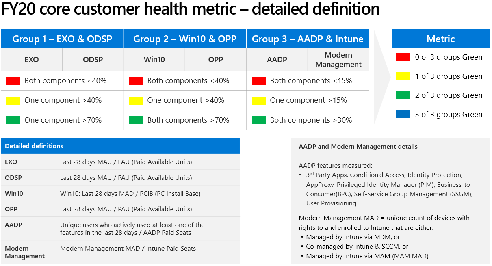

---  
# required metadata  
title: FastTrack Playbook - Customer Health Motion
description: FastTrack Playbook - Customer Health Motion
author: Mark Eichenberger
ms.author: mareich
manager: eduardod  
ms.date: 3/25/2020  
ms.topic: playbook  
ms.prod: non-product-specific  
ms.custom: internal-playbook  
ft.audience: internal  
ft.owner: mareich
---  
[!INCLUDE [Playbook Feedback](./includes/questions-feedback.md)]
# Customer Health Motion

## Overview

When a customer uses multiple, complementary Microsoft 365 cloud services to established usage thresholds, we consider them to be healthy. Overall "Healthy" customers are more likely to renew, upgrade, and recommend Microsoft 365 cloud services to others. More details are specified in the Scope table below.

This is a change in our strategy. Historically, the FastTrack Center has seen usage of Microsoft 365 cloud services as a measurement of customer satisfaction and an indicator of whether the customer will renew their subscription. However, we learned from the data, that usage alone in any individual service is not the best predictor of customer satisfaction, potential renewal or upsell/upgrade of Microsoft 365 cloud services.

## Scope

| Type | Definition |
-----------------------|------------------------|
| **Workloads**  | **Group 1:** Exchange, ODSP (OneDrive/SharePoint)   **Group 2:** Windows 10, Office ProPlus   **Group 3:** Azure Active Directory Premium (AADP), Intune |
| **Customers** | **Strategic 1500 (s1500) and Strategic 500 (S500):** 1500 customers (TPIDs) have been chosen for FY20 to receive proactive engagement through an assigned FastTrack Manager. These are the largest 1500 customers by Microsoft revenue.   A subset of this list, the S500, will also have a FastTrack Architect assigned. | 

## Objective
Increase the health of the S1500 customers, driving the customer to Green in order to help them realize the full value of their purchase and prepare them to purchase and consume additional services.

## Definitions

Below are the FY20 Customer Health measurements and definitions:

## Motion

Using the FastTrack methodology (Initiate, Assess, Remediate, Enable, Migrate), FastTrack engagement teams will work with account teams and CSMs to drive the most strategic customers (S1500) to achieve the Customer Health Objectives.

When a FastTrack Architect or FastTrack Manager is accountable for the health of a S1500 customer, their [recurring activities](motion-customer-health-activities.md) include:
- Monitor Workload Active Usage and Activated Devices
- Understand and document [Situational Awareness](../role-guide/fta-situational-awareness.md)
- Enter Quarterly Projected Usage in [Forecasting Site](http://aka.ms/ftcforecast)
- Update Enterprise Status Notes in FTOP
- Pertain situational awareness to the FY priorities
- Understand and drive what it will take to move the customer forward on the FY priorities
- Manage Internal and External [Escalations](../role-guide/fta-escalation-mgmt.md)
- Prepare for, attend, and present customer details in regionalCustomer Review Meetings

## Additional Guidance
- [Mentoring and Coaching](/role-guide/fta-mentoring.html)
- [Soft Skills](/role-guide/fta-soft-skills.html)
- [Area Liaison](/role-guide/fta-area-liaison.html)

## Customer Health Lifecycle

The full Customer Health Lifecycle is available below.

> [!Note]
> Activities that are unique to this motion are shown in **Bold**

1.  [Presales](phase-presales.md)
    -  [Request FastTrack Architect](presales-request-fasttrack-architect.md)
    -  [Assign FastTrack Architect](presales-assign-fasttrack-architect.md)
    -  [Discovery Workshop](presales-discovery-workshop.md)
    -  [End Customer Incentive Funds / Digital WinRoom Request Review](presales-ecif-dwr.md)
    -  [Migration Exception](presales-migration-exceptions.md)
2.  [Assignment](phase-assignment.md)
    - [Determine Onboarding Channel Assignment](assignment-determine-onboarding-channel-assignment.md)
    - [Assign Delivery Resources](assignment-assign-delivery-resources.md)
3.  [Initiate](phase-initiate.md)
    - **[Land the Benefit](initiate-land-the-benefit.md)**
    - [Conduct Customer Kickoff](initiate-conduct-customer-kickoff.md)
    - **[Setup Governance Review Meeting Cadence](initiate-review-meeting-cadence.md)**
    - [Deploy Securely](initiate-deploy-securely.md)
4.  [Assess](phase-assess.md)
    -   [Conduct Technical Assessment](assess-conduct-technical-assessment.md)
    -   [Conduct Security and Compliance Workshops](assess-conduct-security-and-compliance-workshops.md)
    -   [Conduct Services Workshops](assess-conduct-services-workshops.md)
    -   [Conduct Adoption & Change Management Customer Conversation](assess-conduct-adoption-and-change-management-conversation.md)
5.  [Remediate](phase-remediate.md)
    -  [Address Technical Gaps](remediate-address-technical-gaps.md)
6.  [Enable](phase-enable.md)
    -  [Enable Services](enable-enable-services.md)
7.  [Migrate](phase-migrate.md)
    - [FastTrack Migration Process](migrate-migration.md)
