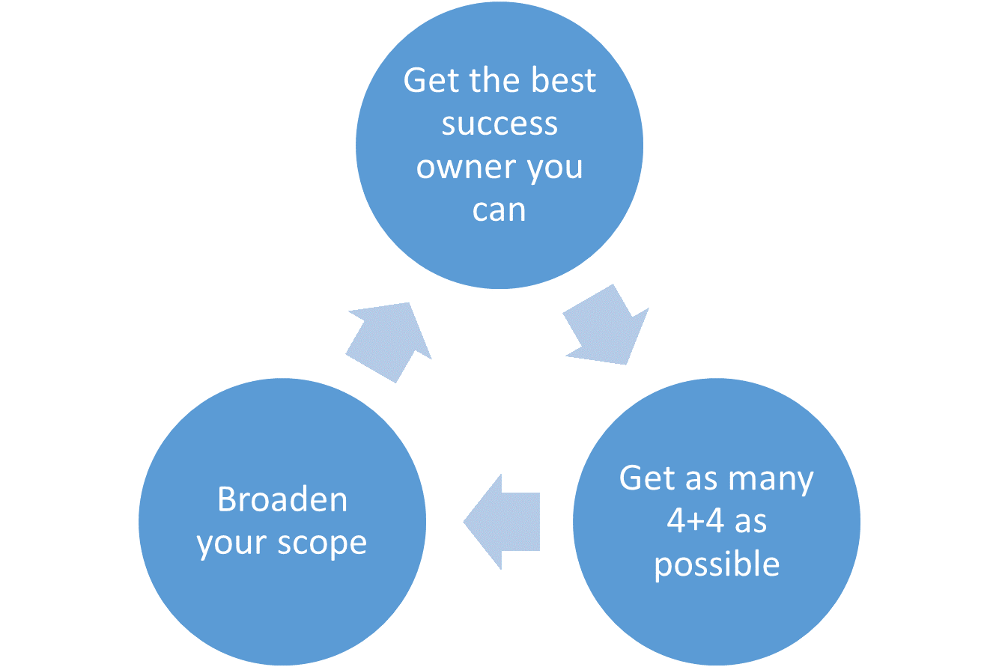
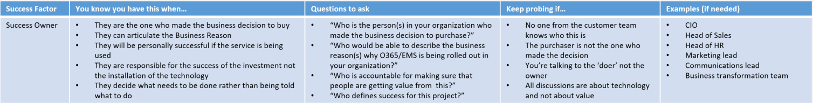

---  
# required metadata  
title: FastTrack Playbook - DIBS 
description: FastTrack Playbook - DIBS
author: Ryan Meehan  
ms.author: ryanme  
manager: eduardod  
ms.date: 5/5/2020  
ms.topic: playbook  
ms.prod: non-product-specific  
ms.custom: internal-playbook  
ft.audience: internal  
ft.owner: ryanme  
---  
[!INCLUDE [Playbook Feedback](./includes/questions-feedback.md)]  

# DIBS Guidance

## Success Factors

|Success Factor| You know you have this when… | Questions to ask| Keep probing if… | How to Capture Status |
| - | - | - | - | - |
| Success Owner | - They are the one who influenced the business decision to buy - They can articulate the Business Reason - They will be personally successful if the service is being used - They are responsible for the success of the investment not the installation of the technology - They decide what needs to be done rather than being told what to do | - “Who is the person(s) in your organization who made the business decision to purchase?” - “Who would be able to describe the business reason(s) why O365/EMS is being rolled out in your organization?” - “Who is accountable for making sure that people are getting value from this?” - “Who defines success for this project?” | - No one from the customer team knows who this is - The purchaser is not the one who made the decision - You’re talking to the ‘doer’ not the owner - All discussions are about technology and not about value | Success Owner role is captured under the Adoption Insights section on the Services Tab in FTOP for each workload.  Available Options: - CIO / IT Leader - CEO - CMO / Marketing Leader - CFO / COO - IT Manager - Purchasing Manager - Change Management Lead - HR / Communication / Training Manager - Digital Transformation Lead - IT Administrator - Other \[Include details in the entitlement notes\] |

### Success Owner

**You know you have this when:**  

- They are the one who influenced the business decision to buy
- They can articulate the Business Reason
- They will be personally successful if the service is being used
- They are responsible for the success of the investment not the installation of the technology
- They decide what needs to be done rather than being told what to do

**Questions to ask:**  

- “Who is the person(s) in your organization who made the business decision to purchase?”
- “Who would be able to describe the business reason(s) why O365/EMS is being rolled out in your organization?”
- “Who is accountable for making sure that people are getting value from this?”
- “Who defines success for this project?”

**Keep probing if:**  

- No one from the customer team knows who this is
- The purchaser is not the one who made the decision
- You’re talking to the ‘doer’ not the owner
- All discussions are about technology and not about value

**How to Capture Status**  

Success Owner role is captured under the Adoption Insights section on the Services Tab in FTOP for each workload.  

Available Options:
- CIO / IT Leader
- CEO
- CMO / Marketing Leader
- CFO / COO
- IT Manager
- Purchasing Manager
- Change Management Lead
- HR / Communication / Training Manager
- Digital Transformation Lead
- IT Administrator
- Other \[Include details in the entitlement notes\]

## Intent

**You know you have this when:**  

- Entitlements are In Progress (not No Intent)
- Customer/partner has put a high priority on rolling the service(s) out
- Customer/partner has adequate resources (people/financial) to roll out the service

**Questions to ask:**  

- “Since your license entitles you to a suite of products we are going to enable all of them, aren’t we?”
- “What other priorities do you have that would keep us from moving forward?”
- “We recommend the following roles \<provide list\>.  Will you have those resources available?”

**Keep probing if:**  

- Customer doesn’t understand the business value of the service
- Customer isn’t sure what priority the customer will place on this rollout
- Customer isn’t sure if they will have all the resources needed

**How to Capture Status**  

All entitlements entered into “In-Progress” should have Customer Intent to use.

All entitlements recorded as In- Progress Adoption should already be enabled and customer should have SOME INTENT. Please include Notes about why Adoption may be slow (e.g., Pilot, lack of Readiness, completing security reviews, etc.)  

If customer does not intend to use entitlements or there are blockers, they should be entered in the Blocked or No Intent sections with the appropriate L3 reason and a description of the reason in the Entitlement Notes.  

If workload is NOT deployed due to other workloads being prioritized first, then status should be Initiate-Serialized.  

If customer is dedicated and has plans to move to vNEXT, they should still be in Initiate or Technical Onboarding.  They should only be in Adoption if service has been enabled and they have intent to use.  

## Target Date

**You know you have this when:**  

- Target Date for In Progress entitlements means the date when the first user will start using the service. The first user can be any user, including test users, pilot users and production users.
- If the customer is undertaking migration (Exchange, OneDrive, SharePoint), it’s the date the first wave of users is expected to go ‘live’
- This is the date we are expecting the customer to make their ‘In Progress’ entitlements ‘Live’ (if ‘in Progress’)
- If the customer has a go-live date for the service (i.e. a day they are going to tell their people about the service), use that  
- If the customer doesn’t have one, it’s the date the customer’s people are first able to use the service (i.e. can actually use Mail/SfB/Yammer/SPO/EMS)
- The criteria for Target Date is not met if the entitlements are not In Progress  

**Questions to ask:**  

- “By when do you (<customer/partner>) expect your people to start using the service?”
- When are you going to launch this service to your people?
- “Are there things you need to decide before you can identify this date?”
- “If you don’t know now, what needs to be in place to decide?”

**Keep probing if:**  

- Customer doesn’t have a date
- Customer’s Target Date is > 180 days
- Target date is 31 December, or right at the end of a month (indicates lack of urgency)

**How to Capture Status**  

Target Date is captured under on the Services Tab in FTOP for each workload.

## Business Reason

**You know you have this when:**  

- Success Owner has described why the customer bought O365/EMS
- Reason should include:
- Improves some business outcome
- Identifies business group(s) who would benefit
- The reason should address any of the following (from Measuring success guide)
- The reason can be easily translated to Scenarios

**Questions to ask:**  

- “Who in your organization will benefit from O365/EMS?”
- “What will that benefit be?”

**Keep probing if:**  

- There is no identified Success Owner
- You can’t describe why they’re doing this in one sentence that isn’t ‘because we were told to’
- The reason is purely technical (upgrade, for example)
- There isn’t a clearly identified beneficiary 

**How to Capture Status**  

Business Reason is captured under the Adoption Insights section on the Services Tab for each workload. We've broken down the options to two types of customers, those that want to get to the cloud and those that want to use the cloud to achieve more. New Available Options:

**Get to the Cloud** (this title will not be shown in FTOP)  

- End of life of existing IT
- Increase security
- Improve service quality
- High Availability/Improved uptime
- Eliminate on-premise hardware cost and support
- Reduce overhead for application updates/maintenance
- Greater savings over previous solution  

**Use the Cloud to Achieve More** (this title will not be shown in FTOP)  

- Collaborate and communicate with our people
- Transform business processes
- Use our collective knowledge
- Engage our front-line workers
- Work with partners and suppliers
- Work from anywhere
- Get insights from data

## Stakeholders

**You know you have this when:**  

- You’ve identified one or more people who 
- benefit from the Business Reason(s) 
- Will benefit from hitting the Target Date
- Will be key personas in Scenarios
- Represent key supporting functions (Comms, legal, security)

**Questions to ask:**  

- “Who are the people in your organization that will represent the business reason(s) you’ve stated?”
- “Who will be able to provide the key messages we need to define our scenarios?”
- “Who are the representatives for each of the key roles in this table?”

**Keep probing if:**  

- Key supporting functions are missing from the conversation (e.g. Security, Risk, Comms)
- Scenarios don’t have stakeholders
- Stakeholders aren’t aligned to at least one Scenario

**How to Capture Status**  

Stakeholder is captured under the Adoption Insights section on the Services Tab for each workload.  

Available Options:
- IT Lead \[NEW\]
- Business Lead \[NEW\]
- IT and Business Leads \[NEW\]
- No stakeholders \[NEW\]

NOTE: Previous responses from the One Adoption Wizard are different and may show up.  These options include Customer has Training Lead, Customer has Communication Lead, Customer has Both, or Customer has none.  

## Scenarios

**You know you have this when:**

- A scenario clearly defines
- the needs of each Stakeholder
- a business problem
- How the solution will address the problem
- What the solution looks like

**Questions to ask:**

- “Who are the groups in your organization that will benefit from the Business Reason(s) you defined?”
- “What are the specific business problems you’re trying to solve?”
- “What capabilities are most important to you that satisfy the business problems?”
- “When the solution is implemented, what does success look like for those users?
- How is work different in 18 months from now?

**Keep probing if:**

- You don’t have a clear alignment between Business Reason and the Scenarios
- You can’t quantify the business problem
- The scenario is technical in nature and not focused on business outcomes
- Scenarios don’t cover everyone the products touch

**How to Capture Status**

Scenarios are captured under the Adoption Insights section on the Services Tab for each workload.  

Available Options:
- Modern workplace – M365 \[NEW\]
- Work in email, solo or as a group \[NEW\]
- Provide a chat-based workspace
- Connect your organization 
- Meet and collaborate with ease \[NEW\]
- Share sites and content \[NEW\]
- Information protection \[NEW\]
- Identity/Access management \[NEW\]
- Other \[Include details in the entitlement notes\]

NOTE: Previous responses from the One Adoption Wizard are different and may show up.  These options include:  

- Collaborate on Content
- Make Meetings Matter
- Email & Calendar on the Go

## Awareness

**You know you have this when:**  

- Collateral is created that is in alignment with the organization’s culture
- Stakeholders are involved in creating collateral that addresses all users for each Scenario
- Messages in awareness campaigns have statements/messages that are aligned to Scenarios
- Awareness campaign is complete before launch Target Date

**Questions to ask:**  

- “When you last rolled out a significant change to your business, what were the most successful ways you communicated those change?”
- “Who are the groups of users who need to get this awareness?”

**Keep probing if:**  

- The customer wants to use just the vanilla email templates
- They only want to build awareness via email – this may be ok, but you should check
- Customer doesn’t think their people need awareness

**How to Capture Status**  

Awareness plans are captured under the Adoption Insights section on the Services Tab for each workload.  

Available Options:  

- Customer does not have any awareness plan
- Email communications
- Posters in offices
- Awareness days where people can use the products
- Skype Meeting Broadcast
- Weekly scenario spotlight or Contests
- Other \[Include details in the entitlement notes\] \[NEW\]

## Training

**You know you have this when:**  

- Stakeholders confirm that users are fully competent to use the product
- Training is complete near launch Target Date
- Training approach addresses all users

**Questions to ask:**  

- “Who needs to be trained?”
- “What does success look like? What should the user population be able to do?”
- How do your people best learn how to do new things?

**Keep probing if:**  

- Users groups are not clearly identified
- Timeline for completion is well beyond launch
- Training = sending emails out

**How to Capture Status**  

Training Plans are captured under the Adoption Insights section on the Services Tab for each workload.  

Available Options:
- Customer does not have any training plan
- Classroom training or online training
- Online Learning Center and 'How to' Videos
- Champions Program
- Help Desk Training
- Third Party Service
- Other [Include details in the entitlement notes] \[NEW\]

## Introduction

All the data we have points to our pre-requisites (Success Owner, Business Reason, Target Date and Intent) and our success factors (Stakeholder, Scenarios, Awareness and Training), also known as ‘4+4’ as being key to successful outcomes for our customers.  

Specifically:  

- We know 4+4 drives usage
- We know customers with 4+4 have better outcomes
- We know unsuccessful customers are generally missing the 4+4

Therefore, getting these in place is the key to being successful. If we do not, our customers will have less successful outcomes.  

However, we know we cannot get all of the 4+4 in place to the quality we would like all the time.  

This guidance sets out a process that will help you maximize your customer’s chances of success given the reality of where they are at and in doing so create the opportunity for more success in the future.

## Process

With every customer, run the following cycle:

  

## Get the best success owner you can

You’ll have a customer (or Partner) contact point established already. What you need to do is work out how much success you’ll have by working with that contact point and see if you can maximize that by getting others involved.  

**The quality of the success owner determines the quality of the rest of the 4+4 and therefore the customer’s success.** Success owners with limited influence, desire or ability to drive the rest of the 4+4 will mean that your customer will be less likely to be successful.

### Building to a great success owner

Start with your contact points and understand what you could achieve together with that person:  

- Do they fulfil the criteria of a success owner?
- Are they just responsible for one workload?
- Are they responsible for the value that people are going to get, or just technical configuration?

  

See if you can expand beyond that person. Multiple success owners are OK. What you are looking for is a person (or people) able to drive success of all the services the customer has invested in.  

Ways to expand:  

- Help your existing contact understand what a Success Owner looks like
- Establish whether your contact is going to be able to fulfill the role of the Success Owner
(get the 4+4 in place, own the business outcome of the service)
- Understand who their equivalent might be for the other workloads (if not them)
- Help them understand the risks of not having Success Owner(s)
(less 4+4, less value delivered, an enabled product no-one uses)
- Understand whether there’s appetite to go broader and deliver more value right now

### What if I can’t get a great success owner (or one at all?)

Sometimes a low-influence success owner (or a contact point who doesn’t qualify as a success owner) is going to be all you can find and influence. They, or the account team, might not be willing to provide additional contacts.  

In those situations:  

- Follow the rest of the process to make that person hugely successful within their scope
- Make sure the risks of this approach are well understood and discussed with your contact point and the account team (i.e. there will be a ceiling on success)
- Make use of the goodwill with that contact point during the ‘broaden your scope’ stage to build out from that contact towards a success owner (if you’ve ‘given’ something, you’re likely to ‘get’ something)
- Make sure your forecasts of likely success reflect what is realistic with the current success owner – e.g. **someone that’s just focused on technically enabling Exchange isn’t going to drive the same success as someone trying to transform their business with Office 365.**

## Get as many 4+4 as possible

Now you know what you have to work with, aim to get as many of the 4+4 as you can in place with that contact. You are aiming to have all the remaining 7 established but you should just maximize what you can do with whom you are working.  

### What if my contact is not interested in establishing these?

Help your contact understand that they are carrying the risk of a less successful outcome if they’re not prepared / able to have the 4+4 in place. Make the risks visible to them and reflect these risks internally in your forecast of the customer’s success.  Make sure to provide further details on the customer’s intentions and concerns in the Entitlement Notes.  

Continue to gently push your contact on the importance of the 4+4, whilst working with them to onboard the service.  Provide further details in the Entitlements Notes regarding the actions you took to capture these factors and why the customer was not interested.  

## Broaden your scope

If you find that you’ve onboarded your customer without the 4+4 being present, then it’s likely that the customer is not seeing the success outcomes that you would ideally want them to (or that they would expect). It is also likely that your contact will be more inclined to partner with you to get the 4+4 in place at this stage, as:  

- You have helped them achieve the thing that was important to them (onboarding)
- They are likely to now see the importance of the 4+4 to longer term success (particularly if they are not currently being successful)  

A business value discussion or Success Workshop is a great opportunity to review current progress and re-establish the need for the 4+4 with your contact.  Also consider sharing the Measuring Success deck and O365 Dashboard Reports to help your customer establish baseline goals and discuss how to move forward. 
Arrange the meeting with your contact and use the [Guidance: Business Value Discussions and O365 Usage Reporting](https://aka.ms/oawlink48) for reference.  

Use this guidance to bring up key points such as:  

- Whether your contact is able to drive success for other services
- Whether your contact is seeing the success they expect for the services they have deployed
- Whether the 4+4 were present for the services deployed (and how that relates to success)
- Where the customer wants to go next on their success journey

## Measures

### FTC CSS-Led Engagements

Below, are the prioritized data fields that will be formally tracked in FTOP for all FTC CSS-Led engagements, broken out by tenant priority, SMC/Enterprise and O365/EMS tenants.  

| Tenant Priority | Pre-Requisites (DIBS) Required in FTOP* | Success Factors (SSAT) Required in FTOP* |
| :- | :- | :- |
| SMC: High Priority Tenants | **All DIBS:** Target **D**ate, **I**ntent, **B**usiness Reason for Purchase and **S**uccess Owner Role | Not required at this time |
| SMC: Medium/Low Priority Tenants | **Intent only required;** others not required | Not required at this time |
| All O365 Enterprise Tenants | **All DIBS:** Target **D**ate, **I**ntent, **B**usiness Reason for Purchase and **S**uccess Owner Role | **All SSAT:** **S**takeholders, **S**cenarios, **A**wareness and **T**raining Plans |
| All EMS | **All DIBS:** Target **D**ate, **I**ntent, **B**usiness Reason for Purchase and **S**uccess Owner Role | Not required at this time |

NOTE: This does not mean delivery team members are not required to work with customers to establish the Adoption Pre-requisites or Success Factors.  FMs should continue to follow the FastTrack Operations Playbook ([https://aka.ms/ftplaybook](https://aka.ms/ftplaybook)) and work with customers to obtain all these data points. We are just prioritizing the recording of the above fields in FTOP first.

### FTC FTP-Led Engagements**

Below, are the data fields that will be formally tracked for all FTC FTP-Led engagements.  Per contractual requirements, Intent and Target Date should be recorded for all tenants.

| Tenant Priority | Pre-Requisites (DIBS) | Success Factors (SSAT) |
| :- | :- | :- |
| All Tenants | Target **D**ate and **I**ntent only, others not required | Not required at this time |

***Due to contractual obligations, FTP-led engagements currently have separate data capture requirements*

## Data Validation

The following summarizes and provides recommendations for the Adoption activities where the DIBS and SSAT are discussed with customers and FTOP data should be entered into FTOP. Refer to the FastTrack Operations Playbook ([https://aka.ms/ftplaybook](https://aka.ms/ftplaybook))for more detailed information on the overall objectives, inputs/outputs and approach needed to complete each step.  

## Data Review Examples

Data will also be periodically analyzed to ensure data accuracy and impact.  These outcomes can help identify process areas that have the most potential to increase usage and/or where delivery teams may require further resources and guidance.  The following are examples of data points that will be reviewed and their intended insights:  

### Measure - Adoption Pre-requisites captured in FTOP, as required

**Expectation**  

- Per the FastTrack Operations Playbook ([https://aka.ms/ftplaybook](https://aka.ms/ftplaybook)), status of Pre-Requisites is ideally known at completion of the Remediate phase before moving to Enable/Migrate 
- Reasons for delay should be included in Entitlement Notes.

**How Measured/Tracked**  

FastTrack PowerBI: OPS-CSB Dashboard NS Report tracks Adoption Pre-requisites and Success Factors
- DIBS completion status 
- Active Usage impact
- Service Status
- Days in Service Status
- Parent Segment

**Data Insights**  

- How long does it take FMs to establish DIBS?
- What is the impact of DIBS on Active Usage?  
- Does timing on when DIBS was captured have an impact on usage?
- What are the factors that are established first, last?
- For 90+ days: What is happening that is causing FMs to capture DIBS later? What are the common challenges FMs are facing?
- For 30+ days: What is happening that is allowing FMs to capture DIBS sooner?
- Are there certain Success Owner Roles that are more impactful than others?

| Measure | Expectation | How Measured/Tracked | Data Insights |
| - | - | - | - |
| Adoption Pre-requisites captured in FTOP, as required | Per the FastTrack Operations Playbook ([https://aka.ms/ftplaybook](https://aka.ms/ftplaybook)), status of Pre-Requisites is ideally known at completion of the Remediate phase before moving to Enable/Migrate  Reasons for delay should be included in Entitlement Notes. | FastTrack PowerBI: OPS-CSB Dashboard NS Report tracks Adoption Pre-requisites and Success Factors DIBS completion status  Active Usage impact Service Status Days in Service Status Parent Segment | How long does it take FMs to establish DIBS? What is the impact of DIBS on Active Usage?   Does timing on when DIBS was captured have an impact on usage? What are the factors that are established first, last? For 90+ days: What is happening that is causing FMs to capture DIBS later? What are the common challenges FMs are facing? For 30+ days: What is happening that is allowing FMs to capture DIBS sooner?  Are there certain Success Owner Roles that are more impactful than others? |
| Adoption Pre-requisites captured in FTOP, as required | - Per the FastTrack Operations Playbook ([https://aka.ms/ftplaybook](https://aka.ms/ftplaybook)), status of Pre-Requisites is ideally known at completion of the Remediate phase before moving to Enable/Migrate  - Reasons for delay should be included in Entitlement Notes. | FastTrack PowerBI: OPS-CSB Dashboard NS Report tracks Adoption Pre-requisites and Success Factors - DIBS completion status  - Active Usage impact - Service Status - Days in Service Status - Parent Segment | - How long does it take FMs to establish DIBS? - What is the impact of DIBS on Active Usage?   - Does timing on when DIBS was captured have an impact on usage? - What are the factors that are established first, last? - For 90+ days: What is happening that is causing FMs to capture DIBS later? What are the common challenges FMs are facing? - For 30+ days: What is happening that is allowing FMs to capture DIBS sooner?  - Are there certain Success Owner Roles that are more impactful than others? |

## Change Log

| Date changed | Changed by | What changed | Why it changed |
| - | - | - | - |
| 10/19/18 | Rosie Arrieta | Business Reasons  Preferred Path to FastTrack Operations Playbook including link | Business Reasons was updated in FTOP  Preferred Path has been replaced with FastTrack Operations Playbook  |
| 1/19/17 | Chad Slipka | Content created | Content released  |
| 11/10/17 | Janice Stern | Major FastTrack Portal release (M365 Intro/Content changes/Productivity Library)   Added new DIBS+SSAT Guidance | Updated to reflect recent changes to FastTrack Portal DIBS+SSAT guidance released (CMR-39184)  |
