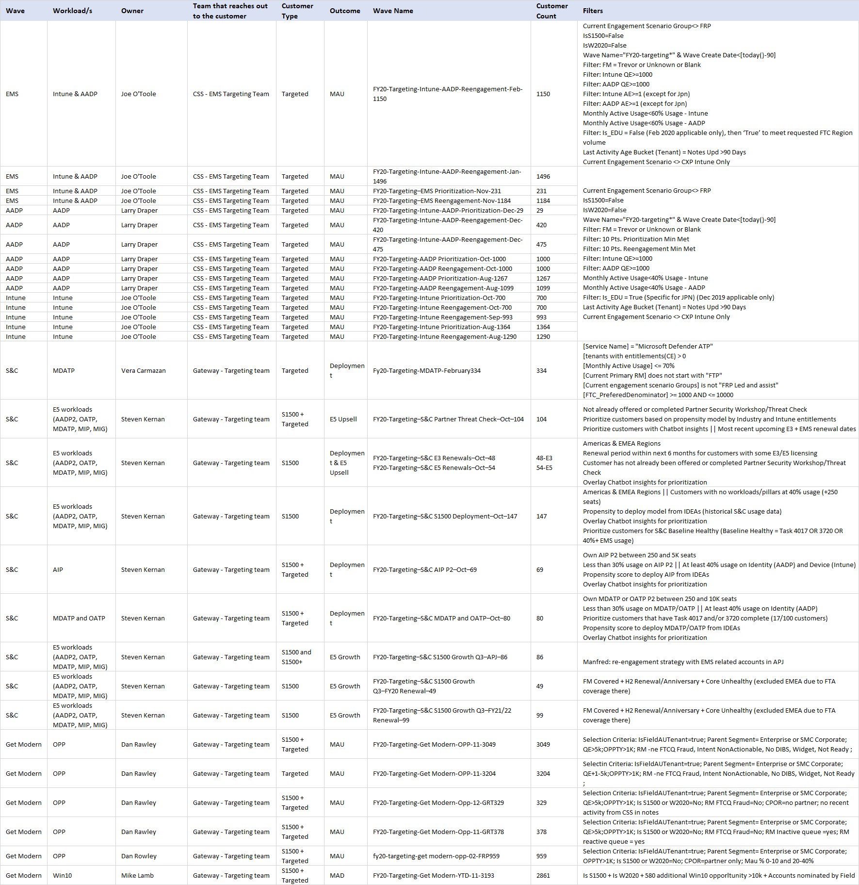

---  
# required metadata  
title: FastTrack Playbook - Targeting Waves
description: FastTrack Playbook - Targeting Waves
author: Maria Conceição  
ms.author: maconcei  
manager: eduardod  
ms.date: 2/19/2020  
ms.topic: playbook  
ms.prod: non-product-specific  
ms.custom: internal-playbook  
ft.audience: internal  
ft.owner: maconcei  
---  
[!INCLUDE [Playbook Feedback](./includes/questions-feedback.md)]  

# Targeting Waves

## Overview  

Waves are used to drive MAU/MAD targets focused on a workload or a specific set of workloads for a predetermined set of customers.  Waves are normally executed during the year for a brief timeframe. Waves are executed by different teams, Gateway or CSS Targeting teams.  

## Waves Launched in FY20

(click the image below to enlarge)  
  

Links to specific Targeting Waves are as follows:

  - [Enterprise Mobility + Security (EMS)](waves-ems.md)

  - [Exchange Online (EXO)](waves-exchange-online.md)

  - [Get Modern Gateway](waves-get-modern-gateway.md)

  - [SharePoint Online (SPO)](waves-sharepoint-online.md)

  - [Teams](waves-teams.md)

 To start a new wave, follow the process below and use the provided template.

  - [Creation Process](waves-creation-process.md)

  - [Template](https://microsoft.sharepoint.com/:w:/r/teams/ftccm/opsplaybook/_layouts/15/Doc.aspx?sourcedoc=%7BEA70A1C0-8020-4280-8057-E0F709BDBD59%7D&file=Template%20-%20New%20Wave.docx&action=default&mobileredirect=true)
