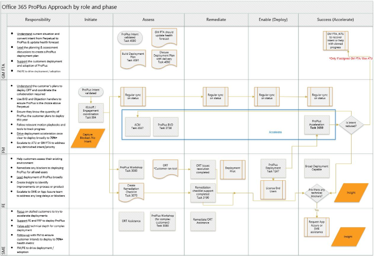

---  
# required metadata  
title: FastTrack Playbook - Office 365 ProPlus Standalone Scale Approach
description: FastTrack Playbook - Office 365 ProPlus Standalone Scale Approach 
ms.author: maconcei  
manager: eduardod  
ms.date: 1/31/2020  
ms.topic: playbook  
ms.prod: non-product-specific  
ms.custom: internal-playbook  
ft.audience: internal  
ft.owner: maconcei
---   
[!INCLUDE [Playbook Feedback](./includes/questions-feedback.md)]

# Office 365 ProPlus Standalone Scale Approach

Program Manager: **Dan Rowley**  
Phase: **Assess, Remediate, Enable**

## Overview

The primary driver of Office 365 ProPlus MAU in FY20 will be the Get
Modern motion, which includes both Windows 7/8.1 to Windows 10 upgrade &
Office 365 ProPlus deployment using System Center. Please reference the
[Get Modern Scale Playbook](https://aka.ms/ftgetmodernplaybook) for
additional information.

This guide is designed for FastTrack Engineers, with support from
FastTrack Managers & OPP SMEs, to guide customers through deployment of
Office 365 ProPlus without Windows upgrade.

**In some cases, steps can be bypassed if the relevant topic is
completely addressed/remediated.**

## Objectives

The following is a list of objectives for this playbook:

  - **Use of steps that align to where the customer is with their
    deployment of Office 365 ProPlus.** In some cases, steps can be
    bypassed if the relevant topic is completely addressed/remediated.
    Piloting is recommended to prevent support cases from untested
    deployments.  
  - **Ensuring customers deploy to 70%+ and use the latest cloud
    connected Office client applications** in organizations is critical
    as we continue to support our customers as they prepare for Office
    2010 end of support and through their digital transformation
    journey.  
  - **Office 365 ProPlus is of strategic importance to Microsoft** among
    competition as we shift our customers to the cloud with Microsoft
    365.

## Office 365 ProPlus WorkFlow  
(Click the image below to enlarge)  

## Approach
Primary Roles: **FastTrack Manager; FastTrack Engineer; SME**  
Applies To: **Office 365 ProPlus**  

The FastTrack Manager should have the situational awareness of the customer intent and understand the MAU expected by date. This should be shared with the FastTrack Engineer to determine the best approach to help the customer complete their deployment of Office 365 ProPlus.  

If an engaged FE is confident in their understanding, capabilities to deliver the Get Modern motion the FE should be empowered to continue with the engagement. However, if the engagement becomes stalled, blocked, or the FE requires any additional support executing this playbook, the FE shall request a Get Modern SME (OPP SME) using the FastTrack Resource Request Tool.  

The Get Modern SME team is a dedicated team of Windows and OPP SMEs that is available to support at scale motion. The SMEs are adjunct resources to the capabilities of the FastTrack delivery, but at no time do they replace the roles of the FastTrack Manager, Engineer or Architect.  

## Playbook Processes  
- [Conduct Services Workshops](assess-conduct-services-workshops.md)
- [Conduct Adoption & Change Management Customer Conversation](assess-conduct-adoption-and-change-management-conversation.md)
- [Conduct Technical Assessment](assess-conduct-technical-assessment.md)
- [Enable Services](enable-enable-services.md)  

#### FTOP Tasks

| Task ID                                        | Task Description                                                                 | (M) Mandatory (O) Optional | FastTrack Role |
| ---------------------------------------------- | -------------------------------------------------------------------------------- | -------------------------- | -------------- |
| 3080   | [Office 365 ProPlus Assessment Workshop](https://aka.ms/ftoppassessmentguidance)  | M    | FE             |
| 3738   | Office 365 ProPlus - Deliver Pitch Deck | M    | FM             |
| 3070   | Create Remediation Checklist            | M    | FE             |
| 4105   | Office Readiness Toolkit           | M    | FE             |
| 3190   | Confirm the customer reviews & resolved anything in the remediation checklist    | M  | FE  |
| 1247   | [Deploy Office 365 ProPlus](https://aka.ms/ftoppdeploymentguidance)               | M    | FE             |
| 3650   | Office ProPlus – OPP Acceleration      | O    | FM             |

## Key Inputs

  - Customer has intent to deploy Office 365 ProPlus

## Key Outputs

  - Office 365 ProPlus deployment complete

## Next Steps

  - Continue to support the customer until fully deployed with AU \> 70%.

## Data Collected

| Data Field/Common Name           | Required for this Process | First Entered into FTOP |
| -------------------------------- | ------------------------- | ----------------------- |
| L1 – Consumption Status          | Yes                       | Yes                     |
| L2 – Entitlements                | Yes                       | Yes                     |
| L3 – Engineering Reason          | Yes                       | Yes                     |
| Engagement Scenario              | Yes                       | Yes                     |
| Engagement Management Notes (FM) | Yes                       | Yes                     |
| Technical Enablement Notes (FE)  | Yes                       | Yes                     |
| Enterprise Notes (FTA)           | No                        | Yes                     |

## Success Measurements

| KPI Name        | Definition                                                       | Green/Yellow/Red Thresholds                                                |
| --------------- | ---------------------------------------------------------------- | -------------------------------------------------------------------------- |
| OPP MAU         | [Detailed Definition](https://aka.ms/ftoppmaudefinition)         | Green: \> 70%; Yellow: \> 40% \< 70%; Red: \< 40%                          |
| Customer Health | [Detailed Definition](https://aka.ms/ftcustomerhealthdefinition) | Green: 1 WL AU \> 70%; Yellow: 1 WL AU \> 40% \< 70%; Red: 2 WLs AU \< 40% |

## Change Log

| **Date**    | **What Changed**                                                                 | **Publish Date** |
| ----------- | -------------------------------------------------------------------------------- | ---------------- |
| 5 Mar 2020 | Updated OPP Workflow Visio to include new Task 4105 Office Readiness Toolkit  Deleted 'Deployment' and 'Accelerate' sections, as this content was added directly to the FTOP playbook steps and task descriptions. Added Task 4105 Office Readiness Toolkit to Task List. | 27 Mar 2020 |
| 31 Jan 2020  | Added "Office 365 ProPlus Workflow" and "Playbook Processes" section, Modified "Approach" and "Deployment" section. | 31 Jan 2020  |
| 25 Oct 2019 | Several sections - Title, Approach, Accelerator information, App Assure guidance | 6 Dec 2019       |