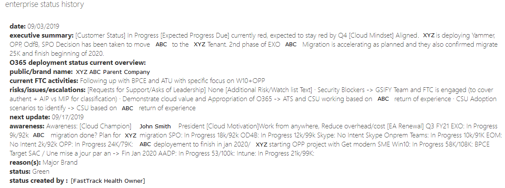

---  
# required metadata  
title: FastTrack Playbook - Enterprise Staus Guidance 
description: FastTrack Playbook - Enterprise Staus Guidance
author: Rosie Arrieta  
ms.author: rosiea  
manager: eduardod  
ms.date: 11/8/2019  
ms.topic: playbook  
ms.prod: non-product-specific
ms.custom: internal-playbook  
ft.audience: internal  
ft.owner: rosiea
---  
[!INCLUDE [Playbook Feedback](./includes/questions-feedback.md)] 

# Enterprise Status Guidance

[!INCLUDE [COVID Guidance](./includes/playbook-covid-guidance.md)]  

Primary Role: **FastTrack Architect, FastTrack Manager**  
Applies To: **All Services**

Health Owners (FMs and FTAs accountable for the health of the S1500)
will utilize the *Enterprise Status Notes* for their updates to the
winner tenant only. For S500, the FTA is accountable for Enterprise
Status updates, but the FM is accountable for Enterprise Status updates
on the S501+ customers.

## Objectives

Enterprise Status Notes should reflect:

  - Understanding of the Customer intent

  - Accountability for the success of the overall end-to-end deployment
    program as a trusted advisor in the process

  - Driving the adoption conversation throughout the lifecycle

  - Accountability for facilitating the landing of the FTC benefit where
    applicable to ensure customers fully exhaust the benefit

## Frequency

For Red and Yellow health customers: There should be an update to the
Enterprise Status Notes every 2 weeks, not to exceed 21 days between
updates.

For Green and Blue health customers: There should be at least one
Enterprise Status Note update per quarter.

## Location

FTOP tenant \> Status \> Enterprise Status Note: You must be assigned to
the tenant and the Enterprise flag must be set to either *Level
3* or *Level 4* to edit these fields.

## Notes Content and Format

**Reason (Required):**   
For S1500 customers, select "Major Brand" and click Add.  
For non-S1500 customers, select the most appropriate option available.
Keep in mind that more than one reason can be added.

**Status (R/Y/G; Required):** Red indicates the customer is not
currently involved in any onboarding efforts. Yellow indicates there
would be ongoing deployment/adoption efforts, but there is a blocker or
something significantly slowing the progress. Green indicates
deployment/adoption is moving at an expected pace, given the
circumstances. This is not the same as the *"Customer Health"* that is
based upon percentage usage.

**Exec Summary (Required):** Crisp executive level summary that serves
to answer the question: *What is preventing this engagement from having
a Green status?* Answer format: High Level Topic, Brief Description,
Impact, Action(s). Progress within the account, high-level situational
awareness.

**O365 Deployment Status Current Overview (Required):** What are their
adoption plans and where are they on the roadmap? Understand Customer
intent, document opportunities to create intent.

**Current FTC Activities:** Quick update of FTC activities, including
FTA activities. For the core workloads: Exchange Online (EXO),
SharePoint Online (SPO) and Office 365 ProPlus (OPP), we need to have
the status, blockers, next actions, due dates and actions.

**Risks:** Highlight any risks or concerns within the account. Describe
efforts to respond to, resolve and elevate escalations and blockers.

**Public/Brand Name:** If the tenant name does not make clear the
customer's brand affiliation or public company name, this is where you
can provide clarity or recognition.

**Next Update (Required)**: Select the date you expect to make your next
Enterprise Status update in FTOP.

**Awareness:** The value we bring is our situational awareness of the
account. What is really happening, and what does our leadership need to
be aware of? Consider including current strategy, partner activity,
company restructuring/re-organization, etc. Our measure of success is
adoption and customer satisfaction, so include things that would affect
our ability to secure these capabilities. Also use this field to
call-out licensing and data issues such as Blocked Telemetry, licensing
overages, and others.

For further detail in Customer Health expectations, please visit the
[Situational Awareness Resources](https://fasttrack-docs.microsoft.com/role-guide/fta-situational-awareness-resources.html)
article.

The following is an example of great Enterprise Status notes in FTOP:   

