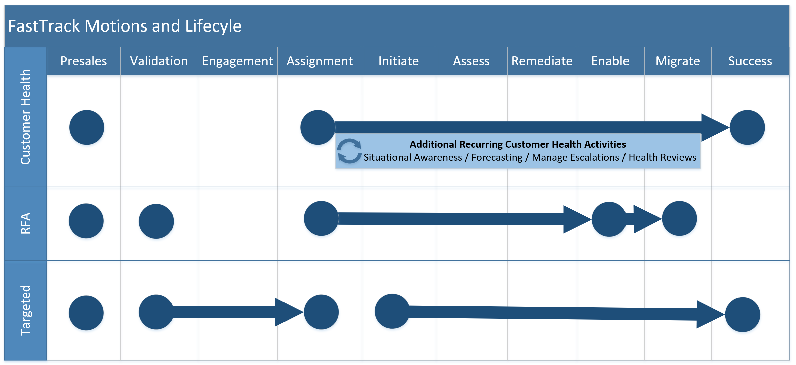
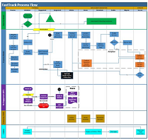

---  
# required metadata  
title: FastTrack Playbook
description: FastTrack Playbook
author: Mark Eichenberger
ms.author: mareich
manager: eduardod  
ms.date: 9/25/2019  
ms.topic: playbook  
ms.prod: non-product-specific  
ms.custom: internal-playbook  
ft.audience: internal  
ft.owner: mareich
---  

[!INCLUDE [Playbook Feedback](./includes/questions-feedback.md)]
# FastTrack Introduction

The FastTrack Center Benefit for Microsoft 365 provides guidance for planning,
deployment, and adoption including remote access to Microsoft engineering
expertise, best practices, tools, and resources. FastTrack for Microsoft 365
helps organizations and their partners accelerate deployment and gain end-user
adoption of Office 365, Enterprise Mobility + Security, and Windows 10. Included
in eligible Microsoft 365 subscriptions at no additional cost, FastTrack can
help onboard to Microsoft 365 services, migrate data, protect customer's organization
from cybersecurity threats, enable effective teamwork, and keep your devices and
apps up to date. This includes:

-   Ongoing, repeatable benefits included in your subscription.

-   Delivery by Microsoft engineers or approved partners.

-   Online resources and tools available to all customers.

# FastTrack Motions and Lifecycle

*FastTrack Motions and Lifecycle - Summary*

<!-- 
For a more detailed and interactive view, please visit the [FastTrack Process
page](https://microsoft.sharepoint.com/teams/ftccm/opsplaybook/SitePages/Home.aspx).

-->

## Engagement Motions

One deployment option does not fit the diverse situations of Microsoft M365
customers. FastTrack utilizes multiple engagement models to best
support a customer's cloud deployment journey. 

> [!NOTE]
> It is possible that a customer may engage in multiple motions during their lifecycle.
>
> For example, Commercial Services Monthly Active Usage (**CSMAU**) model searches for customers that meet certain critera and then may utilize the processes from the **Re-engagement** model before passing that customer back to the **Proactive** model.

-   [Customer Health Motion](./motion-customer-health.md)

-   [RFA Motion](./motion-rfa.md)

-   [Targeting Motion](./motion-targeted.md)

## FY20 Approaches/Priorities
In FY20, various priorities exist to better empower our customers and ensure their success with M365.  These are the Approaches:
- [Get Modern](approach-get-modern.md)
- [Security and Compliance](approach-security-compliance.md)
- Skype for Business to Teams Transition
- Teams Rooms
- Edge Adoption

## Customer Lifecycle

A customer's onboarding journey will progress through various phases. The number
of phases can vary based on the engagement model.

### FastTrack Phases

1.  [Presales](./phase-presales.md)

2.  [Validation](./phase-validation.md)

3.  [Engagement](./phase-engagement.md)

4.  [Assignment](./phase-assignment.md)

5.  [Initiate](./phase-initiate.md)

6.  [Assess](./phase-assess.md)

7.  [Remediate](./phase-remediate.md)

8.  [Enable](./phase-enable.md)

9.  [Migrate](./phase-migrate.md)

### Adoption Planning

FastTrack provides various adoption services that occur across several different
lifecycle phases.

[Adoption Continuum](./adoption-continuum.md)
