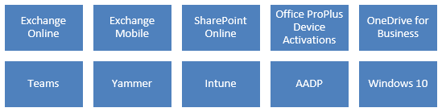
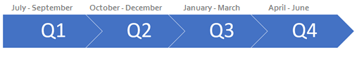
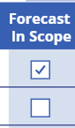

---  
# required metadata  
title: FastTrack Playbook - Customer Health Forecasting
description: FastTrack Playbook - Customer Health Forecasting
author: Mark Eichenberger
ms.author: mareich
manager: eduardod  
ms.date: 8/6/2019  
ms.topic: playbook  
ms.prod: non-product-specific  
ms.custom: internal-playbook  
ft.audience: internal  
ft.owner: mareich
---  
[!INCLUDE [Playbook Feedback](./includes/questions-feedback.md)]

# FastTrack Forecasting 

## Overview

The purpose of the FastTrack Forecast tool is to provide a
simplified process to gather S1500 customer forecasting data. This
allows the FastTrack Team to better understand customer
intent and potential adoption of all workloads across your portfolio of
engagements.\
\
The new forecasting tool provides the following benefits:
-   Simplified and standardized interface to capture forecast data
-   Security vetted following CXP security team process
-   Import functionality of your assigned customers from FTOP to reduce errors
-   Co-authoring between FastTrack Architects and FastTrack Managers
-   Database of forecast data to provide simplified reporting capabilities

Forecasting fields are available for the following workloads:

## Process

### Capturing Forecast Data

FastTrack Architects assigned to S500 and FastTrack Managers assigned to
S1500 who are accountable for their respective customer engagements will
be required to enter forecast data using the forecasting tool across
each workload.

The forecasting tool can be found here -- [http://aka.ms/ftcforecast](http://aka.ms/ftcforecast).

Capture the customer's **total active usage or total active devices for
the TPID level** (across all tenants the customer may have). This
quantity will represent the expected total active usage by the end of each quarter,
the example below details how active usage is captured.  Note that this is not the incremental change in active usage, but the total usage for each workload.

If you are currently assigned to multiple tenants in FTOP that report
into a single master TPID, please **only import the referencing tenant** (also known as the winner tenant) to the
forecast tool and report total TPID AU across all the tenants into that
master tenant.

**Example:**

Contoso has Exchange Online usage of 10,000 monthly active usage (MAU)
at start of FY20

> **By the end of Q1** = expected uplift of 10K = Enter total MAU of **20,000** \
> **By the end of Q2** = expected uplift of 15K = Enter total MAU of **35,000**\
> **By the end of Q3** = expected uplift of 20K = Enter total MAU of **55,000**\
> **By the end of Q4** = expected uplift of 25K = Enter total MAU of **80,000**

### MAU - Total Monthly Active Users 

Enter all up total "Active Users" monthly across the following
workloads:

-   Exchange Online
-   SharePoint Online
-   OneDrive for Business
-   Outlook Mobile
-   Teams
-   Yammer
-   Intune
-   AADP
-   Office Pro Plus

### MAD - Total Monthly Active Devices 

Enter all up total "Active Devices" monthly across the following
workloads:

-   Windows 10

### Forecast Frequency

Initially, enter forecasting for the entire fiscal year ahead. If
adjustments are required to the forecast data based on customer
discussions that may result in a decrease or increase in active usage,
it is the responsibility of the FastTrack Architect or FastTrack Manager
to revise the forward-looking quarters to more accurately predict
customer health.

The graphic below details how each quarter maps to calendar months:

### Forecast In Scope

If a listed workload is out-of-scope for a customer, the Health Owner may deselect the checkbox from the Forecast In Scope column.  When deselected, this indicates that we do not expect any usage increase for this workload within this fiscal year.

## Resources

The forecasting tool can be found here -- [http://aka.ms/ftcforecast](http://aka.ms/ftcforecast)

The forecasting readiness presentation can be found here -- [http://aka.ms/ftcforecasthelp](http://aka.ms/ftcforecasthelp)
