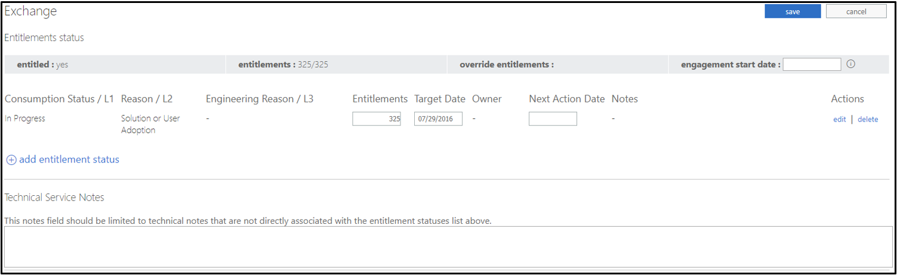

---  
# required metadata  
title: FastTrack Playbook - Customer Health RFA Process Guide  
description: FastTrack Playbook - RFA process guide for Customer Health Customers
author: Erin Saville  
ms.author: v-ersav  
manager: steveso
ms.date: 1/13/2020  
ms.topic: playbook  
ms.prod: non-product-specific  
ms.custom: internal-playbook  
ft.audience: internal  
ft.owner: alicia.evans
---  
[!INCLUDE [Playbook Feedback](./includes/questions-feedback.md)]

# Customer Health RFA Process Guide

## [Type and use of document](#type-and-use-of-document)

- Topic category: Request for Assistance (RFA)
- This article applies to: Gateway RFA FMs
- Use: A branch of the RFA Process Guide for **Customer Health** tenants

## [Summary](#summary)

This article provides step-by-step guidance for Gateway RFA FMs to follow when processing M365 FastTrack Benefit RFAs submitted via the [FastTrack Portal](https://fasttrack.microsoft.com/) for **Customer Health** tenants. To determine if this process flow is applicable to your RFA tenant, follow the guidance found in the main [RFA Process Guide](rfa-process-guide.md), paying special attention to the [Determine customer type and branch to Process flow](rfa-process-guide.md#7-determine-customer-type-and-branch-to-process-flow) section.

## [I. Check for Skype for Business selection](#i-check-for-skype-for-business-selection)

1. On the RFA form, check to see if **Skype for Business** appears in the **Chosen Products** section.

    1. If no, proceed to the next section, [Review RFA Assignment Dashboard and Partners](#ii-review-rfa-assignment-dashboard-and-partners) section below.

    1. If yes, proceed to the article, [Teams First Pitch](rfa-teams-first-pitch-customer-health.md).

## [II. Review RFA Assignment Dashboard and Partners](#ii-review-rfa-assignment-dashboard-and-partners)

### 1. [Determine partner engagement](#1-determine-partner-engagement)

1. Determine if an FRP or Non-FRP is engaged.

    1. If the domain of a non-customer contacts on the RFA form belongs to a Partner company (for example, not a Microsoft or personal email account), a partner is likely engaged.

        > [!Note]
        > If you see a v- Microsoft account, you'll need to confirm this is not an MCS contact. If confirmed MCS, then this contact should be considered a partner contact.

    1. If the partner can be found in the [FRP List](https://msit.powerbi.com/groups/me/apps/f8dbc5ed-8560-4384-99bb-6486899741e9/reports/b3b75f94-ac3b-4760-a8c1-a984b0e1a24d/ReportSection286e648ca0a2792b097a?ctid=72f988bf-86f1-41af-91ab-2d7cd011db47), an FRP is engaged.

        > [!Note]
        > Some FRPs are associated with a specific location, for example, Avanade US verses Avanade UK. Currently, these are regional designations. Avanade US is for the entire Americas region and Avanade UK is for the entire EMEA region. If an Avanade resource filed an RFA for a Canadian customer, the tenant would still be assigned to Avanade US.

    1. If the partner contact cannot be found in the [FRP List](https://msit.powerbi.com/groups/me/apps/f8dbc5ed-8560-4384-99bb-6486899741e9/reports/b3b75f94-ac3b-4760-a8c1-a984b0e1a24d/ReportSection286e648ca0a2792b097a?ctid=72f988bf-86f1-41af-91ab-2d7cd011db47), a non-FRP is engaged.

### 2. [Review Staging Contacts Tab in RFA Assignment Dashboard](#2-review-staging-contacts-tab-in-rfa-assignment-dashboard)

1. If Automation has been closed in the [RFA Assignment Dashboard](https://ftop.microsoft.com/rfa/dashboard/#/), open your RFA in the Dashboard and select **Start Automation**.

1. Open the **Staging Contacts Tab** in a separate browser tab to confirm contact automation is correct.

1. Select the row for each contact shown and review the **Update Source** note on the right-hand margin. The note will identify the **Sources** where each contact was pulled from and will also serve as an indication of the type of contact. The **Source** note for the contacts are displayed as follows:

    - Requestor (RFA Form): **RFA\_REQUESTOR**

    - Customer Contact (RFA Form): **RFA\_CUSTOMER**

    - Account team Contact (CALC): **CALC**

    - TAM Contact (PSR): **PSR**

1. Any older duplicate contacts (that is, contacts existing prior to automation that are the same as what is pulled in from automation) must be deleted from the record after automation is accepted.

### 3. [Review Staging Services Tab in RFA Assignment Dashboard](#3-review-staging-services-tab-in-rfa-assignment-dashboard)

Note: *All eligible, unselected workloads in the RFA form will not be changed and will remain as is. All eligible, selected workloads in the RFA form will update their corresponding fields on the Services Tab as described in this section.*

1. Open the **Staging Services Tab** in a separate browser tab to confirm intent automation is correct.

1. Select **View** for each workload selected on the RFA Form and review the following elements:

    1. **Consumption Status/L1: In Progress**

    1. **Reason/L2** = Will automatically be determined by existing FTOP logic.

    1. **Target Date:** The target date will be updated in the corresponding row for **In Progress** and match the **Product Launch Date** on the RFA form (see example).

    1. **Notes:** "Intent information updated automatically with input from RFA ID \#xxx")" will be added.

    1. **Technical Service Notes:**  For EXO, the note **Current Mail System** is added and the name of the mail system in the RFA form is populated.  There is a known bug that adds the note **Current Mail System** to all workloads other than EXO.

        

    1. **Business Reason:** This should match the Purchase Reason noted on the RFA form.

    1. **Success Owner Role:** This should match the **Business Sponsor** details on the RFA Form.

        1. **Other** should only be selected if the role in RFA is not one of the options in the dropdown list. If there is no match and **Other** is selected, then the **Success Owner Role** should be added to the entitlement notes field.

    1. **Data Migration** is *selected* then the following fields should be updated:

        1. **Microsoft Performing Migration?** checkbox is checked

        1. **Migration TBD** is selected from the dropdown list

        1. The **"+"** is selected and the number of entitlements is populated

        1. The migration notes field has a note **Data Migration assistance was selected on the RFA form** (see example)

        

    1. **Data Migration** is *unselected* then the following fields should be updated:

        1. **RFA Undetermined** is selected from the **Migration Rejection Reason** dropdown list

        1. The **migration rejection reason** has the following note: "Data Migration assistance was not selected on the RFA form"

## [III. Update RFA Assignment Dashboard](#iii-update-rfa-assignment-dashboard)

>[!Important]
> If the **Is Valid** checkbox in the is left unchecked per guidance below, then the automation will not populate in the tenant's FTOP record and manual processing and validation is required.

1. If Request is being Approved:

    1. In the [RFA Assignment Dashboard](https://ftop.microsoft.com/rfa/dashboard/#/), fill in the **Final Customer Tenant Domain** field with the final tenant domain.

    1. Fill in the **Final Customer OMS Tenant ID** field with the final tenant ID.

    1. If **Windows 10** is *not* a selected workload on the RFA form, then skip to sub-step five (5) below; otherwise, proceed to the next step.

    1. If **Windows 10** *is* a selected workload on the RFA form ***and both*** of the following conditions are true, ***then*** proceed to the next step (sub-step 5.):

        - The Reference tenant *is* the RFA tenant

            ***AND***

        - The Reference tenant *was **not*** found in the **All Customers** filter in FTOP

        ***Otherwise, skip to step sub-step six (6.) below.***

        > [!Important]
        > For all **Windows 10** tenant scenarios, if ***either*** of these ***two*** conditions are not met, then it is important that you ***do not*** check the **Is Valid** checkbox. Also, *leave the **Reason for Invalid** dropdown blank.*

    1. If the automation is correct in staging, check the **Is Valid** checkbox; otherwise, leave it blank.

        > [!Note]
        > For tenants where this step (sub-step 5) applies, the processor can use their best judgement to determine whether it is more efficient to check this box or not.

    1. Select **Request Approved** from the **Status** dropdown.

    1. Select **Save**.

    1. Skip to the next section, [Update FastTrack Portal RFA Status](#iv-update-fasttrack-portal-rfa-status).

1. If Request is being set to anything other than approved:

    1. Select desired status from the **Status** dropdown (**On Hold**, **On Hold Pending Requestor Response**, or **Cancelled (closed)**).

    1. Select **Save**.

    1. Proceed to the [Update FastTrack Portal RFA Status](#iv-update-fasttrack-portal-rfa-status) section.

## [IV. Update FastTrack Portal RFA Status](#iv-update-fasttrack-portal-rfa-status)

### [Skip to relevant instructions](#skip-to-relevant-instructions)

Using the links below, skip to the relevant section below based on what you will be updating the FastTrack Portal status to:

- [Request Approved](#1-request-approved)

- [On Hold Pending Requestor Response/On Hold](#2-on-hold-pending-requestor-responseon-hold)

- [Cancelled (closed)](#3-cancelled-closed)

### 1. [Request Approved](#1-request-approved)

1. Review the [Assign to downstream team](#vi-assign-to-downstream-team) section below to confirm or determine assignment; then return here and proceed to the next step.

    ***Note:** Before reviewing the **Assign to downstream team** section, you may wish to click the **Request Approved** heading above to update your web browser's URL, bookmarking your spot for easy web-browser page navigation (e.g. forward and back buttons).*

1. Return to the customer’s FastTrack Portal record via the link provided in the **Request URL** column in the [RFA Assignment Dashboard](https://aka.ms/assignmentdashboard).

1. Click on the **Services** tab.

1. Click **View Submitted Requests**.

1. In the **View Service History** tab, select the status from the **Status** column.

1. In the fly-out window, scroll down to the **Update Request** section and select **Request Approved** from the **Status** dropdown list.

1. In the **Tenant Assignment** field, enter the RM queue the Tenant will be assigned to (e.g. FTCQ CSS Americas).

1. If an additional queue is being assigned (i.e. split workload assignment), enter that queue name in the **Split Workload Assignment 1** field.

1. If a second additional queue is being assigned, enter that queue name in the **Split Workload Assignment 2** field.

1. Select the reason(s) for the assignment(s) from the **Assignment Reason** multi select box.

    > [!Note]
    > If more than one assignment reason is required, hold down the **Ctrl** key and select all desired assignment reasons. There is no order to these; all applicable reasons should be included.

1. In the **Status Details** section, record the appropriate status note from the [FastTrack Portal Notes Bank](https://microsoft.sharepoint.com/:x:/r/teams/FastTrackAssignmentTeamLeads/_layouts/15/Doc.aspx?sourcedoc=%7BCA587309-09E4-445C-A7CB-28058CE91555%7D&file=FastTrack%20Portal%20Notes%20Bank.xlsx&action=default&mobileredirect=true).

1. Click **Save**.

1. Once the RFA is **Approved**, and the RFA Dashboard and FT Portal have been updated accordingly, then proceed to the [Update FTOP](#v-update-ftop) section below.

### 2. [On Hold Pending Requestor Response/On Hold](#2-on-hold-pending-requestor-responseon-hold)

> [!Note]
> Once the reason for the On Hold/On Hold Pending Requestor Response status is resolved and the RFA can be approved, return to the beginning of the [**Update RFA Assignment Dashboard**](#iii-update-rfa-assignment-dashboard) section and proceed from there.

1. Return to the customer’s FastTrack Portal record via the link provided in the **Request URL** column in the [RFA Assignment Dashboard](https://aka.ms/assignmentdashboard).

1. Click on the **Services** tab.

1. Click **View Submitted Requests**.

1. In the **View Service History** tab, select the status from the **Status** column.

1. In the fly-out window, scroll down to the **Update Request** section and select **On Hold Pending Requestor Response** or **On Hold** (depending on the scenario) from the **Status** dropdown list.

1. In the **Reason for Delay** field, enter the reason for placing the tenant on hold.

    > [!Note]
    > Mapping logic for **Other 1/Other 2/Other 3** will be provided as needed by your lead. Do not select these values unless otherwise instructed.

1. In the **Status Details** section, record the appropriate status note from the [FastTrack Portal Notes Bank](https://microsoft.sharepoint.com/:x:/r/teams/FastTrackAssignmentTeamLeads/_layouts/15/Doc.aspx?sourcedoc=%7BCA587309-09E4-445C-A7CB-28058CE91555%7D&file=FastTrack%20Portal%20Notes%20Bank.xlsx&action=default&mobileredirect=true).

1. Click **Save**.

1. If the tenant is **On Hold**, then follow any prescribed steps in the process relevant to the RFA's **On Hold** status. Once that process is complete, return to the step subsequent to that process blocker.

### 3. [Cancelled (closed)](#3-cancelled-closed)

> [!Note]
> If cancelling in the FT Portal due to a duplicate RFA, be sure to use the **Cancelled (closed)** note for duplicate RFAs found here in the [**FastTrack Portal Notes Bank**](https://microsoft.sharepoint.com/:x:/r/teams/FastTrackAssignmentTeamLeads/_layouts/15/Doc.aspx?sourcedoc=%7BCA587309-09E4-445C-A7CB-28058CE91555%7D&file=FastTrack%20Portal%20Notes%20Bank.xlsx&action=default&mobileredirect=true).

1. Return to the customer’s FastTrack Portal record via the link provided in the **Request URL** column in the [Update RFA Assignment Dashboard](#iii-update-rfa-assignment-dashboard).

1. Click on the **Services** tab.

1. Click **View Submitted Requests**.

1. In the **View Service History** tab, select the status from the **Status** column.

1. In the fly-out window, scroll down to the **Update Request** section and select **Cancelled (closed)** from the **Status** dropdown list.

1. In the **Cancelled Reason** field, enter the reason for cancelling the RFA.

    > [!Note]
    > Mapping logic for **Other 1/Other 2/Other 3** will be provided as needed by your lead. Do not select these values unless otherwise instructed.

1. In the **Status Details** section, record the appropriate status note from the [FastTrack Portal Notes Bank](https://microsoft.sharepoint.com/:x:/r/teams/FastTrackAssignmentTeamLeads/_layouts/15/Doc.aspx?sourcedoc=%7BCA587309-09E4-445C-A7CB-28058CE91555%7D&file=FastTrack%20Portal%20Notes%20Bank.xlsx&action=default&mobileredirect=true).

1. Click **Save**.

1. If the RFA is being **cancelled**, then there are no additional steps necessary for this RFA.

## [V. Update FTOP](#v-update-ftop)

### 1. [Update Services Tab](#1-update-services-tab)

**Note:** If a workload is set to **0 Entitlements** after automation is accepted OR if automation is not accepted and a workload is set to **0 Entitlements**, submit a support ticket in [FTC Help](https://o365cxp.microsoftcrmportals.com/FTCChangeRequest/), and override the entitlement to reflect the correct number (see screenshot).

:::image type="content" source="media/rfa-override-entitlements.png" alt-text="Override entitlements field image":::

1. If the **Is Valid** checkbox was selected when the RFA was approved in the RFA Dashboard, then review the **Services** tab to make sure that it was populated correctly.

1. If automation did not populate the **Services** tab correctly, or the **Is Valid** checkbox was not selected, then populate the services tab with the correct information from the RFA form.

### 2. [Update Partners Tab](#2-update-partners-tab)

1. If no partner is engaged on the RFA form, skip to the section to the [Update Contacts Tab](#3-update-contacts-tab) section.

1. To add partner related details to the **Partners** tab in FTOP, first *search for the Partner in [**OCP Insights**](https://ocpinsights.microsoft.com/)* to gather the required Partner related information.

    1. Open **OCP Insights**.

    1. Type the Partner name in the **Search Partner** box.

    1. Select **Go to Advanced Search** from the search list dropdown.

        :::image type="content" source="media/rfa-ocp-insights.png" alt-text="OCP Insights image showing link to Go to Advanced Search":::

    1. Select **MPN** from the following page.

    1. Select the **Partner Name or MPNID** and the affiliated **Region** or **Country** (if known) from the **Partner Geography** from the list of **Filters**.

    1. Select **Apply**.

    1. Select the **Virtual Organization** that matches the name and region for the partner.

        > [!Note]
        > If there is no Virtual Organization, then report the Partner name based on what you know and the MPN ID as **N/A** in the Partner Details within FTOP.

1. In the **Partners** tab in FTOP, fill in the following fields with the appropriate information, as indicated below:

    1. **Partner**: [partner name and competency]

    1. **MPN ID**: [MPNID #]

    1. **Partner Type**: Onboarding Partner

    1. **Notes**: Partner information updated per RFA (RFA ID: [#####])

### 3. [Update Contacts Tab](#3-update-contacts-tab)

1. If Automation was accepted in the **RFA Assignment Dashboard**, review existing contacts to ensure automation was successful and remove any duplicate contacts existing prior to automation being run.

1. If Automation was not accepted in the **RFA Assignment Dashboard**, perform manual validation lookups for the customer, account team, and partner.

### 4. [Update Assignment Urgency Flag](#4-update-assignment-urgency-flag)

1. If Automation was accepted in the **RFA Assignment Dashboard**, skip to the [Update Engagement Management note in FTOP](#5-update-engagement-management-note-in-ftop) section below.

1. If Automation was not accepted in the **RFA Assignment Dashboard**, set the **Assignment Urgency** flag in FTOP:

    1. Select the **Flags** tab in tenant's FTOP record.

    1. Select **High** from the dropdown for **Assignment Urgency**.

    1. Click **Save**.

### 5. [Update Engagement Management note in FTOP](#5-update-engagement-management-note-in-ftop)

1. Select the **Status** tab.

1. Change Overall Status to **Active**.

1. Select the link to the **Create Notes** tab.

1. In the Notes Editor select **Engagement Management Note** from the **Note Category** dropdown.

1. Select the approved workloads from the **Services** dropdown.

1. Copy and Paste the following status note template (see [**Template**](#template) below) into the large notes box located directly under the dropdown filters.

1. Review the [Notes about Template](#notes-about-template) section below to determine which of the [Template's](#template) bracketed conditional notes apply to this specific RFA, as well as how to populate them.

1. Remove the bracketed notes that don't apply, and populate the ones that do with the appropriate information from the RFA.

1. Complete the remaining fields for the Engagement Management note as follows:

    1. **Next Action:** Complete next steps for RFA tenant

    1. **Next Action Date:** [next business day]

    1. **Next Action Owner:** FM

1. Click **Save**.

#### [Notes about Template](#notes-about-template)

**Notes: See corresponding numbered brackets in [Template](#template) section below (e.g. "[1.]")**

**[1.]** If Emergency COVID-19 REQUEST= **yes**, include **#covid** at the beginning of the RFA note.

**[2.]** Use this bracketed note if ***one (or more)*** of the bulleted factors below is true.

- Emergency COVID-19 REQUEST= **yes**

- Eligibility Bypassed = **true**

- There is any mention of COVID in the comments field

- The customer has COVID APPROVED free/trial licenses ***and*** one or more of their requested workloads is affiliated with those licenses

**[3.]** Use this bracketed note if an Onboarding or Migration exception was granted for COVID free/trial licenses. Exceptions can be granted by the Migration Team, ft-covid-er DL, and others.

**[4.]** This note is only required If MDATP, OATP, or both are being assigned to the FTC or Teresa Santos in addition to existing queues (that is, FRP or Targeting queues).

**[5.]** Use this note if there is a duplicate RFA for this tenant.

**Addition note on *Information that may impact the project:*** This can include, but is not limited to, additional comments from the RFA Form, information related to FPM escalations, or any other pertinent information related to the RFA.

#### [Template](#template)

> [!Important]
> See [**Notes about Template**](#notes-about-template) section above for guidance on bracketed conditional notes below (e.g. "**[1.]**").

***[TEMPLATE:]***

*RFA/WinRoom Hi Pri: [Include the FastTrack Portal status note.]*

**[1.]** *#covid*

**[2.]** *Customer is approved for assistance based on FastTrack's response to COVID-19. [Includes [trial/free] offers]*

**[3.]** *An exception was granted for [Services] by [Team]*

**[4.]** *[MDATP and/or OATP] are assigned to [CSS and/or Teresa Santos]; all other workloads are assigned to [Delivery Team]*

**[Notes *always* included:]**

*Partner Engaged? [Yes/No]*

*Contacts:*

- *Requestor contact information: [Details]*
- *Customer contact information: [Details]*
- *Partner contact information: [Details]*

*Location and Language:*

- *City: [Details]*
- *State: [Details]*
- *Country: [Details]*
- *FT Supported Language: [Details]*

*RFA Approved Workloads (**including percent Active Usage & seat count**): [Details]*

*Information that may impact the project: [Details]*

*RFA Form URL: [URL]*

**[Final *conditional* note:]**

**[5.]** A duplicate RFA was submitted due to [Reason].

### 6. [Update Priority in FTOP](#6-update-priority-in-ftop)

1. If automation was accepted, skip to the [Assign to downstream team](#vi-assign-to-downstream-team) section below; otherwise, proceed to the next step.

1. Set the Priority Wizard to **High Priority** using the following steps:

    1. Assign yourself as the **FastTrack Manager** in FTOP.

    1. Click **Apply Assignments**.

    1. Select the Priority Dropdown from the Priority column for the tenant in the Portfolio View in FTOP.

        :::image type="content" source="media/rfa-setting-priority.png" alt-text="Setting Tenant Priority in FTOP":::

    1. Select High (overridden).

    1. Select Other.

    1. Unassign yourself from the tenant.

## [VI. Assign to downstream team](#vi-assign-to-downstream-team)

### 1. [Check current tenant assignments in FTOP](#1-check-current-tenant-assignments-in-ftop)

1. In the FTOP dashboard, open the tenant's Assignment fly-out window.

    1. In FTOP's dashboard, set **Filter** to **All**.

    1. Set **Display** to **Partner Validation**.

    1. Search by the tenant ID (listed as **Company ID** in the **Profile tab** of [ViewPoint](https://support.office.net/?modern=0&source=ViewPointV2)).

    1. Click the row of your tenant to allow the assignment flyout window to appear.

1. Review the **RM, FM,** and **FPM** assignments to determine the type of team that is currently assigned to the RFA tenant.

### 2. [Make assignments](#2-make-assignments)

#### 1. MDATP and OATP

1. If **MDATP**, **OATP**, or both workloads were selected on the RFA form, then assign them as primary at the workload level to FTCQ CSS [Americas, EMEA, or APJ] unless the tenant meets MDATP/OATP CAT Team requirements.

#### 2. Take the following actions based on FM assignment

- **If** the tenant **is** assigned to an FTC Delivery FM ***then*** Leave the tenant assigned to its current team and assign the Regional FTC queue (that is, FTCQ CSS Americas, EMEA, or APJ).

- **If** the tenant **is *not*** assigned to an FTC Delivery FM ***then:***

    1. Search FTOP on the customer TPID (listed in the customer's FastTrack Portal record) to match it back to the reference tenant.

        1. Locate assigned FM.

        1. Assign the RFA tenant to the FM currently assigned to the reference tenant in FTOP.

    1. Assign the Regional FTC queue (that is, FTCQ CSS Americas, EMEA, or APJ).

### 3. [Proceed to the *Send email notifications* section below](#vii-send-email-notifications-non-covid-19-rfas)

## [VII. Send email notifications (non-COVID-19 RFAs)](#vii-send-email-notifications-non-covid-19-rfas)

**If tenant has COVID-19 trial/free licenses**, skip to the [Send email notifications (COVID-19 email approvals)](#viii-send-email-notifications-covid-19-email-approvals) section below. Following tenant assignment to downstream team, select the appropriate approval email scenario.

Following the tenant assignment to the appropriate downstream team, select the corresponding approval email scenario below and send the emails included in that scenario.

> [!Note]
> For **Skype for Business** requests, see footnote ([fn](#skype-for-business-footnote)) where indicated below.

### 1. [Email to be sent in *all* scenarios](#1-email-to-be-sent-in-all-scenarios)

- ***All*** RFAs:

    1. Notify non-Requestor field contacts generated in FTOP through this RFA's automation. Do *not* include any historical field contacts in FTOP. Also, do *not* include any CSMs.

        - [Approval notification for generated field contacts](https://microsoft.sharepoint.com/teams/FastTrackAssignmentTeamLeads/Shared%20Documents/AiR%20Leads/Gateway%20RFA%20Team%20GitHub%20files/rfa-approval-notification-for-generated-field-contacts.msg).

### 2. [Additional emails needed for your RFA's *specific* scenario](#2-additional-emails-needed-for-your-rfas-specific-scenario)

- ***Customer*** submitted RFA, ***and*** FRP is newly assigned or already assigned in FTOP:

    1. Notify customer requestor:

        - [Approval notification to Requestor - general](https://microsoft.sharepoint.com/teams/FastTrackAssignmentTeamLeads/Shared%20Documents/AiR%20Leads/Gateway%20RFA%20Team%20GitHub%20files/rfa-approval-notification-to-requestor-general.msg) ([fn](#skype-for-business-footnote))

    1. Notify the FRP (Program Contact in the [FRP list](https://msit.powerbi.com/groups/me/apps/f8dbc5ed-8560-4384-99bb-6486899741e9/reports/b3b75f94-ac3b-4760-a8c1-a984b0e1a24d/ReportSection286e648ca0a2792b097a?ctid=72f988bf-86f1-41af-91ab-2d7cd011db47) copied:

        - [Approval notification to FRP and FPM (cust Req)](https://microsoft.sharepoint.com/teams/FastTrackAssignmentTeamLeads/Shared%20Documents/AiR%20Leads/Gateway%20RFA%20Team%20GitHub%20files/rfa-approval-and-assignment-notificaton-for-frp-and-fpm-when-cr.msg)

- ***Customer*** submitted RFA ***with*** non-FRP Partner engaged or assigned, *or* no partner engaged or assigned:

    1. Notify customer Requestor:

        - [Approval notification to Requestor - general](https://microsoft.sharepoint.com/teams/FastTrackAssignmentTeamLeads/Shared%20Documents/AiR%20Leads/Gateway%20RFA%20Team%20GitHub%20files/rfa-approval-notification-to-requestor-general.msg) ([fn](#skype-for-business-footnote))

- ***Microsoft*** submitted RFA, ***and*** FRP is newly assigned or already assigned in FTOP:

    1. Notify the Requestor and copy the Partner contacts from the RFA form, Primary Customer contact from the RFA form, and the [FPM](https://msit.powerbi.com/groups/me/dashboards/2d456979-c0ff-4a19-a2a8-2c92c791ef91):

        - [Approval notification to Microsoft Requestor, FRP, FPM, and customer](https://microsoft.sharepoint.com/teams/FastTrackAssignmentTeamLeads/Shared%20Documents/AiR%20Leads/Gateway%20RFA%20Team%20GitHub%20files/rfa-approval-and-assignment-notif-microsoft-requestor-frp-fpm-customer.msg)

- ***Microsoft*** submitted RFA ***with*** non-FRP Partner engaged or assigned, *or* no partner engaged or assigned:

    1. Notify field Requestor:

        - [Approval notification to Requestor - general](https://microsoft.sharepoint.com/teams/FastTrackAssignmentTeamLeads/Shared%20Documents/AiR%20Leads/Gateway%20RFA%20Team%20GitHub%20files/rfa-approval-notification-to-requestor-general.msg) ([fn](#skype-for-business-footnote))

    1. Notify the customer:

        - [Approval notification to customer (non-customer Requestor)](https://microsoft.sharepoint.com/teams/FastTrackAssignmentTeamLeads/Shared%20Documents/AiR%20Leads/Gateway%20RFA%20Team%20GitHub%20files/rfa-approval-notification-to-customer-when-non-customer-requestor.msg)

- ***Partner (FRP)*** submitted RFA:

    1. Notify the Partner contacts from the RFA form, and copy the Primary Customer contact from the RFA form and the [FPM](https://msit.powerbi.com/groups/me/dashboards/2d456979-c0ff-4a19-a2a8-2c92c791ef91):

        - [Approval notification to FRP requestor Partner contacts, FPM, and customer](https://microsoft.sharepoint.com/teams/FastTrackAssignmentTeamLeads/Shared%20Documents/AiR%20Leads/Gateway%20RFA%20Team%20GitHub%20files/rfa-approval-and-assignment-notif-partner-requestor-frp-customer-and-fpm.msg)

- ***Partner (non-FRP)*** submitted RFA:

    1. Notify the non-FRP Partner:

        - [Approval notification to Requestor - general](https://microsoft.sharepoint.com/teams/FastTrackAssignmentTeamLeads/Shared%20Documents/AiR%20Leads/Gateway%20RFA%20Team%20GitHub%20files/rfa-approval-notification-to-requestor-general.msg) ([fn](#skype-for-business-footnote))

    1. Notify the customer:

        - [Approval notification to customer (non-customer Requestor)](https://microsoft.sharepoint.com/teams/FastTrackAssignmentTeamLeads/Shared%20Documents/AiR%20Leads/Gateway%20RFA%20Team%20GitHub%20files/rfa-approval-notification-to-customer-when-non-customer-requestor.msg)

## [VIII. Send email notifications (COVID-19 email approvals)](#viii-send-email-notifications-covid-19-email-approvals)

Following the tenant assignment to the appropriate downstream team, select the corresponding approval email scenario below and send the emails included in that scenario.

> [!Note]
> For **Skype for Business** requests, see footnote ([fn](#skype-for-business-footnote)) where indicated below.

### 1. [Email to be sent in *all* scenarios](#1-email-to-be-sent-in-all-scenarios)

- ***All*** RFAs:

    1. Notify non-Requestor field contacts generated in FTOP through this RFA's automation. Do *not* include any historical field contacts in FTOP. Also, do *not* include any CSMs.

        - [Approval notification for generated field contacts](https://microsoft.sharepoint.com/teams/FastTrackAssignmentTeamLeads/Shared%20Documents/AiR%20Leads/Gateway%20RFA%20Team%20GitHub%20files/rfa-approval-notification-for-generated-field-contacts.msg).

### 2. [Additional emails needed for your RFA's *specific* scenario](#2-additional-emails-needed-for-your-rfas-specific-scenario)

#### 1. Approved for ***all*** requested services (non-Health Provider Exception related)

##### 1. Notification for ***all*** scenarios where **Data Migration** was approved for COVID-19 licenses without an Exception required

If Data Migration is being approved for COVID-19 licenses and no Exception request was required then notify the Migration Team of the approval in the **FastTrack COVID-19 Response Team / Migration Requests** channel in Teams of using the: [Migration Exception/Notification Request template](https://microsoft.sharepoint.com/teams/FastTrackAssignmentTeamLeads/Shared%20Documents/AiR%20Leads/Gateway%20RFA%20Team%20GitHub%20files/COVID-19%20email%20templates/data-migration-template-for-data-migration-team.msg).

  > [!Note]
  > When entering the notification, use the "**Notification only – Migration approved by Gateway Team**" heading option found in the [**Migration Exception/Notification Request template**](https://microsoft.sharepoint.com/teams/FastTrackAssignmentTeamLeads/Shared%20Documents/AiR%20Leads/Gateway%20RFA%20Team%20GitHub%20files/COVID-19%20email%20templates/data-migration-template-for-data-migration-team.msg). Be sure to "@ mention" Ramakrishnan G and Steven Ngo.

##### 2. Specific scenarios

- ***Customer*** submitted RFA ***with*** FRP engaged (assigned or reassigned to tenant in FTOP):

    1. Notify customer requestor:

        - [Approval notification to Requestor - general](https://microsoft.sharepoint.com/teams/FastTrackAssignmentTeamLeads/Shared%20Documents/AiR%20Leads/Gateway%20RFA%20Team%20GitHub%20files/rfa-approval-notification-to-requestor-general.msg) ([fn](#skype-for-business-footnote))

    1. Notify the FRP (Program Contact in the [FRP list](https://msit.powerbi.com/groups/me/apps/f8dbc5ed-8560-4384-99bb-6486899741e9/reports/b3b75f94-ac3b-4760-a8c1-a984b0e1a24d/ReportSection286e648ca0a2792b097a?ctid=72f988bf-86f1-41af-91ab-2d7cd011db47)) with the [FPM](https://msit.powerbi.com/groups/me/dashboards/2d456979-c0ff-4a19-a2a8-2c92c791ef91) copied:

        - [Approval notification to FRP and FPM (cust Req)](https://microsoft.sharepoint.com/teams/FastTrackAssignmentTeamLeads/Shared%20Documents/AiR%20Leads/Gateway%20RFA%20Team%20GitHub%20files/COVID-19%20email%20templates/FRP%20Notification%20templates%20with%20COVID%20Subject/covid-subject-rfa-approval-and-assignment-notificaton-for-frp-and-fpm-when-cr.msg)

- ***Customer*** submitted RFA ***with*** non-FRP Partner engaged or assigned, *or* no partner engaged or assigned:

    1. Notify customer Requestor:

        - [Approval notification to Requestor - general](https://microsoft.sharepoint.com/teams/FastTrackAssignmentTeamLeads/Shared%20Documents/AiR%20Leads/Gateway%20RFA%20Team%20GitHub%20files/rfa-approval-notification-to-requestor-general.msg) ([fn](#skype-for-business-footnote))

- ***Microsoft*** submitted RFA ***with*** FRP engaged (assigned or reassigned to the tenant in FTOP):

    1. Notify the Requestor and copy the Partner contacts from the RFA form, Primary Customer contact from the RFA form, and the [FPM](https://msit.powerbi.com/groups/me/dashboards/2d456979-c0ff-4a19-a2a8-2c92c791ef91):

        - [Approval notification to Microsoft Requestor, FRP, FPM, and customer](https://microsoft.sharepoint.com/teams/FastTrackAssignmentTeamLeads/Shared%20Documents/AiR%20Leads/Gateway%20RFA%20Team%20GitHub%20files/COVID-19%20email%20templates/FRP%20Notification%20templates%20with%20COVID%20Subject/covid-subject-rfa-approval-and-assignment-notif-microsoft-requestor-frp-fpm-customer.msg)

- ***Microsoft*** submitted RFA ***with*** non-FRP Partner engaged or assigned, *or* no partner engaged or assigned:

    1. Notify field Requestor:

        - [Approval notification to Requestor - general](https://microsoft.sharepoint.com/teams/FastTrackAssignmentTeamLeads/Shared%20Documents/AiR%20Leads/Gateway%20RFA%20Team%20GitHub%20files/rfa-approval-notification-to-requestor-general.msg) ([fn](#skype-for-business-footnote))

    1. Notify the customer:

        - [Approval notification to customer (non-customer Requestor)](https://microsoft.sharepoint.com/teams/FastTrackAssignmentTeamLeads/Shared%20Documents/AiR%20Leads/Gateway%20RFA%20Team%20GitHub%20files/rfa-approval-notification-to-customer-when-non-customer-requestor.msg)

- ***Partner (FRP)*** submitted RFA:

    1. Notify the Partner contacts from the RFA form, and copy the Primary Customer contact from the RFA form and the [FPM](https://msit.powerbi.com/groups/me/dashboards/2d456979-c0ff-4a19-a2a8-2c92c791ef91):

        - [Approval notification to FRP requestor Partner contacts, FPM, and customer](https://microsoft.sharepoint.com/teams/FastTrackAssignmentTeamLeads/Shared%20Documents/AiR%20Leads/Gateway%20RFA%20Team%20GitHub%20files/COVID-19%20email%20templates/FRP%20Notification%20templates%20with%20COVID%20Subject/covid-subject-rfa-approval-and-assignment-notif-partner-requestor-frp-customer-and-fpm.msg)

- ***Partner (non-FRP)*** submitted RFA:

    1. Notify the non-FRP Partner:

        - [Approval notification to Requestor - general](https://microsoft.sharepoint.com/teams/FastTrackAssignmentTeamLeads/Shared%20Documents/AiR%20Leads/Gateway%20RFA%20Team%20GitHub%20files/rfa-approval-notification-to-requestor-general.msg) ([fn](#skype-for-business-footnote))

    1. Notify the customer:

        - [Approval notification to customer (non-customer Requestor)](https://microsoft.sharepoint.com/teams/FastTrackAssignmentTeamLeads/Shared%20Documents/AiR%20Leads/Gateway%20RFA%20Team%20GitHub%20files/rfa-approval-notification-to-customer-when-non-customer-requestor.msg)

#### 2. Approved for Onboarding but ***not*** Data Migration

- ***Customer*** submitted RFA ***with*** FRP engaged (assigned or reassigned to tenant in FTOP):

    1. Notify customer requestor:

        - [Approved but not for Data Migration](https://microsoft.sharepoint.com/teams/FastTrackAssignmentTeamLeads/Shared%20Documents/AiR%20Leads/Gateway%20RFA%20Team%20GitHub%20files/COVID-19%20email%20templates/approved-but-not-data.msg)

    1. Notify the FRP (Program Contact in the [FRP list](https://msit.powerbi.com/groups/me/apps/f8dbc5ed-8560-4384-99bb-6486899741e9/reports/b3b75f94-ac3b-4760-a8c1-a984b0e1a24d/ReportSection286e648ca0a2792b097a?ctid=72f988bf-86f1-41af-91ab-2d7cd011db47)) with the [FPM](https://msit.powerbi.com/groups/me/dashboards/2d456979-c0ff-4a19-a2a8-2c92c791ef91) copied:

        - [Approval notification to FRP and FPM (cust Req)](https://microsoft.sharepoint.com/teams/FastTrackAssignmentTeamLeads/Shared%20Documents/AiR%20Leads/Gateway%20RFA%20Team%20GitHub%20files/COVID-19%20email%20templates/FRP%20Notification%20templates%20with%20COVID%20Subject/covid-subject-rfa-approval-and-assignment-notificaton-for-frp-and-fpm-when-cr.msg)

- ***Customer*** submitted RFA ***with*** non-FRP Partner engaged or assigned, *or* no partner engaged or assigned:

    1. Notify customer Requestor:

        - [Approved but not for Data Migration](https://microsoft.sharepoint.com/teams/FastTrackAssignmentTeamLeads/Shared%20Documents/AiR%20Leads/Gateway%20RFA%20Team%20GitHub%20files/COVID-19%20email%20templates/approved-but-not-data.msg)

- ***Microsoft*** submitted RFA ***with*** FRP engaged (assigned or reassigned to the tenant in FTOP):

    1. Notify the Requestor and copy the Partner contacts from the RFA form, Primary Customer contact from the RFA form, and the [FPM](https://msit.powerbi.com/groups/me/dashboards/2d456979-c0ff-4a19-a2a8-2c92c791ef91):

        - [Approval notification to Microsoft Requestor, FRP, FPM, and customer](https://microsoft.sharepoint.com/teams/FastTrackAssignmentTeamLeads/Shared%20Documents/AiR%20Leads/Gateway%20RFA%20Team%20GitHub%20files/COVID-19%20email%20templates/FRP%20Notification%20templates%20with%20COVID%20Subject/covid-subject-rfa-approval-but-not-data-notif-micro-requestor-frp-fpm-customer.msg)

- ***Microsoft*** submitted RFA ***with*** non-FRP Partner engaged or assigned, *or* no partner engaged or assigned:

    1. Notify field Requestor:

        - [Approved but not for Data Migration](https://microsoft.sharepoint.com/teams/FastTrackAssignmentTeamLeads/Shared%20Documents/AiR%20Leads/Gateway%20RFA%20Team%20GitHub%20files/COVID-19%20email%20templates/approved-but-not-data.msg)

    1. Notify the customer:

        - [Approval notification to customer (non-customer Requestor)](https://microsoft.sharepoint.com/teams/FastTrackAssignmentTeamLeads/Shared%20Documents/AiR%20Leads/Gateway%20RFA%20Team%20GitHub%20files/rfa-approval-notification-to-customer-when-non-customer-requestor.msg)

- ***Partner (FRP)*** submitted RFA:

    1. Notify the Partner contacts from the RFA form, and copy the Primary Customer contact from the RFA form and the [FPM](https://msit.powerbi.com/groups/me/dashboards/2d456979-c0ff-4a19-a2a8-2c92c791ef91):

        - [Onboarding Approved, but not Data - notification to FRP Requestor, FPM, and customer](https://microsoft.sharepoint.com/teams/FastTrackAssignmentTeamLeads/Shared%20Documents/AiR%20Leads/Gateway%20RFA%20Team%20GitHub%20files/COVID-19%20email%20templates/FRP%20Notification%20templates%20with%20COVID%20Subject/covid-subject-frp-submitted-approval-notification-but-not-for-data-migration.msg)

- ***Partner (non-FRP)*** submitted RFA:

    1. Notify the non-FRP Partner:

        - [Approved but not for Data Migration](https://microsoft.sharepoint.com/teams/FastTrackAssignmentTeamLeads/Shared%20Documents/AiR%20Leads/Gateway%20RFA%20Team%20GitHub%20files/COVID-19%20email%20templates/approved-but-not-data.msg)

    1. Notify the customer:

        - [Approval notification to customer (non-customer Requestor)](https://microsoft.sharepoint.com/teams/FastTrackAssignmentTeamLeads/Shared%20Documents/AiR%20Leads/Gateway%20RFA%20Team%20GitHub%20files/rfa-approval-notification-to-customer-when-non-customer-requestor.msg)

#### 3. Approved for Onboarding when Exception was granted due to Health Provider status

- ***Customer*** submitted RFA ***with*** FRP engaged (assigned or reassigned to tenant in FTOP):

    1. Notify customer requestor:

        - [Approval notification to Requestor - general](https://microsoft.sharepoint.com/teams/FastTrackAssignmentTeamLeads/Shared%20Documents/AiR%20Leads/Gateway%20RFA%20Team%20GitHub%20files/rfa-approval-notification-to-requestor-general.msg) ([fn](#skype-for-business-footnote))

    1. Notify the FRP (Program Contact in the [FRP list](https://msit.powerbi.com/groups/me/apps/f8dbc5ed-8560-4384-99bb-6486899741e9/reports/b3b75f94-ac3b-4760-a8c1-a984b0e1a24d/ReportSection286e648ca0a2792b097a?ctid=72f988bf-86f1-41af-91ab-2d7cd011db47)) with the [FPM](https://msit.powerbi.com/groups/me/dashboards/2d456979-c0ff-4a19-a2a8-2c92c791ef91) copied:

        - [Approval notification to FRP and FPM (cust Req)](https://microsoft.sharepoint.com/teams/FastTrackAssignmentTeamLeads/Shared%20Documents/AiR%20Leads/Gateway%20RFA%20Team%20GitHub%20files/COVID-19%20email%20templates/FRP%20Notification%20templates%20with%20COVID%20Subject/covid-subject-rfa-approval-and-assignment-notificaton-for-frp-and-fpm-when-cr.msg)

    1. Notify [ft-covid-er@microsoft.com](mailto:ft-covid-er@microsoft.com) of the approval:

        - [FastTrack COVID ER Approval notification for health providers fewer than 150 seats](https://microsoft.sharepoint.com/teams/FastTrackAssignmentTeamLeads/Shared%20Documents/AiR%20Leads/Gateway%20RFA%20Team%20GitHub%20files/COVID-19%20email%20templates/ft-covid-er-notification-approved-for-health-providers-fewer-than-150.msg)

- ***Customer*** submitted RFA ***with*** non-FRP Partner engaged or assigned, *or* no partner engaged or assigned:

    1. Notify customer Requestor:

        - [Approval notification to Requestor - general](https://microsoft.sharepoint.com/teams/FastTrackAssignmentTeamLeads/Shared%20Documents/AiR%20Leads/Gateway%20RFA%20Team%20GitHub%20files/rfa-approval-notification-to-requestor-general.msg) ([fn](#skype-for-business-footnote))

    1. Notify [ft-covid-er@microsoft.com](mailto:ft-covid-er@microsoft.com) of the approval:

        - [FastTrack COVID ER Approval notification for health providers fewer than 150 seats](https://microsoft.sharepoint.com/teams/FastTrackAssignmentTeamLeads/Shared%20Documents/AiR%20Leads/Gateway%20RFA%20Team%20GitHub%20files/COVID-19%20email%20templates/ft-covid-er-notification-approved-for-health-providers-fewer-than-150.msg)

- ***Microsoft*** submitted RFA ***with*** FRP engaged (assigned or reassigned to the tenant in FTOP):

    1. Notify the Requestor and copy the Partner contacts from the RFA form, Primary Customer contact from the RFA form, and the [FPM](https://msit.powerbi.com/groups/me/dashboards/2d456979-c0ff-4a19-a2a8-2c92c791ef91):

        - [Approval notification to Microsoft Requestor, FRP, FPM, and customer](https://microsoft.sharepoint.com/teams/FastTrackAssignmentTeamLeads/Shared%20Documents/AiR%20Leads/Gateway%20RFA%20Team%20GitHub%20files/COVID-19%20email%20templates/FRP%20Notification%20templates%20with%20COVID%20Subject/covid-subject-rfa-approval-and-assignment-notif-microsoft-requestor-frp-fpm-customer.msg)

    1. Notify [ft-covid-er@microsoft.com](mailto:ft-covid-er@microsoft.com) of the approval:

        - [FastTrack COVID ER Approval notification for health providers fewer than 150 seats](https://microsoft.sharepoint.com/teams/FastTrackAssignmentTeamLeads/Shared%20Documents/AiR%20Leads/Gateway%20RFA%20Team%20GitHub%20files/COVID-19%20email%20templates/ft-covid-er-notification-approved-for-health-providers-fewer-than-150.msg)

- ***Microsoft*** submitted RFA ***with*** non-FRP Partner engaged or assigned, *or* no partner engaged or assigned:

    1. Notify field Requestor:

        - [Approval notification to Requestor - general](https://microsoft.sharepoint.com/teams/FastTrackAssignmentTeamLeads/Shared%20Documents/AiR%20Leads/Gateway%20RFA%20Team%20GitHub%20files/rfa-approval-notification-to-requestor-general.msg) ([fn](#skype-for-business-footnote))

    1. Notify the customer:

        - [Approval notification to customer (non-customer Requestor)](https://microsoft.sharepoint.com/teams/FastTrackAssignmentTeamLeads/Shared%20Documents/AiR%20Leads/Gateway%20RFA%20Team%20GitHub%20files/rfa-approval-notification-to-customer-when-non-customer-requestor.msg)

    1. Notify [ft-covid-er@microsoft.com](mailto:ft-covid-er@microsoft.com) of the approval:

        - [FastTrack COVID ER Approval notification for health providers fewer than 150 seats](https://microsoft.sharepoint.com/teams/FastTrackAssignmentTeamLeads/Shared%20Documents/AiR%20Leads/Gateway%20RFA%20Team%20GitHub%20files/COVID-19%20email%20templates/ft-covid-er-notification-approved-for-health-providers-fewer-than-150.msg)

- ***Partner (FRP)*** submitted RFA:

    1. Notify the Partner contacts from the RFA form, and copy the Primary Customer contact from the RFA form and the [FPM](https://msit.powerbi.com/groups/me/dashboards/2d456979-c0ff-4a19-a2a8-2c92c791ef91):

        - [Approval notification to FRP requestor Partner contacts, FPM, and customer](https://microsoft.sharepoint.com/teams/FastTrackAssignmentTeamLeads/Shared%20Documents/AiR%20Leads/Gateway%20RFA%20Team%20GitHub%20files/COVID-19%20email%20templates/FRP%20Notification%20templates%20with%20COVID%20Subject/covid-subject-rfa-approval-and-assignment-notif-partner-requestor-frp-customer-and-fpm.msg)

    1. Notify [ft-covid-er@microsoft.com](mailto:ft-covid-er@microsoft.com) of the approval:

        - [FastTrack COVID ER Approval notification for health providers fewer than 150 seats](https://microsoft.sharepoint.com/teams/FastTrackAssignmentTeamLeads/Shared%20Documents/AiR%20Leads/Gateway%20RFA%20Team%20GitHub%20files/COVID-19%20email%20templates/ft-covid-er-notification-approved-for-health-providers-fewer-than-150.msg)

- ***Partner (non-FRP)*** submitted RFA:

    1. Notify the non-FRP Partner:

        - [Approval notification to Requestor - general](https://microsoft.sharepoint.com/teams/FastTrackAssignmentTeamLeads/Shared%20Documents/AiR%20Leads/Gateway%20RFA%20Team%20GitHub%20files/rfa-approval-notification-to-requestor-general.msg) ([fn](#skype-for-business-footnote))

    1. Notify the customer:

        - [Approval notification to customer (non-customer Requestor)](https://microsoft.sharepoint.com/teams/FastTrackAssignmentTeamLeads/Shared%20Documents/AiR%20Leads/Gateway%20RFA%20Team%20GitHub%20files/rfa-approval-notification-to-customer-when-non-customer-requestor.msg)

    1. Notify [ft-covid-er@microsoft.com](mailto:ft-covid-er@microsoft.com) of the approval:

        - [FastTrack COVID ER Approval notification for health providers fewer than 150 seats](https://microsoft.sharepoint.com/teams/FastTrackAssignmentTeamLeads/Shared%20Documents/AiR%20Leads/Gateway%20RFA%20Team%20GitHub%20files/COVID-19%20email%20templates/ft-covid-er-notification-approved-for-health-providers-fewer-than-150.msg)

### Non-approval related emails

- ***Inconsistent country or customer name***: [Inconsistent Country or Customer email template](https://microsoft.sharepoint.com/teams/FastTrackAssignmentTeamLeads/Shared%20Documents/AiR%20Leads/Gateway%20RFA%20Team%20GitHub%20files/rfa-inconsistent-country-customer-name.msg)

- ***Response to Requestor's inquiry about timeline or status*** (for when an FM has already been assigned): [Requestor status inquiry response template](https://microsoft.sharepoint.com/:u:/t/FastTrackAssignmentTeamLeads/EfXzfHDE-GZPvszkOd4paBMBpmweEtKyVQ8Ogd7b8ovLYg?e=teVulP)

### Skype for Business footnote

If Skype for Business was rejected after an Exception request was sent following the [Teams First Pitch](rfa-teams-first-pitch-customer-health.md), you will replace the *Approval notification to Requestor - general* email with the [Approval for All Requested Services except Skype for Business](https://microsoft.sharepoint.com/teams/FastTrackAssignmentTeamLeads/Shared%20Documents/AiR%20Leads/Gateway%20RFA%20Team%20GitHub%20files/rfa-approval-notification-to-requestor-sfb-not-approved.msg).

[!INCLUDE [rfa-resources-for-footer-of-every-article-include](includes/rfa-resources-for-footer-of-every-article-include.md)]

## Refresh Summary

| Date       | Who Changed       | What Changed                                                                              |
| ---------- | ----------------- | ----------------------------------------------------------------------------------------- |
| 5/15/2020   | Erin Saville, author;  Ben Skoropinski, GitHub  | Primary change: Updated guidance in *Update FastTrack Portal RFA Status* section  (added guidance about FT Portal status note pane release, including split  workload, reasons for status, etc.), *Removed Technical Enablement Note* section.  Other Updated sections: *Update Priority in FTOP*.       |
| 5/7/2020   | Ben Skoropinski   | Added step to update Overall Status to **Active** for *Engagement Management note*.       |
| 5/6/2020   | Ben Skoropinski   | Updated *Engagement Management note* template's explanatory note within template.         |
| 5/1/2020   | Ben Skoropinski   | Clarified *Update Engagement Management note in FTOP* section.                            |
| 4/30/2020  | Ben Skoropinski   | Created Refresh Summary                                                                   |
