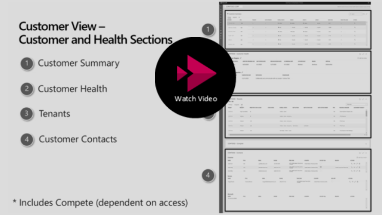
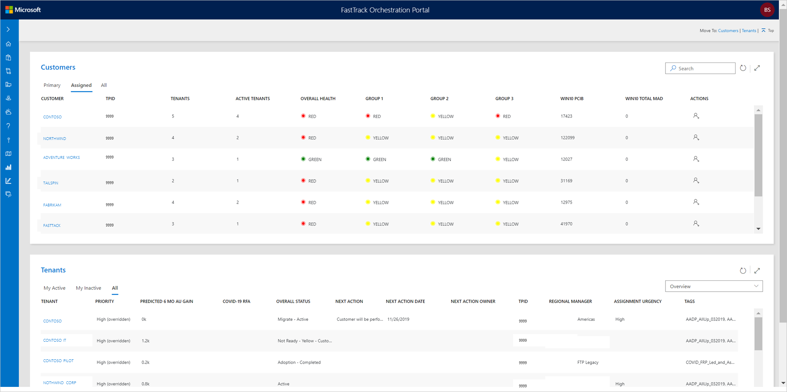
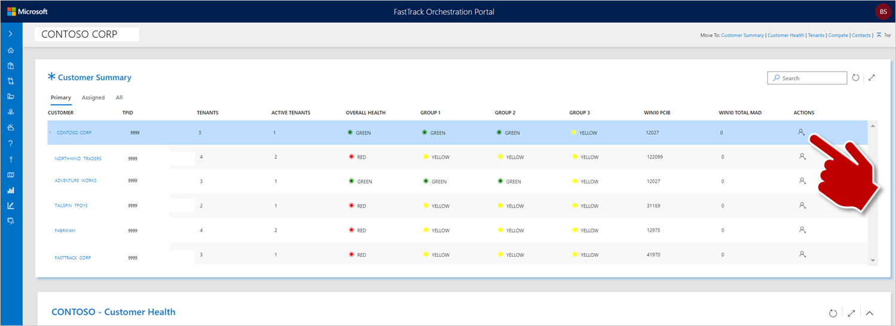
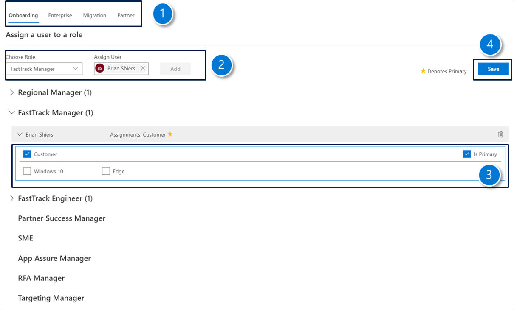
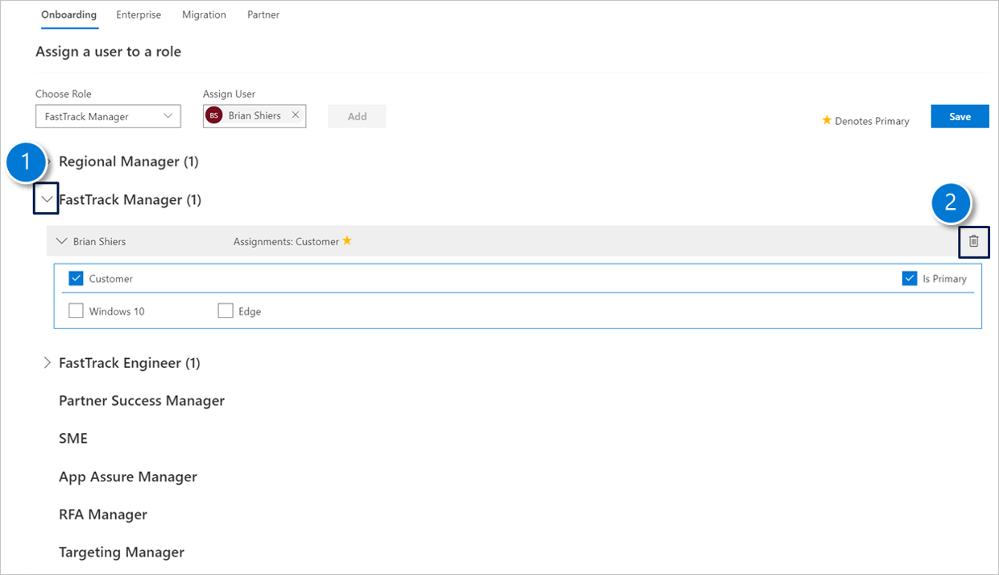

---
# required metadata
title: FTOP 2.5 for Customer Health
description: Process guidance for internal FTOP users.
author: Connie Brenden
ms.author: v-conbre
manager: jimmuir
ms.date: 4/25/2020
ms.topic: ftop-2.5-for-customer-health
ms.prod: non-product-specific
ms.custom: ftop-2.5-for-customer-health
ft.audience: internal
ft.owner: jimmuir
---
# FTOP 2.5 for Customer Health

## Quick Navigation

- [What is FTOP 2.5 for Customer Health](#what-is-ftop-25-for-customer-health)

- [FTOP 2.5 User Interface](#ftop-25-user-interface)

- [Frequently Asked Questions](https://aka.ms/ftop/customerfaq)

- [Customer View in FTOP User Guide](https://fasttrack-docs.microsoft.com/ftop-user-guide/customer-view.html)

- [Resources](#resources)

## What is FTOP 2.5 for Customer Health

We are excited to introduce a new user experience and features that will help you work at a customer level. FTOP 2.5 is the internal name given to the new FTOP UI for managing customers.

You will now work in both the existing FTOP UI (i.e. tenant view) and the new customer view. FTOP 2.5 is the interim step before we move to FTOP vNext. What we release to FTOP 2.5 will functionally be similar in vNext.  

The following sections will give you a taste of what FTOP 2.5 will look like and help you get prepared for the new experience.  

## FTOP 2.5 User Interface

This release of FTOP 2.5 focuses on Customer Health and adds two new views, Customer View and Portfolio view.  

### Customer View

The Customer view is based on a new user experience driven by selecting a customer and then the components of the page (widgets) becoming contextual. Additional widgets may be visible for some of you such as the Compete Widget (not discussed here).

### Customer Health Video

Video 3:12 Minutes

>[!TIP]
>When you launch the video, right-click, select Open in new tab.

### Portfolio View

The Portfolio view shows you in one place all your customers and tenants that you have been assigned. This view includes the following sections.

|View  |Description  |
|---------|---------|
|Customers    |Displays an overview of your assigned customers. If you select the customer, it opens in the customer view with customer selected.         |
|Tenants    |Displays your assigned tenants. This view is similar to what is currently available in the tenant view. If you select the tenant, it opens it in the familiar tenant view.         |

### Customer Assignments

Assignments will be managed at the customer level as well as the Tenant level. The following guided screen shots will provide with a quick understanding on how assignments will be made at the customer level.  

By selecting the Assignments icon in the action column for the customer will open the Assignment dialog box.

### Procedures

#### Adding a new assignment

1. Select the area you wish to make an assignment.

1. Choose a Role from the drop-down, each role is contextual to each area, start to type the user’s name and select the correct user. Select Add to assign the user.

1. The user will appear in the list, select from the tick boxes to refine the assignment – use Customer.

    a. (Optional) Repeat 3 and 4 to add more user assignments.

1. Finally to commit the user assignment select **Save**.

#### Deleting a user assignment

1. Expand the role name and next to user name.

1. Select **Delete**.

## Resources

- FTOP [All Customer Walk-through Videos](../ftop-user-guide/customer-view-videos.md)
